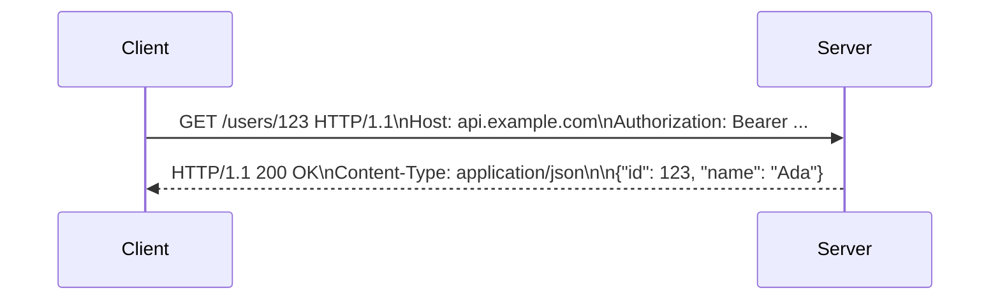

## Definition

HTTP (HyperText Transfer Protocol) is an application-layer protocol for exchanging structured messages — requests and responses — between clients and servers. It's the foundation almost every web API, browser page load, and mobile app network call is built on.

## Why it exists

Before HTTP, there was no shared, simple protocol for a client to ask a server for a resource (a page, a file, data) and get a structured, predictable response. HTTP standardized that exchange: a request always has a method, a path, headers, and optionally a body; a response always has a status code, headers, and optionally a body. That shared structure is what let the entire web — and later, APIs — interoperate regardless of what language or platform either side was written in.

## The problem it solves

Without a standard protocol, every client-server pair would need a custom, bespoke way to communicate. HTTP solves this by defining a universal contract: any HTTP client (a browser, `curl`, a mobile app) can talk to any HTTP server, because both sides agree on the same message format.

## Real-world analogy

HTTP is like a standardized order form at a restaurant chain. Every location uses the same form structure — table number, item, quantity, special instructions — so any server can read any order form correctly, and the kitchen always knows how to respond (with a completed meal, or a "we're out of that" message). The method (GET/POST/etc.) is like a checkbox for "dine in" vs. "delivery" — it tells the kitchen what kind of request this is before they even read the details.

## Simple explanation

An HTTP request has:
- A **method** (GET, POST, PUT, DELETE, PATCH...) describing the intended action.
- A **path** (`/users/123`) identifying the resource.
- **Headers** (metadata like `Content-Type`, `Authorization`).
- Optionally, a **body** (the actual data being sent, for POST/PUT/PATCH).

An HTTP response has a **status code** (200, 404, 500...), headers, and optionally a body.

## Technical explanation

### Common methods

| Method | Purpose | Idempotent? |
|---|---|---|
| GET | Retrieve a resource | Yes |
| POST | Create a resource / trigger an action | No |
| PUT | Replace a resource entirely | Yes |
| PATCH | Partially update a resource | No (usually) |
| DELETE | Remove a resource | Yes |

**Idempotent** means calling it multiple times has the same effect as calling it once — important for retry logic. Retrying a failed GET is always safe; retrying a failed POST might create a duplicate resource unless the API is specifically designed to prevent that (e.g. with an idempotency key).

### Common status code ranges

- **2xx** — success (200 OK, 201 Created, 204 No Content)
- **3xx** — redirection (301 Moved Permanently, 302 Found)
- **4xx** — client error (400 Bad Request, 401 Unauthorized, 404 Not Found, 429 Too Many Requests)
- **5xx** — server error (500 Internal Server Error, 503 Service Unavailable)

## Internal working

Under the hood, HTTP runs on top of [TCP](/docs/networking/tcp) (or, in HTTP/3, on top of QUIC/UDP) — HTTP handles the message format, while TCP handles reliable byte delivery between the two machines.

### HTTP/1.1 vs HTTP/2 vs HTTP/3

- **HTTP/1.1**: one request per TCP connection at a time (without pipelining complications) — browsers work around this by opening multiple parallel connections.
- **HTTP/2**: multiplexes many requests over a single TCP connection, plus header compression — much more efficient for pages with many resources.
- **HTTP/3**: runs over QUIC (built on UDP) instead of TCP, removing head-of-line blocking at the transport layer and improving performance on lossy networks (e.g. mobile).

## Advantages

- Universally supported — every language, platform, and network device understands HTTP.
- Human-readable in its text form (HTTP/1.1), making debugging straightforward.
- Statelessness (each request contains all the information needed to process it) simplifies horizontal scaling of servers.

## Disadvantages

- Statelessness means anything resembling a "session" must be reconstructed on every request (via cookies, tokens) — an extra design burden compared to a persistent-connection protocol.
- HTTP/1.1's one-request-at-a-time-per-connection model creates real performance limits that required both client-side (parallel connections) and protocol-level (HTTP/2/3) workarounds.
- Not ideal for genuinely real-time, bidirectional communication — see [WebSockets](/docs/networking/websockets) for that use case.

## Trade-offs

Statelessness is both HTTP's biggest strength (trivial horizontal scaling — any server can handle any request) and its biggest limitation (no built-in way to maintain a long-lived, low-overhead connection for real-time updates).

## Complexity considerations

Plain request/response HTTP is simple to reason about. Complexity increases once you need things HTTP doesn't provide natively — real-time push (solved with WebSockets or long-polling), or guaranteed exactly-once processing (solved with idempotency keys at the application layer).

## When to use

The default choice for almost any client-server communication: web pages, REST APIs, mobile app backends.

## When NOT to use (or not exclusively)

- Real-time bidirectional communication (chat, live game state) — use [WebSockets](/docs/networking/websockets) instead.
- Extremely latency-sensitive, high-throughput internal service-to-service calls, where [gRPC](/docs/networking/grpc)'s binary protocol and HTTP/2 multiplexing can outperform plain REST-over-HTTP/1.1.

## Common mistakes

- Using GET for actions that have side effects (e.g. a GET request that deletes something) — breaks caching assumptions and can cause accidental deletions from link previews or crawlers.
- Not handling retries safely for non-idempotent methods (POST), risking duplicate side effects (e.g. double-charging a customer) on network retry.
- Returning 200 OK for error conditions (making clients parse the body to figure out if something failed) instead of using appropriate status codes.

## Interview questions

- "Why is GET considered safe to retry automatically, but POST isn't?"
- "What's the difference between 401 and 403?" (401 = not authenticated at all; 403 = authenticated, but not authorized for this resource.)
- "How would you design an API endpoint to be safely retryable even though it's a POST?" (Idempotency keys.)

## Practical example

A mobile app calling `GET /api/feed` to load a user's timeline, and `POST /api/posts` (with an idempotency key in the header) to create a new post safely even if the network request needs to be retried after a timeout.

## Production example

Stripe's API is a widely cited example of well-designed HTTP API practice: consistent use of status codes, required idempotency keys on POST requests that create charges, and clear, structured JSON error bodies.

## Best practices

- Use the method that matches the actual semantics (GET for reads, POST for creates, PUT/PATCH for updates, DELETE for removal).
- Return specific, correct status codes rather than always 200 with an error flag in the body.
- Design mutating endpoints (POST) to support idempotency keys if clients might need to safely retry them.

## Summary

HTTP is the request-response protocol underlying almost all web and API communication: a method and path describe the intent, headers carry metadata, and a status code tells the client what happened. Its statelessness makes horizontal scaling trivial but means real-time and session-like behavior has to be built on top, not assumed for free.

## References

- MDN Web Docs: HTTP overview
- RFC 9110 (HTTP Semantics)

<Quiz questions={[
  {
    q: "Why is it generally safe for a client to automatically retry a failed GET request, but not a failed POST request?",
    options: [
      "GET requests are always faster",
      "GET is idempotent (no side effects from repeating it); POST often isn't",
      "POST requests don't support retries in HTTP",
      "There's no real difference"
    ],
    answer: 1,
    explanation: "GET is defined as safe and idempotent — repeating it has the same effect as doing it once. POST often creates something, so blindly retrying it can cause duplicate side effects (e.g. a duplicate order) unless the API specifically supports idempotency keys."
  }
]} />
