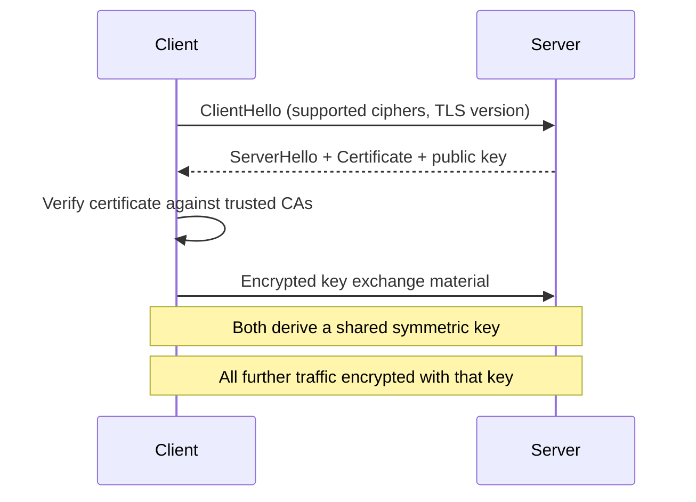

## Definition

HTTPS is [HTTP](/docs/networking/http) transmitted over TLS (Transport Layer Security), an encryption layer that sits between HTTP and [TCP](/docs/networking/tcp). It provides encryption, integrity, and authentication for otherwise plaintext HTTP traffic.

## Why it exists

Plain HTTP sends everything — including passwords, cookies, and personal data — as unencrypted plaintext over the network. Anyone able to observe the traffic (a shared Wi-Fi network, an ISP, an attacker on the same network segment) can read or even modify it in transit. HTTPS exists to close that gap: encrypt the content, verify it hasn't been tampered with, and confirm you're actually talking to the server you think you are.

## The problem it solves

Without HTTPS, three distinct problems exist simultaneously: **eavesdropping** (anyone on the network path can read your data), **tampering** (anyone on the path can modify requests or responses undetected), and **impersonation** (nothing proves the server you're talking to is the real one, not an attacker's server pretending to be it). TLS solves all three at once.

## Real-world analogy

Plain HTTP is like mailing a postcard — anyone who handles it along the way can read it, and nothing stops them from altering the message before it arrives. HTTPS is like sending the same message in a tamper-evident, sealed envelope, addressed using a verified, notarized address — you can tell if it was opened or altered in transit, and you have independent confirmation you're sending it to the right recipient in the first place.

## Simple explanation

HTTPS provides three guarantees on top of plain HTTP:

1. **Confidentiality** — the content is encrypted, so eavesdroppers can't read it.
2. **Integrity** — any tampering with the data in transit is detectable.
3. **Authentication** — a certificate, issued by a trusted certificate authority (CA), proves the server is who it claims to be.

## Technical explanation

### The TLS handshake (simplified)

TLS uses **asymmetric cryptography** (public/private key pairs) only briefly, during the handshake, to safely establish a shared **symmetric key** — symmetric encryption is far faster, so it's used for the actual bulk data transfer once the handshake completes.

### Certificates and the chain of trust

A server's TLS certificate is issued and digitally signed by a Certificate Authority (CA) that browsers and operating systems already trust. The client verifies this signature chain, confirming the certificate — and therefore the server's identity — is legitimate, without ever having communicated with that server before.

## Internal working — cost of the handshake

The TLS handshake adds one or more extra network round trips before any encrypted application data can flow, on top of the TCP handshake already required underneath it. **TLS 1.3** (the current standard) reduced this to a single round trip in the common case, and supports **0-RTT resumption** for repeat connections to a server the client has recently talked to — a meaningful latency improvement over TLS 1.2's typical two round trips.

## Advantages

- Protects against eavesdropping, tampering, and impersonation — three real, common attack classes on plain HTTP.
- Modern TLS versions (1.3) have significantly reduced the historical latency cost of encryption.
- Increasingly required by browsers (marking plain HTTP sites as "not secure") and by many APIs/platforms as a baseline requirement.

## Disadvantages

- Adds handshake latency (though much less than in older TLS versions) and modest CPU overhead for encryption/decryption.
- Requires certificate management — issuance, renewal, and rotation — an operational burden, though largely automated today by tools like Let's Encrypt and ACME.

## Trade-offs

The historical trade-off ("HTTPS is slower") has largely been closed by TLS 1.3's reduced handshake and modern hardware's cheap encryption — today it's rarely a meaningful reason to avoid HTTPS, and it's the default expectation for essentially all production traffic.

## Complexity considerations

Terminating TLS is usually handled at the [reverse proxy](/docs/networking/reverse-proxy) or load balancer layer rather than in every individual backend server, keeping certificate management centralized in one place instead of duplicated across a whole fleet.

## When to use

Essentially always, for any traffic leaving a trusted private network — public APIs, websites, mobile app backends. "HTTPS everywhere" is the modern default, not an optional hardening step.

## When plain HTTP might still appear

Purely internal traffic within a tightly controlled, trusted private network segment (though even here, many organizations now use TLS internally too, given the security benefits and low remaining cost — an approach sometimes called "zero trust" networking).

## Common mistakes

- Terminating TLS at the edge but then sending sensitive data in plaintext over an internal network, assuming internal traffic is inherently safe (it may not be, depending on network architecture).
- Letting certificates expire due to manual renewal processes — solved almost entirely today by automated renewal (e.g. via Let's Encrypt's ACME protocol).
- Mixing HTTP and HTTPS content on the same page (mixed content), which browsers block or warn about, and which reintroduces exactly the vulnerabilities HTTPS was meant to close for that content.

## Interview questions

- "What three specific problems does HTTPS solve that plain HTTP doesn't?"
- "Where in your architecture would you terminate TLS, and why?"
- "How does TLS avoid the cost of asymmetric encryption for every byte of actual data transferred?"

## Practical example

A reverse proxy terminates TLS for all public-facing traffic to a backend service, decrypting once at the edge, then communicating with backend application servers over plain HTTP within a trusted private network — centralizing certificate management in one place instead of every backend instance.

## Production example

Let's Encrypt, a free, automated certificate authority launched in 2015, is widely credited with dramatically accelerating the industry-wide shift to "HTTPS everywhere" by removing the cost and manual renewal burden that previously made TLS certificates a meaningful adoption barrier.

## Best practices

- Terminate TLS at a centralized layer (reverse proxy / load balancer) rather than in every backend service.
- Automate certificate issuance and renewal (e.g. via ACME/Let's Encrypt) rather than relying on manual processes.
- Use TLS 1.3 where possible for its reduced handshake latency and improved security properties over older versions.

## Summary

HTTPS wraps HTTP in TLS encryption, providing confidentiality, integrity, and server authentication — closing off eavesdropping, tampering, and impersonation attacks that plain HTTP is vulnerable to. Modern TLS (1.3) has largely eliminated the historical latency argument against it, making HTTPS the correct default for essentially all production traffic today.

## References

- RFC 8446 (TLS 1.3)
- Let's Encrypt: How It Works

<Quiz questions={[
  {
    q: "Why does TLS use asymmetric (public/private key) cryptography only briefly, during the handshake, rather than for all data transfer?",
    options: [
      "Asymmetric cryptography isn't secure enough for bulk data",
      "Asymmetric cryptography is used to safely establish a shared symmetric key, and symmetric encryption is much faster for the actual bulk data transfer",
      "Symmetric encryption doesn't exist in TLS",
      "It's a historical accident with no real reason"
    ],
    answer: 1,
    explanation: "Asymmetric crypto is computationally expensive, so TLS uses it only to safely exchange a symmetric key during the handshake, then switches to fast symmetric encryption for the actual application data."
  }
]} />
