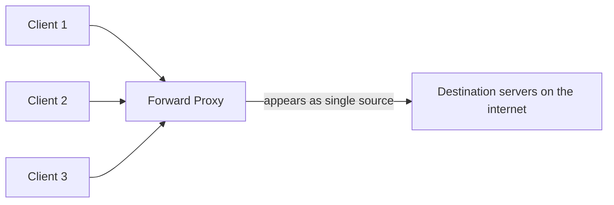

## Definition

A (forward) proxy is a server that sits between clients and the wider internet, forwarding client requests outward and returning responses back to the client. From the destination server's perspective, the request appears to originate from the proxy, not the original client.

## Why it exists

Organizations and individuals often want to control, monitor, or anonymize outbound traffic without changing anything about the destination servers being contacted. A forward proxy exists to sit on the client's side of the connection and do exactly that — on the client's behalf.

## The problem it solves

Without a forward proxy, every client machine would need to individually implement things like content filtering, traffic monitoring, or caching of commonly accessed external resources. A forward proxy centralizes these concerns for a whole group of clients (e.g. everyone on a corporate network) in one place.

## Real-world analogy

A company's mailroom that receives and sends all physical mail on behalf of every employee — an outgoing letter goes through the mailroom, which can log it, apply postage centrally, or hold back anything against policy — is a forward proxy for physical mail. The recipient sees the mailroom's return address, not necessarily any individual employee's.

## Simple explanation

`Client → Forward Proxy → Destination Server`. The proxy acts **on behalf of the client**, and the destination server sees the proxy, not the original client, as the source of the request.

## Technical explanation

Common uses of a forward proxy:

- **Content filtering** — blocking access to certain sites or content categories (common on corporate/school networks).
- **Anonymization** — hiding the client's real IP address from the destination server.
- **Caching** — storing frequently requested external content locally, so repeat requests from any client on the network don't need to go out to the internet again.
- **Logging/monitoring** — recording outbound traffic for security or compliance purposes.

## Internal working

Because all clients' outbound traffic passes through the same proxy, the destination servers see requests coming from the proxy's IP address, not from any individual client behind it — the mechanism behind both content anonymization and, less benignly, some forms of traffic surveillance depending on who operates the proxy.

## Forward proxy vs. reverse proxy (again, since it's the most commonly confused pairing)

A forward proxy represents **clients** to the outside world; a [reverse proxy](/docs/networking/reverse-proxy) represents **servers** to the outside world. Same underlying mechanism (an intermediary forwarding traffic), opposite side of the conversation.

## Advantages

- Centralizes policy enforcement (content filtering, logging) for many clients in one place, rather than per-device configuration.
- Can meaningfully improve performance via shared caching of frequently requested external resources.
- Provides a layer of anonymity/abstraction between individual clients and the destination servers they contact.

## Disadvantages

- Introduces a single point of failure and a potential bottleneck for all outbound traffic from behind it.
- Can be used for surveillance or censorship depending on who controls it and what policies they enforce — a genuine dual-use consideration.
- Adds a network hop, and therefore some latency, to every outbound request.

## Trade-offs

Centralizing outbound traffic through a forward proxy trades some latency and a new potential bottleneck for centralized control, monitoring, and caching benefits across many clients — appropriate in contexts (corporate networks, certain compliance requirements) where that centralized control is actually needed.

## Complexity considerations

A basic content-filtering or caching forward proxy is relatively simple to deploy. More sophisticated deployments (transparent proxying that clients aren't even configured to know about, deep traffic inspection) add real complexity and often require careful handling of encrypted (HTTPS) traffic, which a proxy generally can't inspect the contents of without additional (and often controversial) certificate-based interception.

## When to use

- Corporate or institutional networks wanting centralized content filtering, logging, or outbound traffic policy.
- Situations wanting to anonymize or centralize the apparent source of outbound requests from many clients.

## When NOT needed

- Individual consumer internet usage with no need for centralized policy — most home internet connections have no forward proxy at all, and don't need one.

## Common mistakes

- Deploying a single forward proxy instance for a large organization without considering it as a potential bottleneck or single point of failure for all outbound traffic.
- Confusing forward and reverse proxies in system design discussions — they solve related but distinctly different problems, for opposite parties in a connection.

## Interview questions

- "What's the difference between a forward proxy and a reverse proxy, in terms of who they represent?"
- "Why might a company deploy a forward proxy for its employees' internet access?"

## Practical example

A corporate network routes all employee internet traffic through a forward proxy that blocks known malicious domains, logs outbound requests for security auditing, and caches commonly accessed software update servers so bandwidth isn't wasted downloading the same update repeatedly from many machines.

## Production example

Many enterprise network security products (e.g. Zscaler, Blue Coat) are, at their core, forward proxy deployments at scale, providing centralized content filtering, threat detection, and traffic visibility for large organizations' outbound internet traffic.

## Best practices

- Deploy forward proxies redundantly if they're on the critical path for all outbound traffic from an organization, to avoid a new single point of failure.
- Be deliberate and transparent about what policies (filtering, logging) a forward proxy enforces, given the legitimate privacy and dual-use considerations involved.

## Summary

A forward proxy sits between clients and the broader internet, acting on the clients' behalf to centralize content filtering, caching, logging, or anonymization for outbound traffic. It's the mirror image of a reverse proxy (which represents servers, not clients), and — like any component all traffic passes through — needs to be deployed with its own redundancy in mind.

## References

- Squid Proxy documentation (a widely used open-source forward proxy)

<Quiz questions={[
  {
    q: "In a forward proxy setup, whose identity does the destination server typically see?",
    options: [
      "The original client's IP address",
      "The proxy's IP address, not the original client's",
      "No identity is transmitted at all",
      "The destination server's own IP address"
    ],
    answer: 1,
    explanation: "Since the forward proxy forwards the request on the client's behalf, the destination server sees the proxy as the apparent source, not the original client behind it."
  }
]} />
