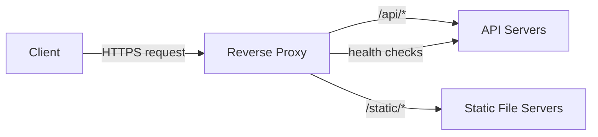

## Definition

A reverse proxy is a server that sits in front of one or more backend servers and forwards client requests to them, returning the backend's response back to the client as if the proxy itself had produced it. From the client's perspective, the reverse proxy **is** the server — the actual backend(s) behind it are invisible.

## Why it exists

Backend servers often shouldn't be exposed directly to the internet — for security, for load distribution, and to allow the backend infrastructure to change without clients noticing. A reverse proxy exists to be the single, stable, hardened front door that clients talk to, while the real work happens on backend servers it manages access to.

## The problem it solves

Directly exposing backend application servers to the public internet means every one of them needs to independently handle TLS, security hardening, and direct exposure to attack traffic — and clients need to know about every individual backend server. A reverse proxy centralizes all of that into one well-defended, well-configured layer.

## Real-world analogy

A hotel's front desk is a reverse proxy for its guests. You don't call individual hotel room phones directly from outside — you call the front desk, and *they* connect you to the right room. The front desk can also decide to route your call differently (a different room, a different department) without you needing to know or care which room you actually end up talking to.

## Simple explanation

`Client → Reverse Proxy → Backend Server(s)`. The reverse proxy receives all incoming requests and decides, based on rules (path, load, health), which backend server actually handles each one — while the client only ever sees the proxy.

## Technical explanation

Common responsibilities a reverse proxy takes on:

- **Load balancing** — distributing requests across multiple backend servers.
- **TLS termination** — handling HTTPS encryption/decryption once, at the proxy, so backend servers can speak plain HTTP internally.
- **Caching** — serving cacheable responses without hitting the backend at all.
- **Request routing** — sending different paths (`/api/*` vs `/static/*`) to different backend services.
- **Security** — hiding backend server details, filtering malicious requests, rate limiting.

## Internal working

## Reverse proxy vs. forward proxy

This distinction trips people up constantly, so it's worth being precise:

| | Forward Proxy | Reverse Proxy |
|---|---|---|
| Sits in front of | Clients | Servers |
| Hides | The client's identity from the server | The server's identity/topology from the client |
| Typical use | Corporate network filtering, VPNs, anonymizing client requests | Load balancing, TLS termination, backend protection |

A forward proxy acts **on behalf of the client** (e.g. a company's outbound internet gateway). A reverse proxy acts **on behalf of the server** (e.g. Nginx sitting in front of a fleet of app servers). Same underlying mechanism — forward traffic on someone's behalf — but for opposite parties.

## Advantages

- Centralizes TLS termination, security hardening, and rate limiting in one place instead of every backend server.
- Enables load balancing and backend changes (adding/removing/replacing servers) without any client-visible change.
- Can absorb load via caching before it ever reaches the backend.

## Disadvantages

- Introduces a new component that itself needs to be highly available — a reverse proxy that goes down takes down access to everything behind it, unless it's itself deployed redundantly.
- Adds a network hop (a small amount of extra latency) to every request.

## Trade-offs

Centralizing responsibilities like TLS termination and rate limiting in one layer simplifies backend servers considerably, but concentrates operational importance (and risk) onto that layer — it needs its own redundancy and careful configuration, since it now sits on the critical path for every single request.

## Complexity considerations

A single reverse proxy instance is simple to set up. Making the reverse proxy layer itself highly available (so it isn't a new single point of failure) requires the same redundancy techniques (multiple instances, health checks, often DNS or an even lower-level load balancer in front) applied one layer earlier.

## When to use

Almost universally recommended in front of any backend service exposed to real traffic — even a single backend server benefits from the TLS termination, security hardening, and abstraction a reverse proxy provides.

## When it might be unnecessary

Purely internal services communicating only within a trusted private network, with no external exposure and no need for load balancing across multiple instances, might reasonably skip a dedicated reverse proxy layer.

## Common mistakes

- Deploying only a single reverse proxy instance, making it a new single point of failure for the whole system.
- Confusing forward and reverse proxies in conversation or design — they solve related but genuinely different problems.
- Not offloading TLS termination to the proxy, leaving every backend server to handle its own certificate management unnecessarily.

## Interview questions

- "What's the difference between a forward proxy and a reverse proxy?"
- "Why would you put a reverse proxy in front of your backend even if you only have one backend server today?"
- "How do you avoid the reverse proxy itself becoming a single point of failure?"

## Practical example

Nginx or Envoy deployed in front of a fleet of application servers: it terminates TLS, routes `/api/*` requests to the application tier and `/static/*` requests to a static file service, and load-balances across multiple healthy instances of each — all while clients only ever see one hostname.

## Production example

Almost every large-scale web architecture uses a reverse proxy layer — Envoy (originally built at Lyft, now widely used, including as the data plane for many [service meshes](/docs/microservices/service-mesh)) is a modern, widely adopted example designed specifically for this role at scale.

## Best practices

- Run the reverse proxy layer itself redundantly (multiple instances behind a lower-level load balancer or DNS), so it isn't a new single point of failure.
- Terminate TLS at the reverse proxy so backend servers can be simpler and communicate over plain HTTP internally (within a trusted network).
- Use the reverse proxy for centralized concerns (rate limiting, request logging, security headers) rather than duplicating that logic in every backend service.

## Summary

A reverse proxy sits in front of backend servers, handling load balancing, TLS termination, caching, and routing on their behalf, while presenting clients with a single, stable front door. It's the mirror image of a forward proxy (which acts on behalf of clients, not servers), and needs its own redundancy to avoid becoming a new single point of failure.

## References

- Nginx documentation: reverse proxy
- Envoy Proxy documentation

<Quiz questions={[
  {
    q: "What's the key difference between a forward proxy and a reverse proxy?",
    options: [
      "A forward proxy is faster",
      "A forward proxy acts on behalf of clients; a reverse proxy acts on behalf of servers",
      "There is no real difference",
      "Reverse proxies only work with HTTPS"
    ],
    answer: 1,
    explanation: "A forward proxy sits in front of clients and represents their requests outward (e.g. a corporate network gateway); a reverse proxy sits in front of servers and represents them to the outside world (e.g. Nginx load balancing across backend app servers)."
  }
]} />
