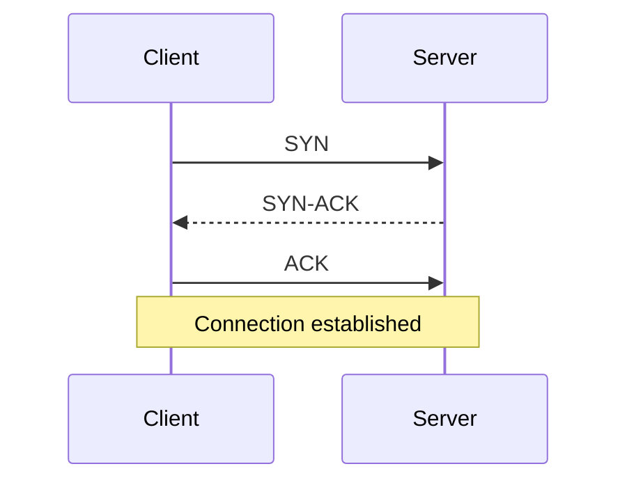
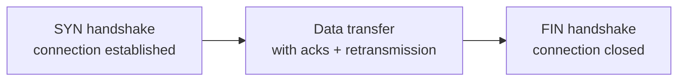

## Definition

TCP (Transmission Control Protocol) is a transport-layer protocol that provides **reliable, ordered, connection-oriented** delivery of a byte stream between two machines over an unreliable network. It's the layer directly beneath [HTTP](/docs/networking/http), most databases' wire protocols, and most application-level networking in general.

## Why it exists

The underlying network (IP) only promises "best effort" delivery — packets can be lost, duplicated, arrive out of order, or arrive corrupted, with no guarantees at all. Almost no application wants to deal with that directly. TCP exists to give applications a much simpler guarantee: bytes sent will arrive, in order, exactly once, or the connection will report an error — hiding all of the underlying unreliability behind a clean abstraction.

## The problem it solves

Without TCP, every application would need to reimplement retransmission of lost packets, reordering of out-of-order packets, and detection of duplicates — solved once, correctly, at the transport layer instead of separately (and probably incorrectly) in every application.

## Real-world analogy

Sending a long letter as a stack of numbered postcards through a postal system that sometimes loses postcards, sometimes delivers them out of order, and occasionally delivers a duplicate. TCP is like a diligent assistant on the receiving end who: numbers every postcard (sequence numbers), asks the sender to resend any that never arrived (retransmission), reassembles them in the correct order regardless of arrival order, and discards duplicates — so that by the time you read the letter, it's exactly as the sender intended, in order, with nothing missing or repeated.

## Simple explanation

TCP provides four core guarantees on top of the unreliable network below it:

1. **Reliable delivery** — lost data is automatically retransmitted.
2. **Ordered delivery** — bytes arrive in the same order they were sent, even if underlying packets didn't.
3. **Connection-oriented** — a connection is explicitly established (handshake) before data flows, and explicitly closed afterward.
4. **Flow and congestion control** — the sender doesn't overwhelm the receiver or the network itself.

## Technical explanation

### The three-way handshake

This handshake exists so both sides agree on initial sequence numbers and confirm each other's ability to send and receive, before any actual application data is exchanged — this round trip is also exactly why establishing a **new** TCP connection has a real, measurable latency cost (one full round-trip minimum, more with TLS on top for HTTPS).

### Reliability mechanisms

- Every byte gets a **sequence number**.
- The receiver sends **acknowledgments (ACKs)** for data received.
- If the sender doesn't get an ACK within a timeout, it **retransmits**.
- Out-of-order packets are buffered and reassembled in the correct order before being handed to the application.

## Internal working — connection lifecycle

## Advantages

- Applications get a simple, reliable byte-stream abstraction without implementing retransmission or reordering themselves.
- Congestion control helps prevent any single connection (or the network as a whole) from being overwhelmed.

## Disadvantages

- The handshake adds real latency before any data can flow — costly for very short-lived connections (mitigated in practice by connection reuse/keep-alive, and in HTTP/2 and HTTP/3 by multiplexing many requests over one connection).
- **Head-of-line blocking**: if one packet is lost, all subsequently received packets must wait for it to be retransmitted before any of them can be delivered to the application, even if they arrived successfully — a real limitation on lossy networks (this is part of why HTTP/3 moved to QUIC over UDP instead).
- More overhead per packet (sequence numbers, ACKs) than a simpler protocol without these guarantees.

## Trade-offs

TCP trades some latency and overhead for strong reliability and ordering guarantees. For use cases where occasional packet loss is acceptable and lowest possible latency matters more (live video, gaming, DNS), [UDP](/docs/networking/udp) — which provides none of these guarantees — is often a better fit.

## Complexity considerations

Applications built directly on TCP get reliability "for free," but still need to handle application-level concerns TCP doesn't provide: message framing (TCP is just a byte stream, so knowing where one message ends and the next begins is the application's job), and application-level timeouts/retries for cases where the connection itself is fine but the application on the other end is slow or stuck.

## When to use

The default choice for anything requiring reliable, ordered delivery: HTTP/web traffic, database connections, file transfers, most request-response or streaming application protocols.

## When NOT to use (prefer UDP instead)

- Real-time media (video calls, live streaming) where a dropped frame is better than a delayed one waiting for retransmission.
- DNS queries, where a simple request-response with application-level retry is simpler and faster than paying for a full TCP handshake for one tiny query.

## Common mistakes

- Assuming TCP guarantees message boundaries — it doesn't; it's a byte stream, and applications must implement their own framing (e.g. length-prefixing messages) if they need distinct messages.
- Opening a new TCP connection per request instead of reusing connections (keep-alive) — paying the handshake cost repeatedly for no reason.
- Not accounting for head-of-line blocking when diagnosing latency spikes on lossy networks (e.g. mobile connections).

## Interview questions

- "Why does establishing a new TCP connection add latency, and how do modern systems mitigate that?"
- "When would you choose UDP over TCP, and why?"
- "What is head-of-line blocking, and how does HTTP/3 address it?"

## Practical example

A mobile app's API client keeping a persistent, reused TCP connection (via HTTP keep-alive) to the backend avoids paying the handshake cost on every single request — a meaningful latency win on mobile networks where round trips are expensive.

## Production example

Google's move to QUIC (the transport underlying HTTP/3) was explicitly motivated by TCP's head-of-line blocking problem hurting performance on lossy mobile networks — QUIC runs over UDP and reimplements reliability at a layer that avoids blocking unrelated streams behind one lost packet.

## Best practices

- Reuse TCP connections (keep-alive / connection pooling) rather than opening a new one per request.
- Implement explicit message framing at the application layer if sending discrete messages over a raw TCP connection.
- Consider UDP-based protocols for latency-sensitive, loss-tolerant workloads rather than forcing everything through TCP.

## Summary

TCP provides reliable, ordered, connection-oriented delivery over an inherently unreliable network, via sequence numbers, acknowledgments, and retransmission — at the cost of handshake latency and head-of-line blocking. It's the right default for most application traffic, but not for latency-sensitive, loss-tolerant workloads like live media, where UDP is usually the better fit.

## References

- RFC 793 (original TCP spec) / RFC 9293 (current)
- "Computer Networks," Andrew Tanenbaum

<Quiz questions={[
  {
    q: "What is 'head-of-line blocking' in TCP?",
    options: [
      "The handshake taking too long",
      "A lost packet forces all subsequently received packets to wait for its retransmission before being delivered to the application, even if they arrived fine",
      "Too many connections open at once",
      "A DNS lookup failure"
    ],
    answer: 1,
    explanation: "Because TCP guarantees in-order delivery, one lost packet blocks delivery of everything after it until it's retransmitted and received — even data that arrived successfully has to wait."
  }
]} />
