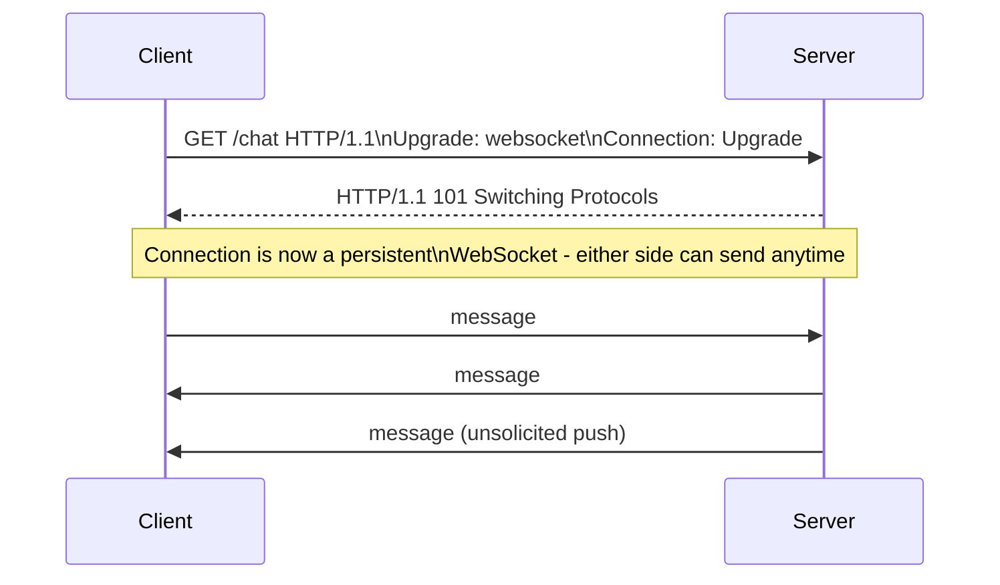

## Definition

WebSocket is a protocol providing a persistent, full-duplex (bidirectional) communication channel over a single [TCP](/docs/networking/tcp) connection, allowing a server to push data to a client at any time — not just in response to a client request, unlike plain HTTP.

## Why it exists

HTTP is fundamentally request-response: the client asks, the server answers, and the exchange is done. That model doesn't fit use cases where the **server** needs to send data to the client without the client asking first — a new chat message arriving, a live score updating, a stock price ticking. WebSockets exist to give the server that ability, over a connection that stays open.

## The problem it solves

Before WebSockets, developers approximated real-time behavior with workarounds like **polling** (the client repeatedly asks "anything new?" on a timer) or **long-polling** (the client asks, and the server holds the request open until there's something to say) — both wasteful and higher-latency than a genuinely persistent, bidirectional connection. WebSockets solve this directly, at the protocol level.

## Real-world analogy

Plain HTTP is like sending a letter and waiting for a reply before you can send another — one exchange at a time, always initiated by you. A WebSocket connection is like an open phone call — either party can speak at any moment, without waiting for the other to "ask" first, for as long as the call stays connected.

## Simple explanation

A WebSocket connection starts as a normal HTTP request, then "upgrades" to the WebSocket protocol, after which either side can send messages to the other at any time, over the same long-lived connection, until either side closes it.

## Technical explanation

### The upgrade handshake

The handshake deliberately starts as a regular HTTP request (with special `Upgrade` headers) specifically so WebSocket connections can pass through existing HTTP infrastructure (proxies, load balancers, firewalls) that already understands HTTP, before switching to the WebSocket protocol proper.

## Internal working

Once established, a WebSocket connection carries a simple framed message protocol directly over the underlying TCP connection — no HTTP request/response overhead per message, and no need for the client to initiate every exchange. The connection stays open (often kept alive with periodic ping/pong frames) until explicitly closed by either side or the underlying TCP connection drops.

## Advantages

- True bidirectional communication — the server can push data the instant it's available, without the client needing to ask.
- Much lower overhead per message than repeated HTTP requests (polling), since there's no repeated handshake or headers per message.
- Lower latency for real-time use cases compared to polling, since there's no wait for the next poll interval.

## Disadvantages

- Persistent connections consume server resources (memory, file descriptors) for every connected client, for as long as they're connected — a different scaling consideration than stateless HTTP request handling.
- Load balancing WebSocket connections is trickier than stateless HTTP — a client typically needs to stay connected to the *same* backend server for the life of the connection (sticky sessions), since the connection itself is stateful.
- Doesn't benefit from HTTP caching infrastructure at all, since it's not a series of independent cacheable requests.

## Trade-offs

WebSockets trade the simplicity and easy horizontal scalability of stateless HTTP requests for real-time bidirectional capability — appropriate when that capability is actually needed, but unnecessary complexity when it isn't (most APIs don't need it).

## Complexity considerations

Scaling WebSocket servers requires thinking about **connection count**, not just request rate — a server might handle relatively few requests per second but still need to maintain hundreds of thousands of concurrent open connections, which has different resource implications (memory per connection) than typical stateless HTTP load.

## When to use

- Live chat applications, real-time collaborative editing, live sports scores/tickers, multiplayer game state, live trading/stock price feeds.

## When NOT to use

- Any interaction that's naturally request-response (most CRUD APIs) — plain HTTP/REST is simpler and scales more easily.
- Occasional updates where a short-interval poll or long-poll is simpler to build and operate, and the added complexity of persistent connections isn't justified by the actual latency requirement.

## Common mistakes

- Reaching for WebSockets by default for any feature that involves "live" updates, when a much simpler polling interval would be entirely sufficient for the actual latency requirement.
- Not planning for connection-count scaling (memory per open connection, sticky routing) the same way one plans for request-rate scaling in stateless HTTP services.
- Forgetting to handle reconnection logic on the client — network interruptions will drop WebSocket connections, and a robust client needs to detect this and reconnect gracefully.

## Interview questions

- "Why can't plain HTTP handle real-time server-to-client push efficiently, and what does WebSocket add?"
- "How would you load-balance WebSocket connections across multiple backend servers?"
- "What's the resource scaling consideration for a WebSocket server that's different from a typical stateless HTTP API server?"

## Practical example

A chat application uses WebSockets so that when User A sends a message, User B's client receives it instantly, pushed from the server the moment it arrives — rather than User B's client needing to repeatedly poll "any new messages?" on an interval, which would either waste requests (polling too often) or add real latency (polling too rarely).

## Production example

Slack and Discord both rely heavily on persistent WebSocket connections to deliver real-time message delivery, typing indicators, and presence updates (who's online) — features that would be either impossible or prohibitively wasteful to implement via repeated HTTP polling at the message volumes these platforms handle.

## Best practices

- Reserve WebSockets for genuinely real-time, bidirectional use cases — don't default to them for ordinary request-response APIs.
- Plan backend capacity around concurrent connection count, not just request throughput.
- Implement robust client-side reconnection logic, since persistent connections will occasionally drop due to network conditions.

## Summary

WebSockets provide a persistent, bidirectional connection that lets a server push data to clients instantly, solving a real gap in plain HTTP's request-response model. They're the right tool specifically for real-time, bidirectional use cases (chat, live feeds, collaborative editing), but introduce connection-count-based scaling considerations and sticky-routing complexity that ordinary stateless HTTP APIs don't have to deal with.

## References

- RFC 6455 (The WebSocket Protocol)
- MDN Web Docs: WebSockets API

<Quiz questions={[
  {
    q: "Why is load balancing WebSocket connections trickier than load balancing typical stateless HTTP requests?",
    options: [
      "WebSockets don't support load balancing at all",
      "A WebSocket connection is stateful and long-lived, so a client generally needs to stay connected to the same backend server for its duration",
      "WebSockets are always slower than HTTP",
      "WebSockets don't use TCP"
    ],
    answer: 1,
    explanation: "Unlike a stateless HTTP request that any server can handle independently, a WebSocket connection is a persistent, stateful session with a specific backend server — routing subsequent messages to a different server would break that established connection's state."
  }
]} />
