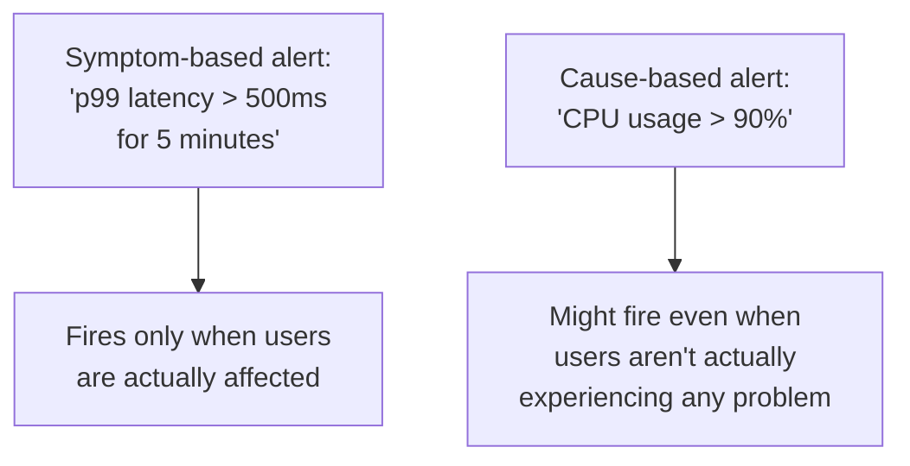
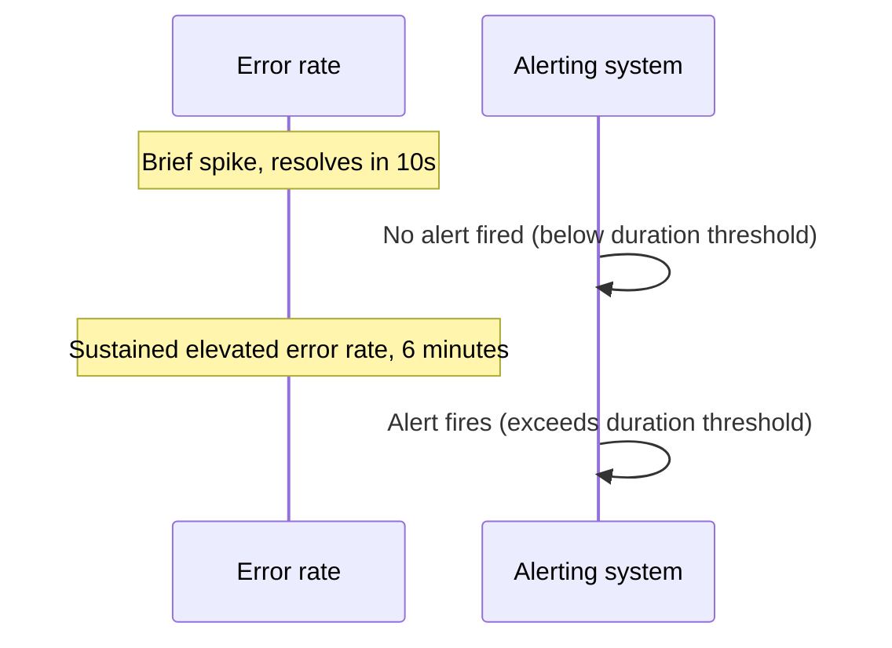

## Definition

Alerting is the practice of automatically notifying a person or team when a monitored signal (a metric crossing a threshold, an error rate spike, a failed health check) indicates a problem requiring attention — turning passive [Monitoring](/docs/observability/monitoring) data into an active notification.

## Why it exists

Dashboards are only useful if someone is actively looking at them at the exact moment a problem occurs — which isn't realistic for 24/7 production systems. Alerting exists to close this gap: instead of requiring constant human observation of dashboards, the system itself actively notifies the right people the moment a defined problem condition is detected.

## The problem it solves

Without alerting, a serious production problem might not be noticed until a user complains, or until someone happens to check a dashboard — an unacceptable delay for anything business-critical. Alerting solves this by actively pushing a notification to the right person or team the moment a problem is detected, minimizing the time between a problem occurring and someone starting to address it.

## Real-world analogy

A smoke detector doesn't require someone to be actively watching for smoke at all times — it actively alerts occupants the moment smoke is detected, regardless of whether anyone happened to be paying attention. Alerting plays exactly this role for production systems: an active push notification the moment a defined problem condition occurs, rather than relying on someone happening to notice.

## Simple explanation

An alert is defined as a condition (e.g. "error rate above 5% for 5 minutes") that, when true, triggers a notification (page, Slack message, email) to whoever's responsible for responding — the goal being fast, reliable notification of genuinely actionable problems, without excessive noise.

## Technical explanation

### Alerting on symptoms vs. causes

A key design principle (popularized by Google's SRE practice): alert on **symptoms** that directly affect users (elevated error rate, high latency, failed health checks) rather than every possible underlying **cause** (high CPU usage, a specific internal queue backing up) — a cause-based alert might fire even when users aren't actually affected (e.g. high CPU that hasn't yet caused any real user-facing slowdown), creating unnecessary noise.

### Alert fatigue

If alerts fire too often, or for conditions that aren't genuinely actionable, on-call engineers become desensitized — genuinely important alerts start getting ignored or dismissed along with the noise, a serious and well-documented failure mode called **alert fatigue**.

## Internal working — thresholds and durations

Most alerts combine a threshold with a duration ("error rate above 5%, sustained for at least 5 minutes") specifically to avoid firing on brief, self-resolving blips that don't actually need human intervention — a single, momentary spike that resolves on its own within seconds shouldn't wake someone up at 3am.

## Advantages

- Ensures problems are noticed and addressed quickly, without requiring constant, active human observation of dashboards.
- Symptom-based alerting focuses attention specifically on issues actually affecting users, rather than every internal anomaly.
- Well-tuned alerting (appropriate thresholds and durations) filters out noise, keeping the signal-to-noise ratio high for on-call engineers.

## Disadvantages

- Poorly tuned alerts (too sensitive, too many, or not clearly actionable) cause alert fatigue, undermining the entire practice's effectiveness.
- Alerting only on predefined conditions means genuinely novel problems that don't match any existing alert definition might go unnoticed until they're severe enough to trip something else.

## Trade-offs

More sensitive alerting (lower thresholds, shorter durations) catches problems faster but risks more false positives and alert fatigue; less sensitive alerting reduces noise but risks missing or delaying detection of genuine problems — tuning this balance is an ongoing, deliberate practice, not a one-time configuration.

## Complexity considerations

Defining a handful of clear, symptom-based alerts tied to actual [Non-functional Requirements](/docs/fundamentals/non-functional-requirements) (SLOs) is manageable. Maintaining a large, complex alerting configuration across many services, with appropriate escalation policies and on-call rotations, requires ongoing discipline and regular review to avoid drift into noise and fatigue over time.

## When to alert on a condition

- Conditions that directly indicate real, current or imminent user-facing impact, tied to specific, agreed-upon service level objectives.

## When NOT to alert (or to use a lower-urgency channel instead)

- Internal conditions that don't yet (and might never) translate into real user impact — these are better tracked on a dashboard for awareness, rather than triggering an urgent page.

## Common mistakes

- Alerting on every possible internal anomaly (cause-based alerting) rather than focusing on symptoms that genuinely affect users, leading to excessive noise.
- Setting thresholds without an appropriate duration requirement, causing alerts to fire on brief, self-resolving blips.
- Not regularly reviewing and pruning alert configurations, letting genuinely low-value or noisy alerts accumulate and contribute to alert fatigue over time.

## Interview questions

- "Why is it generally better to alert on symptoms (like elevated error rate) rather than every possible underlying cause (like high CPU usage)?"
- "What is alert fatigue, and how would you design alerting to avoid it?"
- "Why do most alert definitions include both a threshold and a minimum duration?"

## Practical example

A checkout service defines an alert for "checkout error rate above 2% sustained for 5 minutes," directly tied to its SLO — rather than separately alerting on every internal metric (specific queue depths, individual dependency latencies) that might contribute to that error rate, keeping the on-call engineer's attention focused specifically on genuine, user-affecting problems.

## Production example

Google's SRE practice explicitly popularized the symptom-based, SLO-driven approach to alerting — using error budgets (how much of an SLO's allowed "bad" behavior has already been consumed) to decide not just whether to alert, but how urgently, avoiding both under-alerting on real problems and over-alerting on noise.

## Best practices

- Alert on symptoms directly tied to user impact and defined SLOs, not on every possible internal cause.
- Combine thresholds with minimum durations to avoid firing on brief, self-resolving blips.
- Regularly review and prune alert configurations, removing or adjusting alerts that consistently prove noisy or non-actionable.

## Summary

Alerting turns monitored conditions into active notifications to the people responsible for responding, closing the gap between a problem occurring and a human noticing it. Effective alerting focuses on symptoms that genuinely affect users (rather than every possible internal cause), uses thresholds combined with durations to avoid noise from brief blips, and requires ongoing tuning and review to avoid the serious, well-documented failure mode of alert fatigue.

## References

- Google SRE Book: Practical Alerting

<Quiz questions={[
  {
    q: "Why is alerting on 'symptoms' (like elevated error rate) generally preferred over alerting on every possible 'cause' (like high CPU usage)?",
    options: [
      "Causes are always impossible to measure",
      "Symptom-based alerts fire specifically when users are actually affected, while cause-based alerts can fire on internal conditions that haven't (and might never) translate into real user impact, creating unnecessary noise",
      "There's no meaningful difference between the two approaches",
      "CPU usage cannot be monitored at all"
    ],
    answer: 1,
    explanation: "A symptom like elevated error rate or latency directly reflects actual user-facing impact, while an internal cause like high CPU might not yet (or ever) translate into a real problem for users — alerting on every possible cause tends to create excessive noise and contributes to alert fatigue."
  }
]} />
