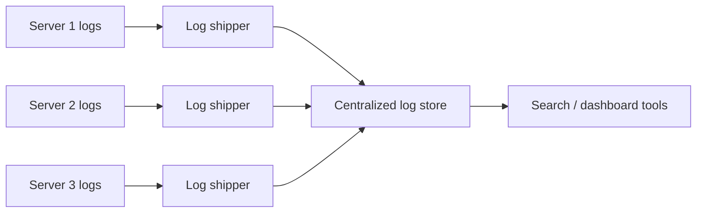

## Definition

Logging is the practice of recording discrete events as a system runs — requests received, errors encountered, state changes — typically as timestamped, structured or unstructured text records, providing a detailed, granular record of what happened and when.

## Why it exists

When something goes wrong in production, engineers need to reconstruct exactly what happened — what request came in, what decision the code made, what error occurred, in what order. Logging exists to leave this detailed trail automatically, as code runs, so that reconstruction is possible after the fact, without needing to reproduce the exact conditions live.

## The problem it solves

Without logs, debugging a production issue requires either reproducing it live (often difficult or impossible for a rare, environment-specific bug) or guessing based on limited external symptoms. Logging solves this by capturing a detailed, timestamped narrative of what actually happened inside the system, available for later inspection.

## Real-world analogy

A ship's logbook records specific events — course changes, weather conditions, notable incidents — with timestamps, so that afterward, anyone can reconstruct exactly what happened and when, even if they weren't there to witness it directly. Application logs serve exactly this purpose for software systems.

## Simple explanation

Code emits log lines at meaningful points — "received request for /users/123," "failed to connect to database: timeout," "user 456 completed checkout" — each tagged with a timestamp and typically a severity level (debug, info, warning, error), collected centrally for later searching and analysis.

## Technical explanation

### Structured vs. unstructured logging

- **Unstructured logging**: plain text log lines (`"User 123 logged in at 10:32am"`) — human-readable, but harder to programmatically search, filter, or aggregate at scale.
- **Structured logging**: log entries as structured data (typically JSON), e.g. `{"event": "user_login", "user_id": 123, "timestamp": "..."}` — easily searchable, filterable, and aggregatable by specific fields, at some cost to raw human readability when read directly.

```json
{"level": "error", "event": "db_connection_failed", "service": "checkout", "timestamp": "2026-07-28T10:15:00Z", "trace_id": "abc123"}
```

### Log levels

Most logging systems support severity levels (commonly: debug, info, warning, error, fatal), letting engineers filter for exactly the granularity needed — debug logs for deep troubleshooting, error logs for production alerting, without one flooding out the other.

## Internal working — centralized log aggregation

At any meaningful scale, logs from many individual servers/instances need to be collected into a centralized, searchable system (rather than requiring someone to SSH into each individual machine and grep local log files) — commonly using a log shipping agent that forwards logs to a centralized store (like Elasticsearch, or a managed logging service).



## Advantages

- Provides a detailed, granular record of exactly what happened, essential for debugging specific, rare, or hard-to-reproduce issues.
- Structured logging enables powerful searching, filtering, and aggregation across potentially enormous volumes of log data.
- Works retroactively — logs already captured can be searched after an incident, without needing to have anticipated the exact question in advance.

## Disadvantages

- Can become extremely voluminous at scale, creating real storage costs and making it harder to find the specific relevant log lines among enormous noise.
- Unstructured logging is harder to search and aggregate programmatically compared to structured logging.
- Logging too much (or too verbosely) can itself become a performance concern, and logging sensitive data (passwords, personal information) is a real security/compliance risk if not carefully filtered.

## Trade-offs

More detailed, verbose logging provides richer debugging information but costs more in storage and can make finding the relevant signal harder amid the noise; sparser logging is cheaper and easier to scan but risks missing detail needed to debug a specific issue after the fact.

## Complexity considerations

Basic logging (writing text lines to a file or stdout) is simple. Building a reliable, scalable centralized log aggregation and search pipeline — with appropriate retention policies, indexing, and access controls — is a meaningfully larger undertaking, generally addressed with existing tools (Elasticsearch/Logstash/Kibana, or a managed service) rather than custom-built.

## When to use

- Essentially always, for any production system — logging is close to a baseline requirement for operability, not an optional extra.

## When to be deliberate about volume

- Extremely high-throughput systems, where naive, verbose logging of every single request could itself become a meaningful performance and cost concern — sampling or more selective logging may be warranted.

## Common mistakes

- Logging sensitive data (passwords, credit card numbers, personal information) in plain text, creating real security and compliance risks.
- Using only unstructured, free-text logging at scale, making programmatic search and aggregation far harder than necessary.
- Not setting appropriate log retention policies, leading to unbounded storage growth or, conversely, losing logs needed for a delayed investigation.

## Interview questions

- "What's the difference between structured and unstructured logging, and why does it matter at scale?"
- "How would you avoid accidentally logging sensitive user data?"
- "Why is centralized log aggregation important for a system running across many servers?"

## Practical example

An API service logs each request as a structured JSON entry including the request path, response status code, latency, and a trace ID (see [Tracing](/docs/observability/tracing)) — when an error occurs, an engineer can search the centralized log store by trace ID to see the complete, detailed sequence of events across every service involved in handling that specific request.

## Production example

Most large-scale production systems use a centralized logging stack (commonly some variant of Elasticsearch/Logstash/Kibana — the "ELK stack" — or a managed alternative like Datadog or Splunk) specifically to make searching and analyzing logs from potentially thousands of individual servers practical.

## Best practices

- Use structured logging (typically JSON) by default, to enable reliable programmatic search and aggregation.
- Never log sensitive data in plain text — actively filter or redact it before it reaches the logging pipeline.
- Include correlating identifiers (like a trace ID) in every log line related to a specific request, to make cross-service debugging tractable.

## Summary

Logging records discrete events as a system runs, providing a detailed, timestamped narrative essential for debugging specific issues after the fact. Structured logging (as JSON, rather than free text) enables far more powerful search and aggregation at scale, and centralized log aggregation is essential once a system runs across more than a handful of servers — while care is needed around log volume, sensitive data, and retention policy.

## References

- Google SRE Book: Practical Alerting (touches on logging's role alongside metrics and alerting)
- Elastic (ELK Stack) documentation

<Quiz questions={[
  {
    q: "What's a key advantage of structured logging (e.g. JSON) over plain, unstructured text logs?",
    options: [
      "Structured logs take up less storage space",
      "Structured logs can be reliably and programmatically searched, filtered, and aggregated by specific fields, which is much harder with free-text log lines",
      "Structured logs don't require timestamps",
      "There's no real difference between the two"
    ],
    answer: 1,
    explanation: "Structured logging captures each log entry as well-defined fields (like a specific user_id or event type) rather than free text, making it possible to reliably search, filter, and aggregate logs programmatically at scale — something that's much harder to do consistently with unstructured, free-form text."
  }
]} />
