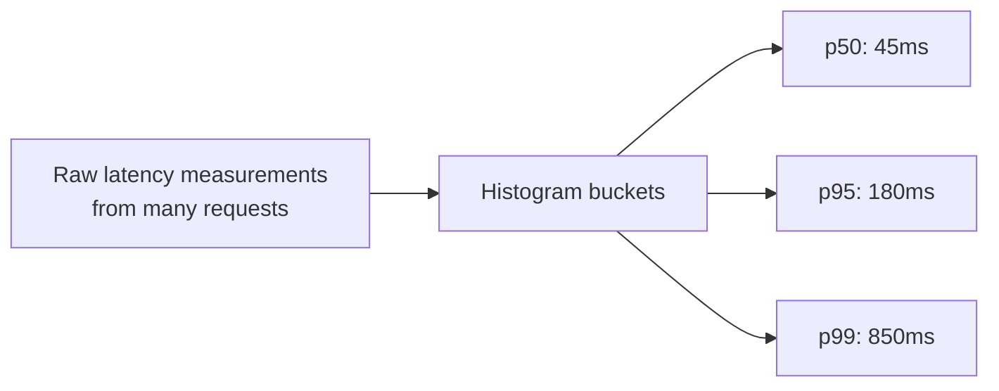

## Definition

Metrics are numerical measurements of system behavior collected and aggregated over time — request counts, latency percentiles, error rates, CPU usage — providing a compact, efficient way to understand a system's overall health and trends, in contrast to the detailed, per-event granularity of [Logging](/docs/observability/logging).

## Why it exists

Logs capture rich detail about individual events, but at scale, sifting through millions of individual log lines to understand overall system health ("is latency trending up? Are we seeing more errors than usual?") is impractical. Metrics exist to provide compact, pre-aggregated numerical summaries specifically designed for exactly this kind of at-a-glance, trend-level understanding.

## The problem it solves

Understanding whether a system is healthy right now, or how its behavior has trended over the past week, by manually inspecting individual log entries doesn't scale. Metrics solve this by continuously aggregating relevant numbers (counts, rates, percentiles) into a compact form specifically built for dashboards, trend analysis, and automated alerting.

## Real-world analogy

A car's dashboard doesn't show you a detailed log of every single engine event — it shows you a small number of continuously updated, aggregated gauges (speed, fuel level, engine temperature) that give you an immediate, at-a-glance sense of the car's current state, without needing to sift through raw sensor data. Metrics play exactly this role for a software system.

## Simple explanation

A metric is typically a name (like `http_requests_total` or `api_latency_p99`), a numerical value, and often labels/tags (like which service, which endpoint) for further breakdown — collected at regular intervals and stored efficiently for querying trends over time.

## Technical explanation

### Common metric types

- **Counter**: a value that only increases (e.g. total requests served) — useful for calculating rates (requests per second) by looking at the counter's rate of change.
- **Gauge**: a value that can go up or down (e.g. current memory usage, current number of active connections).
- **Histogram**: tracks the distribution of a value (like request latency) across configurable buckets, enabling percentile calculations (p50, p95, p99) rather than just an average.

```
http_requests_total{service="checkout", status="200"} 15234
api_latency_seconds{service="checkout", quantile="0.99"} 0.180
active_connections{service="checkout"} 42
```

## Internal working — why percentiles matter more than averages

As discussed in [Latency & Throughput](/docs/fundamentals/latency-and-throughput), a low average latency can hide a bad experience for a meaningful fraction of users — metrics systems specifically support histograms and percentile calculations (not just simple averages) precisely because p95/p99 latency is usually the more actionable, honest signal of real user experience.



## Advantages

- Extremely compact and efficient compared to storing and searching raw event logs, well-suited to real-time dashboards and long-term trend analysis.
- Enables automated [Alerting](/docs/observability/alerting) based on thresholds (e.g. "alert if error rate exceeds 5% for 5 minutes").
- Percentile-based metrics (via histograms) give a much more honest picture of real user experience than simple averages.

## Disadvantages

- Aggregated by nature — metrics tell you *that* something changed (error rate spiked) but not necessarily the specific detail of *why* for any individual case, which is where logs and [Tracing](/docs/observability/tracing) complement metrics.
- High-cardinality labels (e.g. tagging every metric by individual user ID) can cause serious performance and storage problems in most metrics systems, which are optimized for a bounded, relatively low number of distinct label combinations.

## Trade-offs

Metrics trade per-event detail (which logs provide) for extremely efficient, aggregated, trend-level visibility — the right tool for understanding overall system health and triggering alerts, and the wrong tool (on its own) for root-causing a specific individual failure, which usually needs correlated logs and traces as well.

## Complexity considerations

Collecting basic metrics (request counts, latency) is well-supported by most application frameworks and monitoring libraries out of the box. Designing a good metrics strategy — choosing meaningful metrics, appropriate label cardinality, and sensible retention/aggregation policies — requires more deliberate thought as a system and its metrics volume grow.

## When to use

- Essentially always, for any production system — metrics are foundational to dashboards, health checks, and automated alerting.

## When to be careful

- Avoid high-cardinality labels (like per-user or per-request-ID tags) on metrics, which can overwhelm most metrics systems — that level of per-event detail belongs in logs or traces instead.

## Common mistakes

- Only tracking average latency, missing the tail-latency problems that percentile-based metrics (p95/p99) would reveal.
- Using unbounded, high-cardinality labels on metrics (like tagging by individual user ID), causing serious performance and cost problems in the metrics backend.
- Not correlating metrics with logs/traces when investigating an issue — metrics tell you something's wrong and roughly when, but usually not the specific root cause on their own.

## Interview questions

- "Why do metrics systems typically use histograms for latency rather than just tracking an average?"
- "What's the risk of using a high-cardinality label (like user ID) on a metric?"
- "How do metrics complement logs and traces in debugging a production incident?"

## Practical example

A checkout service exposes metrics for request count, error rate, and p50/p95/p99 latency, broken down by endpoint — a dashboard built on these metrics gives the on-call engineer an immediate, at-a-glance view of whether checkout is currently healthy, and an automated alert fires if the error rate or p99 latency crosses a defined threshold.

## Production example

Prometheus (an open-source metrics collection and querying system, often paired with Grafana for dashboards) has become a dominant standard in cloud-native infrastructure specifically for its efficient handling of counters, gauges, and histograms at scale, and its tight integration with Kubernetes and modern alerting workflows.

## Best practices

- Use percentile-based (histogram) metrics for latency, not just averages.
- Keep metric label cardinality bounded — avoid tagging metrics with high-cardinality values like individual user or request IDs.
- Correlate metrics with logs and traces (often via a shared trace ID or timestamp) when investigating a specific incident, rather than relying on metrics alone to root-cause a problem.

## Summary

Metrics are compact, aggregated numerical measurements of system behavior — counters, gauges, and histograms — providing efficient, trend-level visibility into system health, essential for dashboards and automated alerting. They trade per-event detail (which logs and traces provide) for scale and efficiency, making them the right tool for knowing something is wrong and roughly when, while root-causing the specific "why" typically requires correlating with logs and traces as well.

## References

- Prometheus documentation
- Google SRE Book: Monitoring Distributed Systems

<Quiz questions={[
  {
    q: "Why is tagging a metric with a high-cardinality label like individual user ID generally a bad practice?",
    options: [
      "Metrics systems don't support labels at all",
      "Most metrics systems are optimized for a bounded, relatively low number of distinct label combinations, and high-cardinality labels can cause serious performance and storage problems",
      "User IDs cannot be represented as numbers",
      "This is actually a recommended best practice"
    ],
    answer: 1,
    explanation: "Metrics systems are generally optimized for efficient aggregation across a manageable number of distinct label combinations — a high-cardinality label like per-user tagging can explode the number of unique time series being tracked, causing serious performance and cost issues; that level of per-event detail belongs in logs or traces instead."
  }
]} />
