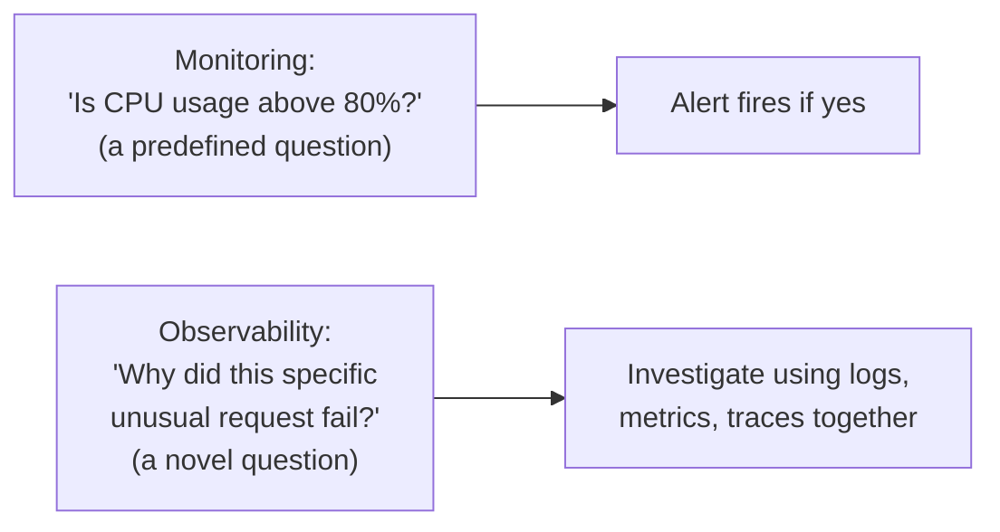
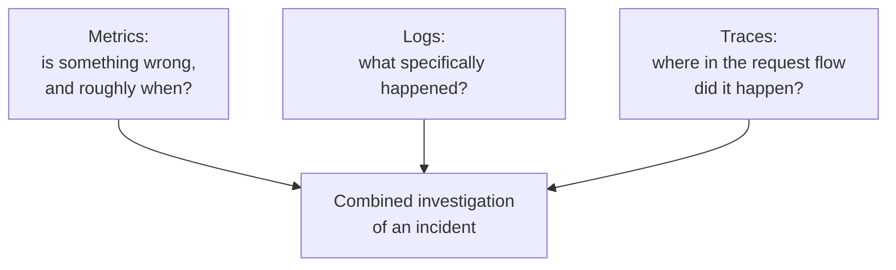

## Definition

Monitoring is the practice of continuously watching a system's behavior and health — typically via dashboards built on [Metrics](/docs/observability/metrics), supplemented by [Logging](/docs/observability/logging) and [Tracing](/docs/observability/tracing) — to detect problems, understand trends, and inform [Alerting](/docs/observability/alerting).

## Why it exists

A system running in production needs continuous, ongoing visibility into its own health — not just after something breaks, but constantly, so problems can be caught early (or even predicted) and understood in context. Monitoring exists to provide this always-on visibility, bringing together the various observability signals (logs, metrics, traces) into a coherent, ongoing practice of watching a system.

## The problem it solves

Without active monitoring, teams only learn about problems when a user complains, or when a failure becomes severe enough to be impossible to miss — far too late, and without the context needed to understand what actually went wrong. Monitoring solves this by providing continuous, proactive visibility, catching issues (ideally) before they become significant user-facing problems.

## Real-world analogy

A hospital's patient monitoring equipment continuously tracks vital signs (heart rate, blood pressure, oxygen levels) — not because something is necessarily wrong right now, but so that any concerning trend or sudden change is caught immediately, by the right people, rather than being discovered too late. Application monitoring plays exactly this role for a software system's "vital signs."

## Simple explanation

Monitoring means having dashboards and automated checks that continuously reflect a system's current health (is it up? Is latency normal? Is the error rate acceptable?) — combining metrics for the "vital signs" view, logs for detailed investigation, and traces for understanding cross-service request flow, all watched on an ongoing basis.

## Technical explanation

### Monitoring vs. observability

These terms are often used together but mean subtly different things:

- **Monitoring** is the practice of watching known, predefined signals (dashboards, alerts) for expected kinds of problems.
- **Observability** is the broader property of a system that lets you ask *new*, previously unanticipated questions about its internal state, using the data it exposes (logs, metrics, traces) — even for problems you didn't specifically build a dashboard for in advance.

A well-monitored system tells you when a known threshold is crossed; a well-observable system lets you investigate and understand a genuinely novel, unanticipated problem using its existing telemetry, without needing to have predicted that exact failure mode ahead of time.

## Internal working — the three pillars working together

Effective monitoring typically starts with metrics-based dashboards and alerts (catching that something is wrong, and roughly when), then uses logs and traces to dig into the specific detail and root cause once an issue is detected.

## Advantages

- Provides continuous, proactive visibility into system health, catching problems earlier than waiting for user complaints.
- Combining metrics, logs, and traces gives both the high-level "something's wrong" signal and the detailed context needed to actually understand and fix it.
- Well-designed monitoring dashboards give the whole team (not just whoever wrote a specific piece of code) a shared, current view of system health.

## Disadvantages

- Monitoring only what you thought to watch in advance (dashboards for known failure modes) can miss genuinely novel problems — this is exactly the gap true observability aims to close.
- Poorly designed monitoring (too many low-value dashboards, unclear ownership of what to watch) can create noise without actually improving anyone's ability to detect or diagnose real problems.

## Trade-offs

Investing heavily in comprehensive monitoring and observability infrastructure costs real engineering time and operational overhead, but the alternative — flying blind in production — risks far more costly, slower-to-diagnose incidents; the right level of investment scales with how critical and complex the system actually is.

## Complexity considerations

Basic monitoring (a few key dashboards, simple alerts) is achievable with modest effort using standard tools. Building genuine observability — rich enough telemetry and tooling to investigate any novel, unanticipated issue — is a more significant, ongoing investment, generally worth it specifically for complex, business-critical systems.

## When to invest heavily

- Production systems of real business criticality, especially complex, multi-service architectures where problems can have subtle, hard-to-anticipate root causes.

## When simpler monitoring suffices

- Small, simple systems with low criticality, where a handful of basic health dashboards and alerts provide sufficient visibility without needing a full observability investment.

## Common mistakes

- Building dashboards only for problems that have already happened before, without investing in the broader observability (rich structured logs, tracing) needed to investigate genuinely new kinds of issues.
- Alert fatigue from poorly tuned monitoring — too many low-value or overly sensitive alerts, causing real, important alerts to get lost in the noise (see [Alerting](/docs/observability/alerting)).
- Treating monitoring as a one-time setup rather than an evolving practice that should be revisited as the system and its failure modes change over time.

## Interview questions

- "What's the difference between monitoring and observability?"
- "How would you design monitoring for a new microservice to ensure you'd catch both known and novel failure modes?"
- "Why is combining metrics, logs, and traces more effective than relying on any single one alone?"

## Practical example

A team monitoring a checkout service maintains a dashboard tracking request rate, error rate, and p99 latency (metrics), with structured logs capturing detailed request/response information, and distributed tracing across the checkout flow's dependent services — when an alert fires for elevated error rate, the team uses logs and traces to quickly pinpoint the specific failing dependency, rather than needing to guess.

## Production example

Google's Site Reliability Engineering practice is built substantially around comprehensive monitoring — explicit SLOs backed by dashboards and alerting, combined with detailed logging and tracing for root-cause investigation — as a foundational discipline for operating complex systems reliably at scale.

## Best practices

- Build monitoring around your actual [Non-functional Requirements](/docs/fundamentals/non-functional-requirements) (SLOs) — latency, error rate, availability — rather than arbitrary metrics.
- Invest in genuine observability (structured logs, tracing), not just a fixed set of dashboards, so novel, unanticipated issues can still be investigated effectively.
- Regularly review and prune monitoring/alerting configuration to avoid alert fatigue and keep dashboards genuinely useful, not just accumulated clutter.

## Summary

Monitoring is the continuous practice of watching a system's health, typically via metrics-based dashboards supplemented by logs and traces, to detect and understand problems as (or before) they occur. It's distinct from — but foundational to — true observability, which is the broader capability to investigate genuinely novel, unanticipated issues using a system's telemetry, not just the specific failure modes anticipated in advance.

## References

- Google SRE Book: Monitoring Distributed Systems
- "Observability Engineering" by Charity Majors, Liz Fong-Jones, George Miranda

<Quiz questions={[
  {
    q: "What's the key distinction between monitoring and observability?",
    options: [
      "They mean exactly the same thing",
      "Monitoring watches known, predefined signals for expected problems; observability is the broader ability to investigate genuinely novel, unanticipated issues using a system's telemetry",
      "Observability doesn't use metrics at all",
      "Monitoring is only relevant for databases"
    ],
    answer: 1,
    explanation: "Monitoring typically involves dashboards and alerts for problems you anticipated in advance; observability is the deeper property of having rich enough telemetry (logs, metrics, traces) to investigate and understand problems you didn't specifically predict or build a dashboard for ahead of time."
  }
]} />
