## Definition

Distributed tracing tracks a single request's complete journey as it flows through multiple services in a distributed system, recording the timing and relationship of each step (called a "span") into a single, connected trace — letting engineers see exactly where time was spent and where something went wrong across an entire multi-service call chain.

## Why it exists

In a microservices architecture, a single user-facing request might touch a dozen different services — logs and metrics from each individual service, viewed in isolation, don't show the full picture of how that one request flowed through and was affected by all of them together. Distributed tracing exists specifically to reconstruct that full, cross-service picture for a single request.

## The problem it solves

When a request is slow or fails in a system built from many services, figuring out *which* specific service in the chain was the actual cause requires correlating logs across all of them manually — slow, tedious, and error-prone at any real scale. Distributed tracing solves this by explicitly tracking and connecting every step of a single request's journey, visualized as one coherent timeline.

## Real-world analogy

If each service's individual logs are like separate security cameras in different rooms of a building, each only showing what happened in that one room, distributed tracing is like being able to follow one specific visitor's entire path through the whole building on a single, stitched-together timeline — seeing exactly how long they spent in each room and in what order, rather than needing to manually cross-reference footage from a dozen separate, disconnected cameras.

## Simple explanation

Each request gets a unique **trace ID** when it first enters the system; as it passes through each service, that service creates a **span** (a timed record of the work it did) tagged with the same trace ID, and these spans are later assembled into a single, visual timeline showing the whole request's journey.

## Technical explanation

### Trace structure

```mermaid
gantt
    title Trace for a single "place order" request
    dateFormat X
    axisFormat %L ms
    section API Gateway
    Total request : 0, 220
    section Auth Service
    Verify token : 5, 15
    section Orders Service
    Create order : 20, 90
    section Inventory Service
    Check stock : 30, 70
    section Payment Service
    Charge card : 95, 200
```

Each span records its own start/end time and is linked to its parent span (e.g. "Charge card" is a child of the overall "Total request" span) — assembled together, this reveals not just that the request took 220ms total, but specifically that the Payment Service's "Charge card" step was the largest contributor to that latency.

### Context propagation

For tracing to work across service boundaries, the trace ID (and current span ID) must be passed along with every downstream call — typically via HTTP headers — so each service knows which trace it's contributing to and which span is its immediate parent.

## Internal working — sampling

At high traffic volumes, tracing every single request in full detail can be prohibitively expensive (in both storage and performance overhead). Most production tracing systems use **sampling** — recording full traces for only a fraction of requests (e.g. 1%, or with a bias toward capturing slow or failed requests specifically) — balancing visibility against overhead.

## Advantages

- Reveals exactly where time is spent (and where failures occur) across an entire multi-service request, something individual services' logs and metrics can't show in isolation.
- Dramatically speeds up debugging latency and failure issues in microservices architectures, compared to manually correlating separate logs.
- Sampling strategies let tracing scale to very high-traffic systems without capturing (and paying the overhead of) every single request in full detail.

## Disadvantages

- Requires instrumentation across every service in the call chain — a service that doesn't properly propagate and record trace context creates a gap in the trace.
- Adds some overhead (however small) to every instrumented request.
- Sampling means not every single request has a full trace available, which can occasionally be limiting when investigating a specific, non-sampled request after the fact.

## Trade-offs

Full tracing of every request gives complete visibility but at real storage and performance cost; sampling reduces that cost significantly but means some individual requests won't have a trace available if you need to investigate them specifically after the fact — most production systems bias sampling toward capturing slow or failed requests, where tracing is most valuable anyway.

## Complexity considerations

Basic tracing instrumentation (propagating a trace ID) is well-supported by most modern frameworks and tracing libraries (following the OpenTelemetry standard, increasingly). Achieving consistent, complete tracing across a large, heterogeneous microservices architecture (many languages, many teams) requires organization-wide instrumentation discipline, not just adopting a tool.

## When to use

- Microservices architectures where a single user request touches multiple services, and understanding cross-service latency and failure causes is important.

## When it's less critical

- Simple, single-service (or monolithic) architectures, where a request's entire journey is already visible within one service's own logs, without needing to correlate across service boundaries.

## Common mistakes

- Instrumenting only some services in a call chain, leaving gaps in traces that make them far less useful for understanding the complete request journey.
- Sampling too aggressively (too low a rate) for a system where investigating specific, individual failed requests after the fact is important, without at least biasing sampling toward capturing failures.
- Not correlating trace IDs with logs, missing an opportunity to jump directly from a specific trace to the detailed log lines for that same request.

## Interview questions

- "Why do individual services' logs and metrics fall short when debugging latency issues in a microservices architecture?"
- "How does a trace ID get propagated across service boundaries, and what happens if one service in the chain doesn't participate?"
- "Why do most production tracing systems use sampling instead of tracing every single request in full detail?"

## Practical example

An e-commerce checkout request is traced end-to-end across the API gateway, auth service, orders service, inventory service, and payment service — when a specific checkout request is slow, the trace immediately reveals that the payment service's card-charging step, not any of the other services, is where the majority of the latency actually occurred.

## Production example

Uber's engineering team built and open-sourced Jaeger, a widely used distributed tracing system, specifically to handle debugging latency and failures across their large, complex microservices architecture — tracing has become a standard, often essential tool for any organization operating at that level of service decomposition.

## Best practices

- Instrument every service in a call chain consistently (ideally via a shared standard like OpenTelemetry), to avoid gaps in traces.
- Bias sampling toward capturing slow or failed requests, where tracing provides the most debugging value, rather than sampling uniformly at random.
- Correlate trace IDs with logs, so engineers can move seamlessly between a trace's high-level timeline and the detailed log lines for the same request.

## Summary

Distributed tracing follows a single request's complete journey across multiple services, connecting timed spans from each service into one coherent timeline — revealing exactly where time was spent and where failures occurred in a way individual services' logs and metrics can't show on their own. It's essential for debugging microservices architectures effectively, requiring consistent instrumentation across services and (at scale) a deliberate sampling strategy to manage overhead.

## References

- OpenTelemetry documentation
- Uber Engineering Blog: Jaeger

<Quiz questions={[
  {
    q: "Why is distributed tracing particularly valuable in a microservices architecture, compared to a monolithic one?",
    options: [
      "It's equally valuable in both, with no real difference",
      "A single request in a microservices architecture touches many separate services, and tracing connects each service's contribution into one coherent timeline that individual services' logs can't show alone",
      "Tracing only works for monolithic architectures",
      "Tracing replaces the need for logging entirely"
    ],
    answer: 1,
    explanation: "In a microservices architecture, a single request's full journey is spread across many independently logged services — tracing specifically stitches together each service's contribution (as spans) into one connected view, which is far more valuable than in a monolith where the whole request naturally stays within one service's own logs."
  }
]} />
