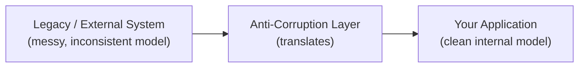
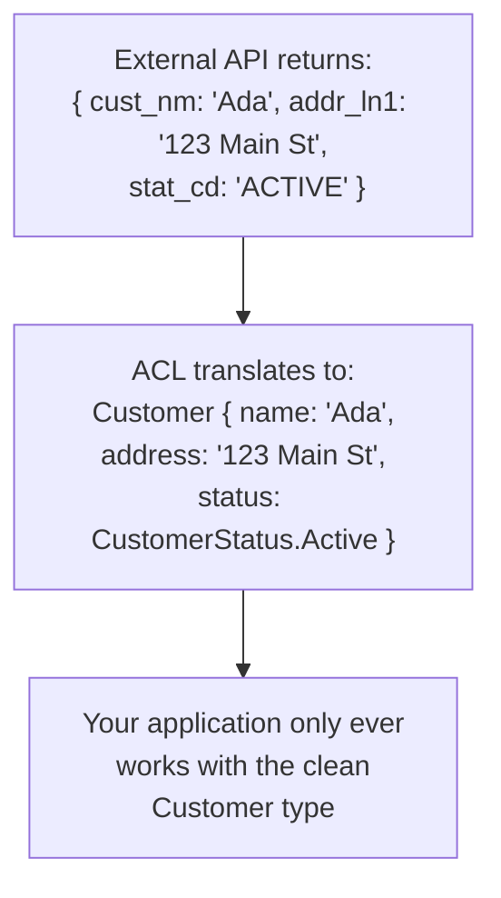

## Definition

An Anti-Corruption Layer (ACL) is a translation layer placed between two systems with different data models — typically a clean, well-designed system and a messy legacy or external system — that translates between the two, preventing the external system's model, quirks, and inconsistencies from "leaking" into and corrupting the internal system's own clean design.

## Why it exists

When integrating with a legacy system, a third-party API, or any external system with an awkward or inconsistent data model, it's tempting to just adopt that external model directly in your own code for expediency — but doing so lets that system's specific quirks, inconsistencies, and design mistakes spread into your own codebase over time. The Anti-Corruption Layer exists specifically to draw a firm boundary, translating at the edge so your internal model stays clean and coherent regardless of how messy the systems you integrate with are.

## The problem it solves

Directly wiring your application's core logic to an external system's exact data shapes and quirks means every subsequent piece of code that touches that data inherits those quirks too — and when that external system changes or is eventually replaced, the awkward, dated assumptions have often spread throughout your codebase, requiring an expensive, wide-reaching rewrite. An ACL solves this by containing the messiness entirely at one well-defined translation boundary.

## Real-world analogy

A skilled interpreter working between two parties speaking different languages doesn't just relay words literally — they translate concepts, idioms, and cultural context so each party genuinely understands the other's actual intent, rather than a confusing, literal, word-for-word rendering that imports the other language's grammar and quirks into the conversation. An Anti-Corruption Layer plays exactly this translating, protective role between two different systems' data models.

## Simple explanation

Rather than directly using an external system's exact data structures and terminology throughout your own application, you build a translation layer at the boundary that converts the external model into your own clean, internal model — your application's core logic only ever deals with your own well-designed types, never directly with the external system's specific quirks.

## Technical explanation

The ACL typically implements an adapter or facade that exposes your application's own clean interface, internally handling all the translation logic needed to map to and from the external system's actual data shapes — your core application code never directly references the external system's specific field names, quirks, or inconsistencies.

## Internal working — a concrete example

If the external system later changes its field names, or you switch to an entirely different external provider, only the ACL's translation logic needs to change — your application's own internal model and all the code built around it remain untouched.

## Advantages

- Keeps your application's internal model clean, consistent, and free of external systems' quirks and inconsistencies.
- Isolates the impact of external system changes (or a full provider switch) to just the ACL, rather than requiring changes throughout your entire codebase.
- Makes it easier to reason about and test your core application logic, since it only deals with your own well-designed types.

## Disadvantages

- Adds an extra translation layer and some development effort, which can feel like unnecessary overhead for a very simple, stable integration.
- If not carefully maintained, an ACL can itself become a complex, poorly-understood piece of code, especially if it needs to handle many edge cases and inconsistencies in the external system's data.

## Trade-offs

An Anti-Corruption Layer trades some upfront translation-layer development effort for long-term protection of your internal model's cleanliness and independence from external systems' quirks — a valuable trade when integrating with a genuinely messy, unstable, or likely-to-change external system, and possibly unnecessary overhead for a very simple, stable, well-designed external API that doesn't actually need translation.

## Complexity considerations

A simple ACL translating a small number of fields between two reasonably similar models is straightforward. Translating a genuinely complex, inconsistent, or poorly documented legacy system's model can require substantial effort and careful, ongoing maintenance as edge cases are discovered.

## When to use

- Integrating with a legacy system, a messy or inconsistent external API, or any system whose data model you don't control and don't want to leak into your own application's design.
- Situations where you anticipate potentially switching or replacing the external system later, and want that change to be isolated to one layer.

## When NOT to use

- Integrating with a very simple, stable, well-designed external system whose model already aligns well with your own — adding a translation layer here may be unnecessary overhead for little real benefit.

## Common mistakes

- Skipping the ACL for expediency and directly adopting an external system's messy model throughout your application, only to face a painful, wide-reaching cleanup later when that system changes or is replaced.
- Letting the ACL itself become poorly maintained or untested, undermining its purpose as a clean, well-understood boundary.
- Over-engineering an ACL for a genuinely simple, stable integration that didn't really need one.

## Interview questions

- "Why might you build an Anti-Corruption Layer when integrating with a legacy system, rather than directly adopting its data model?"
- "What happens to your application if the external system behind an ACL changes, versus if you'd adopted its model directly?"
- "When would building an ACL be unnecessary overhead?"

## Practical example

A modern e-commerce platform integrating with an older, legacy inventory management system (with inconsistent field naming and outdated status codes) builds an Anti-Corruption Layer that translates the legacy system's awkward responses into the platform's own clean `Product` and `InventoryStatus` types — when the company eventually replaces the legacy inventory system with a modern one, only the ACL's translation logic needs to change, leaving the rest of the e-commerce platform's code untouched.

## Production example

The concept originates from Eric Evans' Domain-Driven Design methodology, and is widely applied in enterprise software integrating with legacy systems — many large organizations maintain explicit ACLs specifically at the boundary between modern services and older, harder-to-change legacy systems that can't be immediately replaced.

## Best practices

- Build an ACL at any boundary with a system whose data model is messy, inconsistent, or outside your control, especially if you anticipate it might change or be replaced.
- Keep the ACL's translation logic well-tested and maintained, since it's a critical, easily overlooked piece of the overall system's correctness.
- Avoid over-engineering an ACL for genuinely simple, stable, well-designed external integrations that don't need this protection.

## Summary

An Anti-Corruption Layer translates between an external system's (often messy or legacy) data model and your own application's clean internal model, containing the external system's quirks and inconsistencies at one well-defined boundary rather than letting them spread throughout your codebase. It's a valuable investment when integrating with unstable, inconsistent, or likely-to-change external systems, isolating the impact of any future changes to just the translation layer itself.

## References

- Evans, E. "Domain-Driven Design: Tackling Complexity in the Heart of Software" (2003, origin of the pattern)
- Fowler, M. and colleagues' writings on ACL in microservices contexts

<Quiz questions={[
  {
    q: "What is the main benefit of an Anti-Corruption Layer when integrating with a messy legacy system?",
    options: [
      "It makes the legacy system faster",
      "It contains the legacy system's quirks and inconsistencies at one translation boundary, keeping your own application's internal model clean and isolating the impact of future changes to that one layer",
      "It automatically fixes bugs in the legacy system",
      "It eliminates the need for any integration code at all"
    ],
    answer: 1,
    explanation: "Without an ACL, a legacy or external system's awkward model tends to spread throughout the code that integrates with it; an ACL translates at one well-defined boundary, so your application's own model stays clean and any future change to (or replacement of) the external system only requires updating the ACL, not your entire codebase."
  }
]} />
