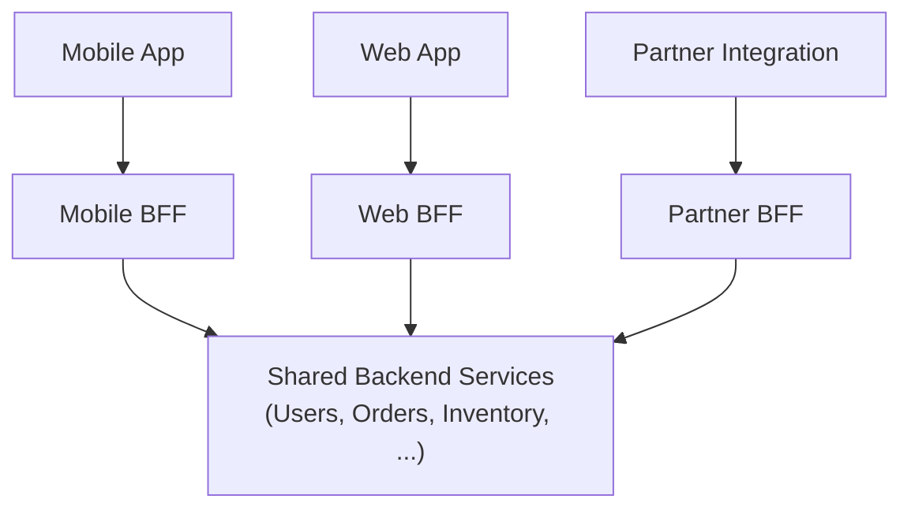

## Definition

Backend for Frontend (BFF) is a pattern where a dedicated backend service is built for each specific client type (mobile app, web application, third-party partner API) rather than forcing all clients to share one, general-purpose backend — each BFF is tailored to exactly the data shape and needs of its specific client.

## Why it exists

Different client types often have meaningfully different needs from the same underlying data — a mobile app wants a minimal, bandwidth-conscious payload; a rich web dashboard wants much more detail; a third-party partner API needs a stable, versioned contract independent of internal changes. A single, general-purpose [API Gateway](/docs/networking/api-gateway) or backend trying to serve all of these well ends up compromising for everyone. BFF exists to let each client type get a backend genuinely optimized for its own specific needs.

## The problem it solves

A single shared backend serving very different client types tends to accumulate special-case logic for each one ("if mobile, return this smaller payload; if web, include this extra data"), becoming increasingly tangled and hard to maintain as more client types and special cases are added. BFF solves this by giving each client type its own dedicated backend, free to evolve independently without needing special-case branches serving unrelated clients.

## Real-world analogy

A hospital doesn't have one single, generic intake desk trying to handle every kind of patient need identically — different departments (emergency, outpatient, maternity) each have their own dedicated intake process, tailored to their specific patients' needs, even though they all ultimately draw on the same underlying hospital systems and records. BFF applies this same idea: dedicated, tailored front-line services per client type, backed by shared underlying systems.

## Simple explanation

Instead of one general-purpose backend serving a mobile app, a web app, and a partner API all through the same endpoints, you build a separate BFF for each — the Mobile BFF returns lean, minimal payloads optimized for mobile bandwidth; the Web BFF returns richer, more complete data suited to a full dashboard; the Partner BFF exposes a stable, carefully versioned contract independent of internal changes.

## Technical explanation

Each BFF is typically thin — it doesn't reimplement core business logic, but instead calls the same underlying shared services (much like an [API Gateway](/docs/networking/api-gateway) doing [API Composition](/docs/microservices/api-composition)), tailoring and shaping the aggregated response specifically for its one client type.

## Internal working — team ownership

A key practical benefit of BFF: each BFF is often owned by the same team that owns its corresponding client (the mobile team owns the Mobile BFF, the web team owns the Web BFF) — letting each team evolve their specific backend needs independently, without needing to coordinate changes through a single, shared, general-purpose backend team.

## Advantages

- Each client gets a backend genuinely tailored to its specific needs, without special-case logic serving unrelated clients cluttering a shared codebase.
- Different client teams can own and evolve their specific BFF independently, reducing cross-team coordination overhead.
- Avoids over-fetching or awkward compromises that a single, general-purpose backend serving very different clients tends to accumulate.

## Disadvantages

- Introduces some duplication across BFFs — similar aggregation or transformation logic might be repeated (with variations) across the Mobile, Web, and Partner BFFs.
- More services to build, deploy, and maintain overall, compared to a single shared backend.
- Risk of business logic creeping into a BFF (rather than staying in shared underlying services), which can lead to inconsistencies between different BFFs over time if not carefully governed.

## Trade-offs

BFF trades some duplication and an increased number of deployed services for backends genuinely tailored to each client's specific needs and independently owned by the relevant client team — a good trade when client needs genuinely diverge significantly, and unnecessary overhead when a single shared backend already serves all clients reasonably well.

## Complexity considerations

Introducing BFFs adds real operational surface area (more services to deploy and monitor) — generally justified specifically when client needs have diverged enough that a single shared backend has become genuinely awkward or heavily special-cased, not as a default architectural starting point for every system.

## When to use

- Systems serving genuinely different client types (mobile, web, third-party partners) with meaningfully different data shape and aggregation needs from the same underlying services.
- Organizations where different client teams want to own and evolve their specific backend independently.

## When NOT to use

- Systems with only one client type, or where all client types have essentially identical needs from the backend — a single shared API is simpler and avoids unnecessary duplication.

## Common mistakes

- Introducing BFFs prematurely, before client needs have actually diverged enough to justify the added complexity and duplication.
- Letting core business logic creep into individual BFFs rather than keeping it in shared underlying services, causing inconsistent behavior to develop across different BFFs over time.
- Not clearly defining what belongs in a BFF (aggregation, client-specific shaping) versus what belongs in shared services (actual business logic), leading to architectural drift.

## Interview questions

- "Why might a mobile app and a web dashboard benefit from separate backends rather than sharing one general-purpose API?"
- "What's the risk of business logic creeping into a BFF rather than staying in shared underlying services?"
- "When would introducing BFFs be unnecessary complexity for a given system?"

## Practical example

A social media platform builds a Mobile BFF that returns lean, minimal post data (optimized for a small screen and limited bandwidth) and a Web BFF that returns richer post data including additional metadata used only in the full desktop experience — both BFFs call the same underlying Posts, Users, and Comments services, but shape and aggregate the response very differently for their specific client.

## Production example

SoundCloud and Netflix have both publicly described adopting the Backend for Frontend pattern specifically to let different client platform teams (mobile, web, TV) build and own backends tailored to their platform's specific constraints and needs, rather than forcing every client through one increasingly special-cased, shared API.

## Best practices

- Keep BFFs thin — aggregation and client-specific shaping only, with actual business logic staying in shared underlying services.
- Let each client team own their corresponding BFF, aligning ownership with the teams best positioned to understand that client's specific needs.
- Introduce BFFs specifically once client needs have genuinely diverged, not preemptively for a system with a single, uniform client type.

## Summary

Backend for Frontend builds a dedicated backend for each specific client type, tailored to that client's exact data shape and needs, rather than forcing all clients through one general-purpose backend that inevitably compromises for at least some of them. It trades some duplication and additional deployed services for backends genuinely optimized for each client and independently ownable by the relevant client team — the right trade specifically once client needs have diverged enough to justify it.

## References

- Newman, S. "Building Microservices" (BFF pattern discussion)
- SoundCloud Engineering Blog: Backend for Frontend

<Quiz questions={[
  {
    q: "Why might a company build separate Mobile and Web BFFs rather than one shared API for both?",
    options: [
      "Mobile and web apps cannot technically share a backend",
      "Mobile and web clients often have meaningfully different data shape and bandwidth needs, and a shared backend serving both well tends to accumulate awkward special-case logic for each",
      "BFFs are required by law for mobile applications",
      "There's never a good reason to separate them"
    ],
    answer: 1,
    explanation: "Different client types (mobile vs. web) often genuinely need different data shapes and levels of detail — a shared backend trying to serve both well tends to become cluttered with special cases, while dedicated BFFs let each be tailored cleanly to its specific client's actual needs."
  }
]} />
