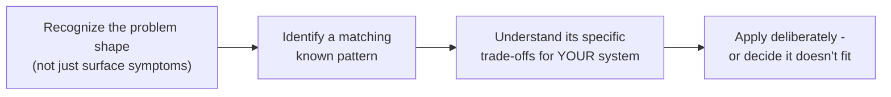

## Definition

A system design pattern is a named, reusable solution to a recurring structural problem in distributed systems — not a specific library or piece of code, but a general approach (with known trade-offs) that's been observed to work well across many different systems facing the same underlying problem.

## Why it exists

Many system design problems recur across completely different companies and domains: how do you gradually replace a legacy system without a risky big-bang rewrite? How do you add cross-cutting infrastructure logic (logging, TLS, retries) to a service without duplicating it in every language your services are written in? Design patterns exist because once a problem and its solution shape have been recognized and named enough times, giving it a shared vocabulary lets engineers communicate a complex idea in a single term, and lets teams draw on already-proven trade-offs rather than reinventing a solution from scratch each time.

## The problem it solves

Without named patterns, teams facing a well-understood, recurring problem often either reinvent an inferior, ad-hoc solution, or fail to recognize that a problem they're facing has a well-known, well-understood shape at all. Naming and cataloging these patterns solves both: it gives teams a starting point with known trade-offs, and a shared vocabulary for discussing architecture decisions clearly and quickly.

## Real-world analogy

Architectural patterns in building design — a "courtyard house" or a "load-bearing wall" — let architects communicate complex structural ideas in a word or two, drawing on centuries of accumulated experience about when each pattern works well and what its limitations are, rather than re-deriving structural engineering principles from first principles for every new building. Software design patterns serve exactly this same communicative and knowledge-transfer purpose.

## Simple explanation

Each pattern in this section names a specific, recurring problem and a general shape of solution — along with its trade-offs — so you can recognize when your own system faces that same underlying problem and draw on already-understood solutions rather than starting from scratch.

## Technical explanation

The patterns covered in this section specifically address **structural and integration** concerns that don't fit neatly into the more specific categories elsewhere in this course (databases, caching, messaging) — patterns for evolving legacy systems safely ([Strangler Fig](/docs/patterns/strangler-fig)), attaching cross-cutting infrastructure to a service without duplicating it in every language ([Sidecar](/docs/patterns/sidecar), [Ambassador](/docs/patterns/ambassador)), serving different client types well from one backend ([Backend for Frontend](/docs/patterns/backend-for-frontend)), and protecting a clean internal model from a messy external one ([Anti-Corruption Layer](/docs/patterns/anti-corruption-layer)).

Other important, frequently tested patterns are covered in their most natural home elsewhere in this course rather than repeated here:

- **Circuit Breaker**, **Retry**, **Bulkhead**, **Saga**, **API Composition**, **Database per Service** — see [Microservices](/docs/microservices/microservices).
- **CQRS**, **Event Sourcing** — see [Messaging](/docs/messaging/cqrs).
- **Cache-Aside**, **Write-Through**, **Write-Back** — see [Caching Strategies](/docs/caching/caching-strategies).

## Internal working — how to actually use a pattern

The most common misuse of design patterns isn't picking the wrong one — it's applying a pattern reflexively, because it's familiar or trendy, to a problem that doesn't actually have the shape the pattern was designed to solve.

## Advantages

- Provides a shared vocabulary that speeds up architecture discussions and design reviews significantly.
- Lets teams draw on already-understood trade-offs rather than discovering them the hard way in production.
- Helps engineers recognize a recurring problem's true shape, rather than treating every new system as an entirely novel design challenge.

## Disadvantages

- Patterns can be misapplied — forced onto a problem that only superficially resembles the pattern's actual intended use case, adding unnecessary complexity for no real benefit.
- Knowing pattern names without understanding their actual trade-offs can lead to cargo-cult architecture decisions ("we should use a sidecar because it sounds sophisticated") rather than deliberate, reasoned ones.

## Trade-offs

Every pattern in this section (and throughout this course) exists specifically because it solves one problem at the cost of something else — there's no pattern that's a strict, no-downside improvement over simpler alternatives; the skill is matching the pattern to a problem that actually has its shape, and understanding what you're trading away by adopting it.

## Complexity considerations

Introducing any pattern adds some complexity relative to the simplest possible solution — that complexity is worth it specifically when the pattern solves a real, present problem, and not worth it when applied preemptively to a problem you don't actually have yet.

## When to use a design pattern

- When you recognize your system facing a problem with a well-understood, previously-named shape, and the pattern's known trade-offs are ones you're willing to accept.

## When NOT to reach for one

- When a much simpler, more direct solution would work just as well — patterns are tools for recurring, structurally recognized problems, not a checklist to apply to every system regardless of actual need.

## Common mistakes

- Applying a well-known pattern reflexively or for its own sake, rather than because the specific problem it solves is genuinely present.
- Learning pattern names without understanding the trade-offs each one makes, leading to decisions that sound sophisticated but don't actually fit the situation.
- Assuming a listed pattern is a complete, ready-to-use solution rather than a general shape that still needs to be adapted thoughtfully to your specific system.

## Interview questions

- "What problem is [a specific pattern] actually designed to solve, and what does it cost you in exchange?"
- "Why might applying [a specific pattern] here be unnecessary or even harmful?"
- "How would you recognize that your system is facing a problem with a well-known pattern shape?"

## Practical example

A team migrating a legacy monolith recognizes their situation matches the [Strangler Fig](/docs/patterns/strangler-fig) pattern's shape (gradually replacing pieces of an existing system while it continues operating) rather than attempting a risky, all-at-once rewrite — drawing on the pattern's well-understood approach and known pitfalls rather than improvising a migration strategy from scratch.

## Production example

Martin Fowler's website and writings (martinfowler.com) have been highly influential in cataloging, naming, and popularizing many of the patterns covered across this course — Strangler Fig, CQRS, and many others were significantly popularized through his and his colleagues' writing, giving the industry a shared vocabulary for these recurring architectural problems.

## Best practices

- Learn a pattern's actual problem and trade-offs, not just its name, before applying it.
- Confirm your system genuinely faces the specific problem shape a pattern addresses before adopting it.
- Treat each pattern as a starting point to adapt to your specific context, not a rigid, one-size-fits-all template.

## Summary

Design patterns are named, reusable solutions to recurring structural problems in distributed systems, providing a shared vocabulary and a starting point of known trade-offs rather than requiring every team to rediscover the same solutions independently. Used well, they speed up architecture discussions and decision-making; used reflexively, they add unnecessary complexity to problems that didn't actually need them.

## References

- Fowler, M. martinfowler.com (extensive cataloging of system design and enterprise patterns)
- Gamma, Helm, Johnson, Vlissides, "Design Patterns: Elements of Reusable Object-Oriented Software" (the original, foundational patterns text, though focused on object-oriented software design rather than distributed systems specifically)

<Quiz questions={[
  {
    q: "What is the most common way design patterns are misapplied in practice?",
    options: [
      "Patterns are never actually misapplied",
      "Applying a pattern reflexively or because it sounds sophisticated, rather than because the system genuinely faces the specific problem shape the pattern is designed to solve",
      "Using too few patterns in a single system",
      "Patterns can only be used in object-oriented programming"
    ],
    answer: 1,
    explanation: "The most common misuse is reaching for a well-known pattern out of familiarity or habit rather than because the actual problem at hand genuinely matches the shape the pattern was designed to address — adding complexity without a real, corresponding benefit."
  }
]} />
