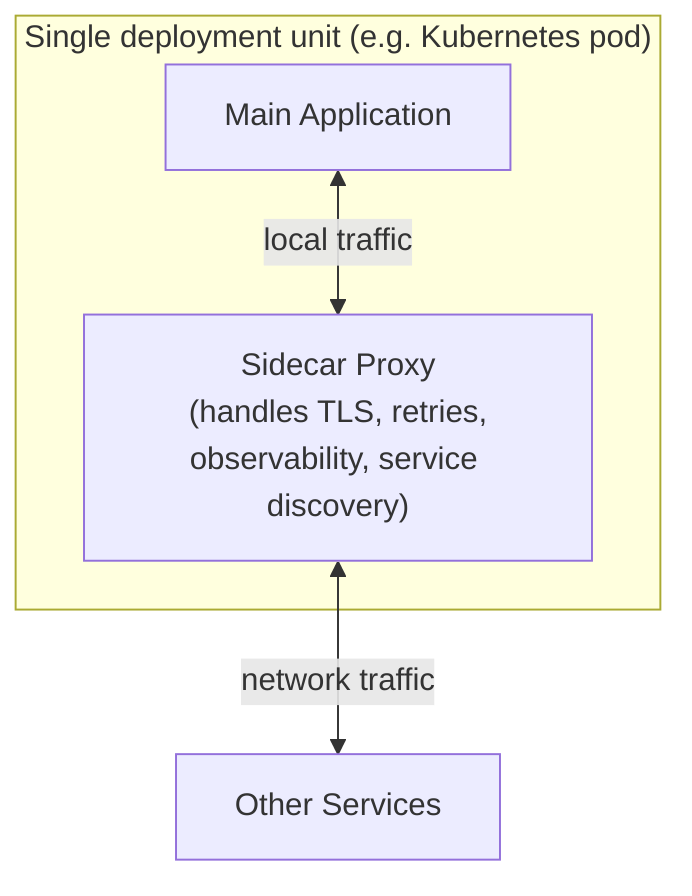
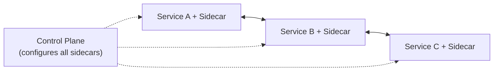

## Definition

The Sidecar pattern deploys a separate, helper process alongside a main application (typically in the same container pod or host), handling cross-cutting infrastructure concerns — logging, TLS termination, retries, service discovery — without that logic needing to be built directly into the main application's own codebase.

## Why it exists

Cross-cutting concerns like retries, TLS, observability, and service discovery are needed by essentially every service in a system, regardless of what language or framework it's written in — but implementing this logic consistently and correctly across many different languages and teams is a real, repeated burden. The Sidecar pattern exists to implement this logic exactly once, as a separate, language-agnostic process, and attach it to every service, rather than duplicating equivalent logic inside every single application.

## The problem it solves

Building retry logic, TLS handling, and observability instrumentation directly into every service (especially across a polyglot organization using multiple languages) means either duplicating that logic many times, in many languages, with subtly inconsistent behavior, or maintaining a shared library per language that still requires each team to correctly adopt and keep updated. The Sidecar pattern solves this by moving that logic out of the application entirely, into a separate process that intercepts network traffic — implemented once, and reused unchanged regardless of what language the main application happens to be written in.

## Real-world analogy

A motorcycle sidecar attaches to the main motorcycle, handling additional capacity or specialized functions (like carrying an extra passenger) without requiring the motorcycle itself to be redesigned — it's a separate, physically attached unit that travels everywhere the main vehicle goes, providing its function alongside, not embedded within, the main engine and frame. The Sidecar pattern applies exactly this idea to software: a separate helper process, always deployed alongside the main application, handling its own specific responsibilities.

## Simple explanation

Instead of building retry logic, TLS, and observability directly into your application code, you deploy a small, separate proxy process right alongside your application (in the same pod, typically) that intercepts and handles this cross-cutting logic transparently — your application code doesn't need to know or care that the sidecar exists.

## Technical explanation

The main application communicates with the sidecar over a local (very fast, reliable) connection, and the sidecar handles all the actual network complexity — TLS handshakes, retries on failure, service discovery lookups, and emitting standardized metrics/traces — completely transparently to the application.

## Internal working — the service mesh connection

The Sidecar pattern is precisely the foundation of a [Service Mesh](/docs/microservices/service-mesh) — a service mesh's "data plane" is essentially a sidecar proxy (like Envoy) deployed alongside every single service instance, with a separate "control plane" configuring all the sidecars' behavior consistently across the entire fleet.

## Advantages

- Cross-cutting logic (retries, TLS, observability) is implemented exactly once, consistently, regardless of what language each individual service is written in.
- Application code stays focused on business logic, without needing to embed and maintain infrastructure concerns directly.
- Sidecar behavior (retry policies, TLS configuration) can often be updated centrally without redeploying the application itself.

## Disadvantages

- Adds an extra process (and a small amount of latency) to every request, since traffic now passes through the sidecar rather than going directly.
- Increases the overall resource footprint (memory, CPU) of every deployment unit, since a sidecar process runs alongside every instance of every service.
- Adds real operational complexity in managing and updating potentially thousands of sidecar instances across a large fleet.

## Trade-offs

The Sidecar pattern trades a small amount of added latency and resource overhead, plus real operational complexity in managing the sidecar fleet, for consistent, language-agnostic handling of cross-cutting concerns — a trade that's increasingly considered worthwhile at meaningful microservices scale, and often unnecessary overhead for a small number of services in a single language.

## Complexity considerations

Running a single sidecar alongside a small number of services is manageable. Operating a full sidecar fleet consistently across a large, polyglot microservices architecture (as a full service mesh does) requires genuine operational investment — configuration management, upgrade rollout strategies, and monitoring of the sidecars themselves, not just the applications.

## When to use

- Large, polyglot microservices architectures where cross-cutting infrastructure logic would otherwise need to be duplicated (or maintained as shared libraries) across many different languages and teams.

## When NOT to use

- Small systems, or systems written entirely in a single language with a mature, well-maintained shared library already handling cross-cutting concerns effectively — the added latency and operational overhead of sidecars may not be justified.

## Common mistakes

- Adopting a full sidecar/service mesh architecture for a small number of services, taking on real operational complexity without a correspondingly large benefit.
- Not accounting for the added latency and resource overhead of sidecars when capacity planning a large fleet.
- Not keeping sidecar configuration and versions consistently managed across the fleet, leading to inconsistent behavior between services.

## Interview questions

- "Why might you implement cross-cutting concerns like retries and TLS in a sidecar rather than directly in each application's code?"
- "What's the relationship between the Sidecar pattern and a service mesh?"
- "What's the cost of adopting a sidecar pattern, and when might that cost not be justified?"

## Practical example

A microservices architecture with services written in Java, Go, and Python each deploys an Envoy sidecar proxy alongside the main application container — all TLS handling, retries, and standardized metrics emission happen consistently in the sidecar, regardless of which language the specific service's business logic is written in, avoiding the need for language-specific implementations of this same infrastructure logic.

## Production example

Istio, one of the most widely used service mesh implementations, is built directly on the Sidecar pattern — deploying an Envoy proxy sidecar alongside every service instance in a Kubernetes cluster, with a centralized control plane configuring consistent behavior (traffic routing, security policies, observability) across the entire fleet.

## Best practices

- Adopt the Sidecar pattern specifically when cross-cutting concerns genuinely need to be consistent across a polyglot, meaningfully-sized microservices architecture.
- Plan for the added latency and resource overhead of sidecars in capacity planning, rather than treating them as free.
- Use a mature, existing sidecar/service mesh implementation (like Istio with Envoy) rather than building custom sidecar infrastructure from scratch.

## Summary

The Sidecar pattern attaches a separate, co-located process to a main application, handling cross-cutting infrastructure concerns (TLS, retries, observability, service discovery) consistently and independently of whatever language the application itself is written in — the foundational building block of modern service meshes. It trades some added latency and real operational complexity for consistent, centrally-manageable handling of concerns that would otherwise need to be duplicated across many services and languages.

## References

- Fowler, M. "Sidecar" (martinfowler.com / microservices.io pattern catalog)
- Istio documentation

<Quiz questions={[
  {
    q: "Why is the Sidecar pattern particularly valuable in a polyglot microservices architecture (services written in multiple languages)?",
    options: [
      "Sidecars only work with a single programming language",
      "Cross-cutting concerns (TLS, retries, observability) are implemented once in the sidecar and reused consistently regardless of what language each individual service's business logic is written in",
      "Polyglot architectures cannot use sidecars at all",
      "There's no particular benefit for polyglot architectures"
    ],
    answer: 1,
    explanation: "Without a sidecar, teams would need to implement (or maintain shared libraries for) the same cross-cutting logic separately in every language used across the organization; the sidecar pattern implements it once, language-agnostically, and attaches it uniformly to every service regardless of implementation language."
  }
]} />
