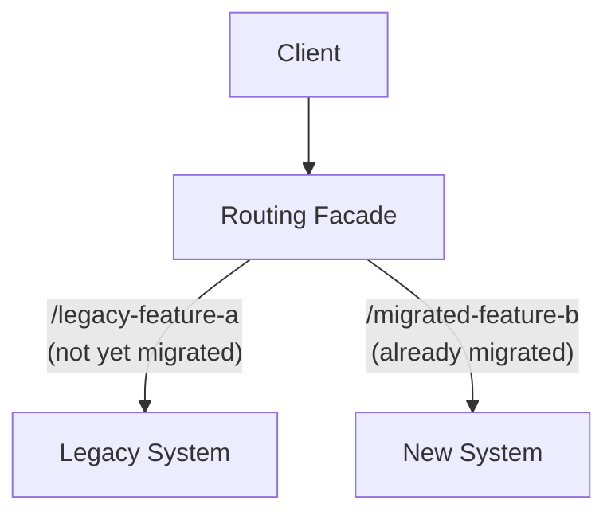
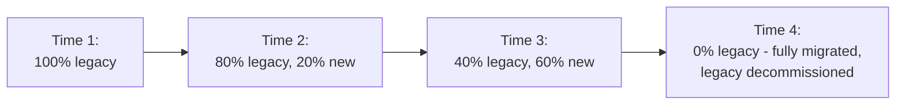

## Definition

The Strangler Fig pattern is an approach to migrating a legacy system by gradually building a new system around it, incrementally routing pieces of functionality to the new system while the old one continues operating, until eventually the old system can be fully decommissioned.

## Why it exists

Rewriting a large, business-critical legacy system all at once ("big bang" rewrite) is enormously risky — it requires halting feature development for a long period, and the new system typically only gets tested against real production conditions right at the very end, when the stakes of failure are highest. The Strangler Fig pattern exists to avoid this risk entirely, by replacing the legacy system gradually and incrementally, with each piece validated in production before moving to the next.

## The problem it solves

Big-bang rewrites have a well-documented history of running over budget, over schedule, or failing outright — famously described in Martin Fowler's original writing on this exact pattern. The Strangler Fig pattern solves this by never requiring the entire system to be rewritten before delivering any value: each incrementally migrated piece can be validated against real production traffic immediately, catching problems early and cheaply rather than all at once at the very end of a long rewrite.

## Real-world analogy

The pattern is named after the strangler fig, a plant that starts as a vine growing around a host tree, gradually extending and thickening over years until it fully envelops the tree structurally — the original tree eventually dies and decays, but by that point the strangler fig's own structure has already fully taken over its role, having grown up gradually and safely around the original rather than replacing it in one sudden, risky event.

## Simple explanation

Instead of rewriting the entire legacy system at once, you build new functionality alongside it, and gradually redirect traffic — piece by piece, feature by feature — from the old system to the new one, validating each migrated piece in production before moving to the next, until the legacy system handles nothing at all and can be safely retired.

## Technical explanation

### The routing facade

A common implementation uses a routing layer (often an [API Gateway](/docs/networking/api-gateway) or reverse proxy) in front of both the legacy and new systems, incrementally redirecting specific routes or features from the legacy system to the new one:

Over time, more and more routes are incrementally redirected to the new system, while the routing facade itself requires no changes to client-facing URLs or behavior — clients are entirely unaware of which system is actually handling their specific request at any given point in the migration.

## Internal working — the migration timeline

At each stage, the migrated portion is running in production, generating real confidence (or surfacing real problems) well before the entire migration is complete — a dramatically lower-risk profile than a single, all-at-once cutover.

## Advantages

- Dramatically reduces the risk of a legacy migration compared to a big-bang rewrite — each piece is validated against real production traffic incrementally.
- Allows continued feature development and bug fixes on the legacy system (for not-yet-migrated pieces) throughout the migration, rather than freezing it entirely.
- Provides a natural rollback point at each stage — if a specific migrated piece has problems, traffic can be routed back to the legacy system for that piece while the issue is fixed.

## Disadvantages

- Requires running and maintaining both the legacy and new systems simultaneously for an extended period, which has real ongoing cost and complexity.
- The routing facade itself becomes a critical new piece of infrastructure that needs careful design and its own reliability.
- Migrations can, in practice, stall partway through if organizational priorities shift, leaving a system permanently straddling both the old and new architecture.

## Trade-offs

The Strangler Fig pattern trades a longer overall migration timeline and the cost of running two systems in parallel for dramatically reduced risk compared to a big-bang rewrite — a trade that's almost always worth making for genuinely business-critical legacy systems, where the cost of a failed big-bang rewrite would be far higher.

## Complexity considerations

Implementing the routing facade correctly, and managing data consistency between the legacy and new systems during the transition period (especially if both need to read/write some of the same underlying data), is often the hardest part of executing this pattern well — it requires careful planning beyond just the routing logic itself.

## When to use

- Migrating a large, business-critical legacy system where a big-bang rewrite's risk profile is unacceptable, and incremental, production-validated migration is feasible.

## When NOT to use

- Very small systems where a full rewrite is genuinely low-risk and fast enough that the added complexity of a gradual, dual-system migration isn't justified.

## Common mistakes

- Not planning for data consistency between the legacy and new systems during the transition period, especially when both need access to overlapping data.
- Losing organizational momentum partway through the migration, leaving a system permanently split between old and new architecture with the costs of maintaining both.
- Not validating each migrated piece thoroughly against real production traffic before moving to the next, undermining the pattern's core risk-reduction benefit.

## Interview questions

- "Why might you choose the Strangler Fig pattern over a full rewrite for migrating a legacy system?"
- "What's the hardest part of implementing this pattern in practice, especially regarding data?"
- "How would you handle a specific migrated piece that turns out to have a serious problem in production?"

## Practical example

A company migrating a large, monolithic e-commerce platform to a microservices architecture starts by routing just the product search functionality to a new, independently built search service, validating it thoroughly in production, then incrementally migrates checkout, then user accounts, and so on — over many months, gradually reducing the legacy monolith's responsibilities until it can eventually be fully decommissioned.

## Production example

Martin Fowler's original 2004 article describing this pattern (drawing on a real migration project) remains the most widely cited reference, and the pattern has since been used extensively across the industry for major legacy modernization efforts, particularly in large enterprises with critical, long-running legacy systems that can't afford the risk of a big-bang rewrite.

## Best practices

- Route traffic incrementally through a well-designed facade, validating each migrated piece thoroughly in production before moving to the next.
- Plan explicitly for data consistency between the legacy and new systems during the (potentially long) transition period.
- Maintain organizational commitment and a clear timeline to avoid the migration stalling indefinitely partway through.

## Summary

The Strangler Fig pattern migrates a legacy system by gradually building new functionality around it and incrementally redirecting traffic, piece by piece, until the legacy system can be fully retired — dramatically reducing the risk associated with a single, all-at-once big-bang rewrite, at the cost of a longer timeline and the complexity of running both systems simultaneously during the transition.

## References

- Fowler, M. "StranglerFigApplication" (martinfowler.com, 2004)

<Quiz questions={[
  {
    q: "What is the main risk-reduction benefit of the Strangler Fig pattern compared to a 'big bang' rewrite?",
    options: [
      "It's always faster than a full rewrite",
      "Each incrementally migrated piece is validated against real production traffic before moving to the next, rather than only discovering problems at the very end of a long, all-at-once rewrite",
      "It requires no additional infrastructure",
      "It eliminates the need for testing entirely"
    ],
    answer: 1,
    explanation: "By migrating and validating one piece at a time in production, problems are caught early and cheaply at each stage, rather than only being discovered after an entire big-bang rewrite is complete and cut over all at once — a much riskier, higher-stakes moment to find serious issues."
  }
]} />
