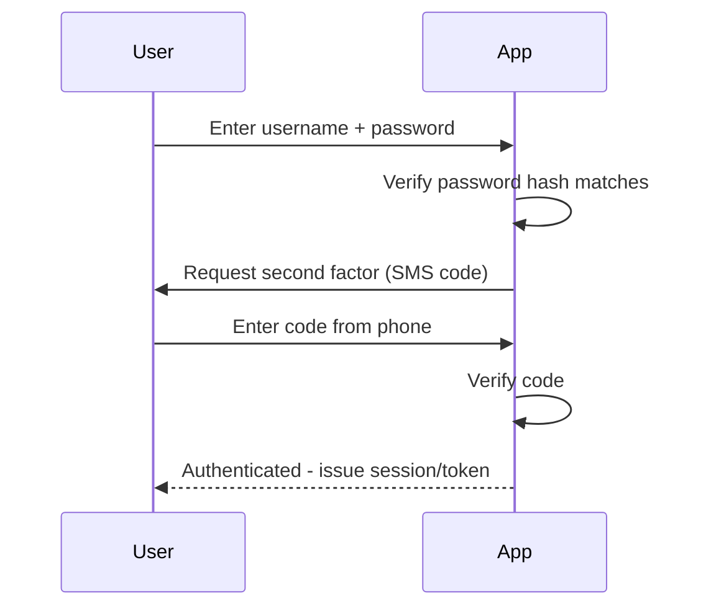

## Definition

Authentication is the process of verifying that someone (or something — a user, a service) is genuinely who they claim to be, typically by checking credentials like a password, a cryptographic token, or a biometric factor.

## Why it exists

A system that lets anyone claim to be anyone, with no verification, can't safely make any subsequent decision about what that person should be allowed to do — every other security control (authorization, audit logging, personalization) depends on first reliably establishing identity. Authentication exists to answer that foundational question — "who is this, really?" — before anything else can happen safely.

## The problem it solves

Without authentication, a system has no way to distinguish a legitimate user from an impostor claiming to be them — anyone could claim any identity and access anything associated with it. Authentication solves this by requiring proof (something only the genuine user should be able to provide) before accepting a claimed identity.

## Real-world analogy

Showing a passport at a border crossing is authentication — the document (and the photo, biometric chip, and issuing authority's signature) proves you are who you claim to be, before the border agent makes any further decision about whether you're allowed to enter. Authentication is exactly this "prove it" step, before any access decision follows.

## Simple explanation

Authentication answers "who are you?" — typically via one or more of three factor categories: **something you know** (a password), **something you have** (a phone receiving an SMS code, a hardware security key), or **something you are** (a fingerprint, facial recognition).

## Technical explanation

### Multi-factor authentication (MFA)

Combining more than one factor category significantly increases security — a stolen password alone (something you know) isn't sufficient if the system also requires a code from the user's phone (something you have), since an attacker would need to compromise both independently.

### Password storage

Authentication systems should never store passwords in plain text — instead, they store a **salted hash** of the password, verifying a login attempt by hashing the submitted password (with the same salt) and comparing it to the stored hash, so even a database breach doesn't directly expose usable plaintext passwords.

## Internal working — what happens after successful authentication

Once authentication succeeds, the system needs some way to remember "this request is from an already-authenticated user" for subsequent requests, without requiring credentials on every single one — this is exactly the role [Sessions](/docs/security/sessions) or tokens like [JWT](/docs/security/jwt) play, working alongside authentication rather than being authentication itself.

## Advantages

- Establishes a reliable basis for every subsequent security decision — authorization, auditing, personalization all depend on knowing who's actually making a request.
- Multi-factor authentication significantly raises the bar for an attacker, since compromising multiple independent factors is much harder than compromising just one.

## Disadvantages

- Adds friction to the user experience — every additional factor or verification step is a real cost to convenience, which needs to be balanced against the security benefit.
- Authentication systems themselves can be a target — weak password storage, poorly implemented verification logic, or social engineering (phishing) can all undermine even a well-designed system.

## Trade-offs

Stronger authentication (more factors, more friction) reduces the risk of unauthorized access but costs real user convenience — the right balance depends on what's actually being protected; a banking application reasonably demands more friction than a low-stakes hobby forum.

## Complexity considerations

Basic password-based authentication is well-understood and widely supported by libraries and frameworks. Building a robust, secure authentication system from scratch (password hashing, secure session/token management, MFA) is genuinely easy to get wrong — using a mature, well-audited authentication library or managed identity provider is strongly preferred over rolling your own.

## When to use

- Essentially every application with any concept of individual users or access control needs authentication as a foundational layer.

## When to require stronger authentication (MFA)

- Systems protecting sensitive data or high-value actions (financial transactions, admin access) where the added friction is justified by the higher stakes of unauthorized access.

## Common mistakes

- Storing passwords in plain text or with weak, unsalted hashing, exposing them directly in the event of a database breach.
- Not offering (or requiring, for sensitive systems) multi-factor authentication, leaving accounts vulnerable to a single compromised password.
- Implementing custom authentication logic from scratch rather than using a mature, well-audited library or managed identity provider.

## Interview questions

- "What are the three general categories of authentication factors, and why does combining them (MFA) improve security?"
- "Why should passwords be stored as salted hashes rather than in plain text?"
- "What's the difference between authentication and authorization?" (See [Authorization](/docs/security/authorization) — authentication establishes who you are; authorization decides what you're allowed to do.)

## Practical example

A banking application requires a password (something you know) plus a one-time code sent to the user's registered phone (something you have) before granting access — even if an attacker obtains the password through a data breach elsewhere, they can't complete authentication without also having access to the user's phone.

## Production example

Auth0, Okta, and similar managed identity platforms are widely used specifically because building genuinely secure authentication (password hashing, MFA, session management, breach detection) correctly and keeping it updated against evolving attack techniques is a significant, specialized undertaking most engineering teams reasonably prefer not to build entirely from scratch.

## Best practices

- Use a mature, well-audited authentication library or managed identity provider rather than implementing password hashing and verification from scratch.
- Offer (or require, for sensitive systems) multi-factor authentication.
- Never store passwords in plain text — use a strong, salted hashing algorithm designed specifically for password storage (like bcrypt or Argon2).

## Summary

Authentication verifies that someone is genuinely who they claim to be, typically via one or more factors (something you know, have, or are) — the foundational security check every other access decision (authorization, auditing) depends on. Strong authentication (multi-factor, properly hashed credentials) meaningfully raises the bar against unauthorized access, at the cost of some user friction that should be balanced against what's actually being protected.

## References

- OWASP Authentication Cheat Sheet
- NIST Digital Identity Guidelines (SP 800-63)

<Quiz questions={[
  {
    q: "Why does multi-factor authentication (MFA) significantly improve security over a password alone?",
    options: [
      "MFA makes passwords unnecessary",
      "An attacker would need to independently compromise more than one factor category (e.g. both a password and a physical device), which is much harder than compromising just one",
      "MFA has no real security benefit, only convenience",
      "MFA eliminates the need for password hashing"
    ],
    answer: 1,
    explanation: "MFA requires proof from more than one independent factor category (something you know, have, or are) — a stolen password alone isn't sufficient for an attacker if a second, independent factor (like a physical device) is also required."
  }
]} />
