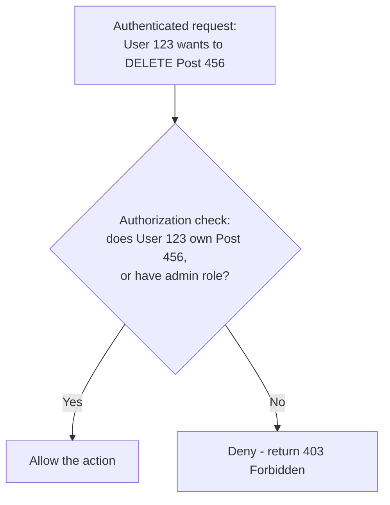

## Definition

Authorization is the process of determining what an already-authenticated identity is permitted to do — which resources they can access, and what actions they can perform on them — a distinct step that happens after [Authentication](/docs/security/authentication) has already established who they are.

## Why it exists

Knowing who someone is (authentication) doesn't automatically tell a system what they should be allowed to do — a logged-in regular user and a logged-in administrator are both authenticated, but should have very different permissions. Authorization exists to make this separate, deliberate decision, specific to each identity and each requested action.

## The problem it solves

Without a distinct authorization step, a system either has to grant every authenticated user the same access (dangerously permissive for anything with differentiated roles or ownership) or bake access decisions directly and inconsistently into authentication logic. Authorization solves this by providing an explicit, separate layer that decides, for a specific authenticated identity and a specific requested action, whether that action is permitted.

## Real-world analogy

Showing your passport at the border (authentication) proves who you are, but it doesn't by itself determine whether you're allowed into a restricted military zone within that country — a separate check (authorization), based on your specific role or clearance, determines that. Authentication and authorization are related but genuinely separate questions, answered by separate mechanisms.

## Simple explanation

Authorization answers "is this specific, already-identified user allowed to do this specific thing?" — checking their role, ownership, or specific granted permissions against what they're trying to do, on every relevant request.

## Technical explanation

### Common authorization models

- **Role-Based Access Control (RBAC)**: permissions are attached to roles (Admin, Editor, Viewer), and users are assigned one or more roles — simple to reason about and manage for most applications.
- **Attribute-Based Access Control (ABAC)**: permissions are decided based on attributes of the user, resource, and context (e.g. "allow if the user's department matches the document's department AND it's during business hours") — more flexible and fine-grained, at the cost of more complex policy management.
- **Ownership-based checks**: a common, simple pattern where a user can access/modify a specific resource only if they own it (e.g. "a user can edit their own posts, but not others'").

## Internal working — the confused deputy problem

A critical, commonly missed authorization mistake: checking *that* a user is authenticated, and forgetting to separately check *whether* they're authorized for the *specific resource* they're requesting — e.g. verifying a user is logged in, then fetching `/api/orders/789` without checking that order 789 actually belongs to that specific user. This class of bug (sometimes called an insecure direct object reference, or IDOR) lets any authenticated user potentially access any other user's data simply by guessing or iterating through resource IDs.

<Callout type="danger" title="Authentication is not authorization">
A shockingly common and serious security bug: an endpoint correctly checks that *a* user is logged in, but fails to check that *this specific* user is actually allowed to access *this specific* resource. Every request touching a specific resource needs its own explicit authorization check, not just a blanket "is someone logged in" check.
</Callout>

## Advantages

- Provides fine-grained, deliberate control over what each specific identity can do, distinct from the broader question of who they are.
- RBAC and ABAC models let complex permission structures be managed systematically, rather than through ad-hoc, scattered checks throughout application code.

## Disadvantages

- Easy to implement incompletely — checking authentication but forgetting resource-specific authorization checks is a common, serious class of vulnerability.
- Complex permission models (especially ABAC) can become difficult to reason about and audit as the number of rules and attributes grows.

## Trade-offs

More fine-grained authorization models (ABAC) provide more precise control but are harder to reason about, test, and audit than simpler models (RBAC) — the right level of granularity depends on how genuinely varied and context-dependent your actual permission needs are.

## Complexity considerations

Simple RBAC (a small number of roles with clearly defined permissions) is straightforward to implement and reason about. More sophisticated ABAC policies, especially ones combining many attributes and conditions, require more careful design, testing, and often dedicated policy-management tooling to keep manageable as they grow.

## When to use RBAC

- Most applications with a reasonably small, stable set of distinct roles (Admin, Editor, Viewer) and permission needs that map cleanly onto those roles.

## When to consider ABAC

- Applications with genuinely complex, context-dependent permission needs that don't map cleanly onto a small, fixed set of roles (e.g. permissions that depend on time of day, resource attributes, or relationships between the user and the specific resource).

## Common mistakes

- Checking only that a user is authenticated, without a separate, resource-specific authorization check — a critical and disturbingly common vulnerability (insecure direct object reference).
- Implementing authorization checks inconsistently across different endpoints, rather than through a centralized, consistently-applied mechanism.
- Over-engineering a complex ABAC system for permission needs that a much simpler RBAC model would have handled just as well.

## Interview questions

- "What's the difference between authentication and authorization, precisely?"
- "What is an insecure direct object reference (IDOR), and how would you prevent it?"
- "When would you choose ABAC over a simpler RBAC model?"

## Practical example

A document-sharing application checks, for every request to a specific document, both that the requesting user is authenticated *and* that they specifically have permission to access that particular document (as its owner, or as someone it's been explicitly shared with) — rather than only checking that they're logged in and trusting that any logged-in user can access any document ID they happen to request.

## Production example

AWS IAM (Identity and Access Management) is a widely used, sophisticated example of an ABAC-influenced authorization system, letting organizations define fine-grained, condition-based permission policies (e.g. "allow this role to read from this specific S3 bucket, but only from this specific IP range") well beyond what a simple RBAC model alone could express.

## Best practices

- Always perform an explicit, resource-specific authorization check, never relying on authentication status alone to imply access is allowed.
- Centralize authorization logic (rather than scattering ad-hoc checks throughout application code) to keep it consistent and auditable.
- Choose RBAC for straightforward permission needs, and reach for ABAC specifically when your actual requirements are genuinely more context-dependent than a fixed set of roles can express.

## Summary

Authorization determines what an already-authenticated identity is allowed to do, a distinct step from authentication that requires its own explicit, resource-specific checks — a commonly missed distinction that leads to serious vulnerabilities (like insecure direct object references) when only authentication is checked. RBAC provides a simple, manageable model for most applications' permission needs, while ABAC offers more fine-grained, context-dependent control at the cost of added complexity.

## References

- OWASP Authorization Cheat Sheet
- NIST RBAC and ABAC guidelines

<Quiz questions={[
  {
    q: "What is an 'insecure direct object reference' (IDOR) vulnerability?",
    options: [
      "A type of SQL injection attack",
      "When an application checks that a user is authenticated but fails to verify they're specifically authorized to access the particular resource they're requesting (e.g. by ID), letting them potentially access other users' data",
      "A vulnerability only affecting mobile applications",
      "A type of network-level attack unrelated to authorization"
    ],
    answer: 1,
    explanation: "IDOR occurs when an application correctly confirms a user is logged in but fails to separately verify that the specific resource being requested (e.g. via an ID in the URL) actually belongs to or is accessible by that particular user — letting an authenticated user access or modify data that isn't theirs simply by changing an ID."
  }
]} />
