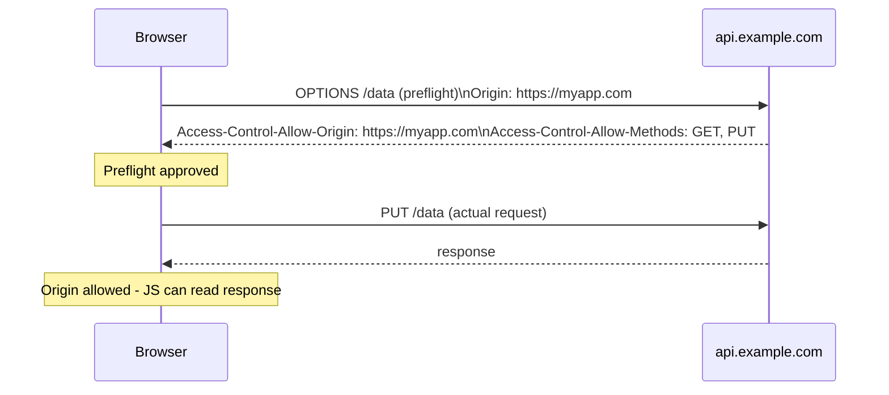

## Definition

CORS (Cross-Origin Resource Sharing) is a browser-enforced mechanism that controls whether JavaScript running on one origin (domain) is allowed to read the response of a request made to a different origin — by default blocked (the "same-origin policy"), unless the target server explicitly opts in via specific response headers.

## Why it exists

Browsers enforce a **same-origin policy** by default — JavaScript on `siteA.com` cannot read responses from `siteB.com` — specifically to prevent a malicious site from silently reading a user's private data from another site they happen to be logged into. CORS exists as the controlled, explicit exception mechanism: a server can deliberately declare "requests from this specific other origin are allowed to read my responses," for legitimate cross-origin use cases (like a public API meant to be called from many different websites).

## The problem it solves

Without any cross-origin restriction, a malicious website could silently run JavaScript that makes a request to your bank's website (using your browser's automatically-attached session cookie) and read the response directly — potentially exposing your private account data to the malicious page. Without any way to *ever* allow legitimate cross-origin requests, on the other hand, entirely reasonable use cases (a public API serving multiple different frontend applications on different domains) would be broken by default. CORS solves both: blocked by default, explicitly allowed where the server intends it.

## Real-world analogy

A company's internal phone directory is normally only accessible to employees calling from inside the building — CORS is like the company explicitly publishing a public directory number specifically meant to be called from outside, while everything else stays restricted to internal calls only. The restriction (same-origin policy) is the default; CORS headers are the explicit, deliberate exception.

## Simple explanation

A browser blocks JavaScript from reading a cross-origin response by default. If a server includes the right CORS response headers (like `Access-Control-Allow-Origin: https://example.com`), the browser will allow JavaScript from that specific origin to read the response — otherwise, even though the request might succeed at the network level, the browser withholds the response from the calling script.

## Technical explanation

### Key headers

```
Access-Control-Allow-Origin: https://example.com
Access-Control-Allow-Methods: GET, POST
Access-Control-Allow-Headers: Content-Type, Authorization
```

### Simple requests vs. preflight requests

For requests beyond simple GET/POST with standard headers (e.g. using custom headers, or methods like PUT/DELETE), the browser first sends an automatic **preflight** OPTIONS request, asking the server "would you allow an actual request like this from my origin?" — only if the server responds affirmatively does the browser proceed with the actual request.



<Callout type="warning" title="CORS is enforced by the browser, not the server">
A common misconception: CORS headers don't actually prevent a request from reaching the server or being processed — the server still receives and can act on the request. CORS only controls whether the *browser* lets the calling JavaScript *read the response*. This is why CORS alone is not a substitute for proper server-side authentication and authorization — it's a client-side (browser) protection for reading responses, not a server-side access control mechanism.
</Callout>

## Internal working — why CORS doesn't stop the request itself

Because the actual HTTP request (in the "simple request" case) is often sent to the server regardless of CORS policy, and the server processes it as normal, a state-changing action without additional protection (like [CSRF](/docs/security/csrf) tokens) could still be triggered by a cross-origin request even if CORS would prevent the malicious script from reading the *response* — this is precisely why CORS and CSRF protections address related but distinct concerns, and why relying on CORS alone as a security boundary is a common, serious misunderstanding.

## Advantages

- Enables legitimate, controlled cross-origin API usage (public APIs, multiple frontend apps calling a shared backend) that the same-origin policy would otherwise block entirely.
- Gives servers explicit, granular control over exactly which origins, methods, and headers are permitted for cross-origin requests.

## Disadvantages

- Widely misunderstood as a general security mechanism, when it specifically only controls whether a browser lets JavaScript read a cross-origin response — it doesn't prevent the request itself from reaching and being processed by the server.
- Misconfiguring CORS (e.g. reflecting any requesting origin back in `Access-Control-Allow-Origin` without real validation) can inadvertently allow malicious sites to read sensitive responses.

## Trade-offs

Overly permissive CORS configuration (allowing all origins) is simple but risks exposing sensitive data to any website; overly restrictive configuration can break legitimate cross-origin use cases — the right configuration should list only the specific, actually-trusted origins that genuinely need cross-origin access.

## Complexity considerations

Basic CORS configuration (allowing a small, known set of trusted origins) is straightforward. Handling more advanced cases correctly (credentials mode, multiple allowed origins, preflight caching) requires understanding CORS's specific rules more thoroughly, and most web frameworks provide well-tested middleware for this rather than requiring manual header management.

## When to use

- Public APIs, or any backend intentionally serving multiple different frontend origins that need to make cross-origin requests to it.

## When NOT to configure permissively

- Never set `Access-Control-Allow-Origin: *` (allowing any origin) for endpoints returning sensitive, user-specific data — this effectively disables the same-origin policy's protection for that endpoint.

## Common mistakes

- Believing CORS headers alone provide server-side security, when they're specifically a browser-enforced restriction on reading responses, not a substitute for proper authentication/authorization or CSRF protection.
- Configuring `Access-Control-Allow-Origin: *` for endpoints serving sensitive, user-specific data, inadvertently allowing any website to read that data via client-side JavaScript.
- Not understanding that a "simple" cross-origin request can still reach and be processed by the server even without CORS approval — only the ability to *read the response* is blocked.

## Interview questions

- "What does CORS actually control, precisely — the request being sent, or something else?"
- "Why is `Access-Control-Allow-Origin: *` dangerous for an endpoint returning sensitive, user-specific data?"
- "What's the difference between what CORS protects against and what CSRF protects against?"

## Practical example

A public weather API sets `Access-Control-Allow-Origin: *` since its data is non-sensitive and meant to be freely used by any website, while a company's internal admin API sets `Access-Control-Allow-Origin` to only its own specific, known frontend domain, since it returns sensitive internal data that shouldn't be readable by arbitrary third-party websites' JavaScript.

## Production example

Most public API providers (weather services, public data APIs, many SaaS platforms offering client-side SDKs) configure permissive CORS specifically because their data is meant to be broadly, freely consumed by many different websites' client-side code — a deliberate, appropriate choice given what they're actually serving.

## Best practices

- Explicitly list only the specific, trusted origins that need cross-origin access, rather than defaulting to `*` for anything serving sensitive or user-specific data.
- Don't rely on CORS as a substitute for proper server-side authentication, authorization, and CSRF protection — it addresses a distinct, browser-side concern.
- Use your framework's well-tested CORS middleware rather than manually managing the relevant headers.

## Summary

CORS is a browser-enforced mechanism controlling whether JavaScript on one origin can read responses from a different origin, providing a controlled exception to the browser's default same-origin policy for legitimate cross-origin use cases. It's frequently misunderstood as a general server-side security control, when it specifically only governs whether the browser lets a script read a response — it doesn't stop the underlying request from reaching and being processed by the server, which is why it complements rather than replaces proper authentication, authorization, and CSRF protections.

## References

- MDN Web Docs: Cross-Origin Resource Sharing (CORS)
- Fetch Standard (WHATWG): CORS protocol

<Quiz questions={[
  {
    q: "What does CORS actually control?",
    options: [
      "Whether a cross-origin request is sent to the server at all",
      "Whether the browser allows JavaScript running on one origin to read the response of a request made to a different origin",
      "Whether a server can process any request whatsoever",
      "CORS has no real effect on anything"
    ],
    answer: 1,
    explanation: "CORS is specifically a browser-side restriction on reading cross-origin responses — for many 'simple' requests, the request itself is still sent to and processed by the server; CORS headers determine only whether the calling JavaScript is allowed to actually read the resulting response."
  }
]} />
