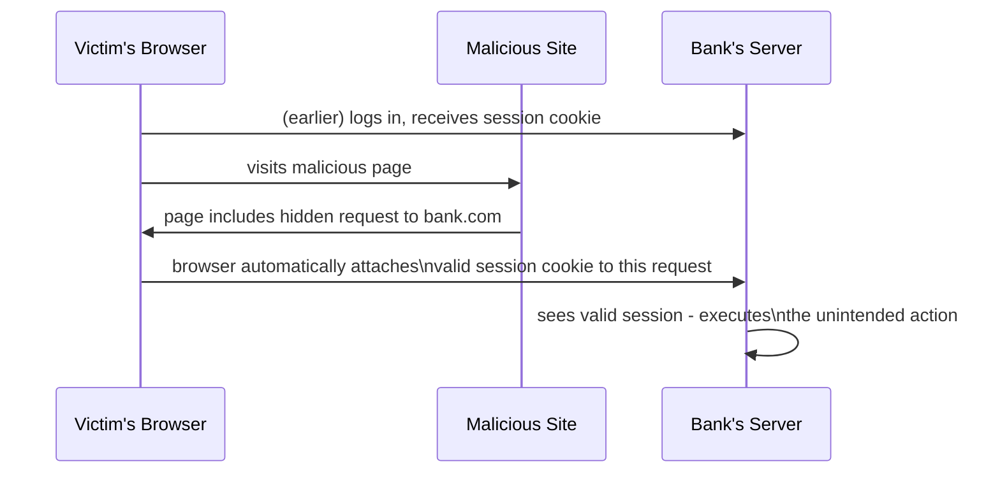

## Definition

Cross-Site Request Forgery (CSRF) is an attack that tricks a victim's browser into making an unintended, state-changing request to a site the victim is currently authenticated to, exploiting the fact that browsers automatically attach [cookies](/docs/security/cookies) (including session cookies) to requests regardless of which site initiated them.

## Why it exists (as a vulnerability)

Browsers automatically attach a site's cookies to any request sent to that site, no matter what page or site actually triggered the request — a behavior that's genuinely necessary for cookies to work as intended for legitimate same-site navigation, but that a malicious site can exploit: if it triggers a request to your bank's website while you're logged in there, your browser will automatically include your valid session cookie, making the malicious request look, from the bank's server's perspective, exactly like a legitimate one from you.

## The problem it solves (understanding it, to defend against it)

Without CSRF defenses, any malicious website you happen to visit (or a malicious ad, or a phishing email) could silently trigger state-changing requests — transferring money, changing your email address, deleting data — against any other site you're currently logged into, simply by embedding a request to that site (e.g. via an auto-submitting form or an image tag) that your browser will dutifully attach your valid session cookie to.

## Real-world analogy

Imagine a signed, blank check that automatically gets your signature attached the instant anyone presents it to your bank while you happen to be standing at the bank's counter — a scammer who gets you to unknowingly present their own check while you're there could effectively forge a transaction in your name. CSRF exploits an analogous "your credentials get automatically attached regardless of who's actually asking" behavior.

## Simple explanation

A malicious site includes something that causes your browser to send a request to a different site (your bank, say) — since your browser automatically attaches your valid session cookie for that other site to any request, the target site can't tell the request didn't actually come from you, intentionally, on their own page.

## Technical explanation

### An example attack

```html
<!-- Hosted on a malicious site -->

```

If a bank's transfer endpoint incorrectly used a simple GET request without any CSRF protection, simply loading this malicious page (with the image tag triggering a request) while logged into the bank could trigger an unintended transfer — the bank's server sees a valid session cookie and no way to tell the request wasn't intentionally initiated by the user on the bank's own site.



### Defenses

- **SameSite cookies**: setting `SameSite=Strict` or `Lax` (see [Cookies](/docs/security/cookies)) prevents the cookie from being attached to genuinely cross-site requests in most cases, closing off much of the attack surface.
- **CSRF tokens**: the server includes a unique, unpredictable token in legitimate forms/pages; the malicious site has no way to know or include this token, so requests missing it (or with an incorrect one) are rejected.
- **Checking the `Origin`/`Referer` header**: verifying that a state-changing request actually originated from the expected site.

## Internal working — why GET requests should never have side effects

CSRF is precisely why [HTTP](/docs/networking/http)'s convention that GET requests should be safe (no side effects) matters for real security, not just semantic cleanliness — a GET-triggered side effect (like the image tag example above) can be triggered simply by a victim's browser loading any resource referencing that URL, without any user interaction beyond visiting a malicious page.

## Advantages of understanding and defending against CSRF

- Properly defended state-changing endpoints can't be triggered by requests originating from other, potentially malicious sites.
- Modern browser defaults (`SameSite=Lax` as the default for cookies without an explicit setting, in current browsers) provide meaningful baseline protection even without additional application-level defenses.

## Disadvantages / limitations

- Relying solely on `SameSite` cookies isn't bulletproof in every scenario (e.g. certain subdomain or configuration edge cases) — defense in depth with an explicit CSRF token remains a recommended additional layer for sensitive actions.
- Implementing CSRF tokens correctly (generating, validating, and refreshing them appropriately) adds some implementation complexity to forms and state-changing endpoints.

## Trade-offs

Relying purely on `SameSite` cookies is simpler to implement but provides slightly less defense-in-depth than combining it with explicit CSRF tokens — for highly sensitive actions (financial transactions, account changes), the additional complexity of a CSRF token is generally worth the extra protection layer.

## Complexity considerations

Modern web frameworks widely provide built-in CSRF token generation and validation, making proper defense largely a matter of using these built-in mechanisms correctly rather than implementing the protection from scratch.

## When to defend against CSRF

- Any state-changing endpoint (anything that modifies data or triggers an action) accessible to an authenticated user via cookie-based sessions.

## When it's less of a concern

- APIs authenticated purely via a token sent in an `Authorization` header (not a cookie) generally aren't vulnerable to CSRF in the traditional sense, since the browser doesn't automatically attach that header the way it does cookies — though this shifts the security consideration to protecting the token itself (e.g. from XSS, if stored in a way JavaScript can access it).

## Common mistakes

- Using GET requests for state-changing actions, making them trivially triggerable via a simple link or image tag.
- Relying on `SameSite` cookies alone without an additional CSRF token for particularly sensitive, high-value actions.
- Not validating the CSRF token server-side at all, rendering the client-side inclusion of a token purely cosmetic and providing no actual protection.

## Interview questions

- "How does a CSRF attack actually work, step by step?"
- "Why do SameSite cookies help defend against CSRF, and why might an application still want an additional CSRF token?"
- "Why should GET requests never have side effects, from a security perspective?"

## Practical example

A banking application's fund-transfer endpoint requires a POST request including a unique, per-session CSRF token embedded in the legitimate transfer form — a malicious site attempting to trigger a transfer can't know or supply this token, so its forged request is rejected by the server even if the victim's session cookie is automatically attached by their browser.

## Production example

Modern web frameworks like Django, Rails, and ASP.NET all include built-in CSRF protection (automatic token generation and validation for forms) enabled by default, reflecting how foundational this defense has become for any application handling authenticated, state-changing requests via cookies.

## Best practices

- Never use GET requests for state-changing actions.
- Set `SameSite=Strict` or `Lax` on session cookies as a baseline defense.
- Use explicit, server-validated CSRF tokens for sensitive, state-changing actions as an additional defense-in-depth layer, using your framework's built-in support rather than implementing this from scratch.

## Summary

CSRF tricks a victim's browser into making an unintended, state-changing request to a site they're authenticated to, exploiting the browser's automatic attachment of session cookies regardless of which site actually triggered the request. Defenses include `SameSite` cookie attributes (a strong baseline) and explicit, server-validated CSRF tokens (recommended for sensitive actions as defense in depth) — and it's precisely why GET requests should never have real side effects.

## References

- OWASP CSRF Prevention Cheat Sheet
- MDN Web Docs: SameSite cookies

<Quiz questions={[
  {
    q: "Why does a CSRF attack succeed even though the victim never intentionally interacted with the malicious request?",
    options: [
      "CSRF attacks require the victim to intentionally click a malicious link",
      "The victim's browser automatically attaches their valid session cookie to any request sent to a given site, regardless of which page or site actually triggered that request",
      "CSRF only works if the victim's password is weak",
      "CSRF attacks are not actually possible in modern browsers"
    ],
    answer: 1,
    explanation: "The core mechanism CSRF exploits is the browser's automatic cookie attachment — a malicious site can trigger a request to a different site (e.g. via a hidden form or image tag), and the victim's browser will still attach their valid session cookie for that target site, making the forged request appear legitimate to the target server."
  }
]} />
