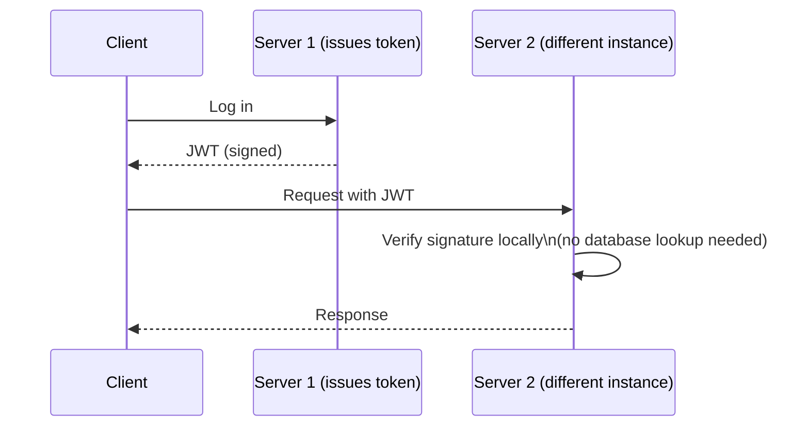

## Definition

JWT (JSON Web Token) is a compact, URL-safe token format encoding a set of claims (like a user ID and permissions) as a signed (and optionally encrypted) JSON payload — allowing a server to verify the token's authenticity and read its contents without needing to look it up in a database.

## Why it exists

Traditional server-side [Sessions](/docs/security/sessions) require a database (or shared cache) lookup on every request to verify a session ID and retrieve the associated user data — a real cost at scale, and something that requires shared, centralized session storage across all server instances. JWT exists to provide an alternative: a self-contained token that carries its own claims and a cryptographic signature, letting any server verify it independently, without a database lookup or shared session store.

## The problem it solves

A traditional session ID is meaningless on its own — it's just a random string that needs to be looked up against server-side storage to find out who it belongs to and what they're allowed to do. This lookup requires either a shared session store accessible to every server instance, or sticky sessions tying a user to one specific server. JWT solves this by making the token itself self-contained — carrying the actual claims (not just a reference to them) and a signature proving they haven't been tampered with, so any server can verify and read it independently.

## Real-world analogy

A traditional session ID is like a coat-check ticket number — meaningless by itself, requiring you to go back to the same coat-check counter (server-side session store) to find out what coat it corresponds to. A JWT is more like a sealed, signed, official letter carrying its own information directly ("this bearer is Alice, an admin, valid until 3pm") — anyone with the right key can verify the seal is genuine and read the letter's contents directly, without needing to check back with whoever issued it.

## Simple explanation

A JWT has three parts, separated by dots: a header (describing the signing algorithm), a payload (the actual claims — user ID, roles, expiry time), and a signature (cryptographically proving the header and payload haven't been tampered with since the token was issued).

## Technical explanation

### Structure

```
header.payload.signature
```

```json
// Header
{ "alg": "HS256", "typ": "JWT" }

// Payload (claims)
{ "sub": "user123", "role": "admin", "exp": 1735689600 }
```

The signature is computed over the header and payload using a secret key (for symmetric algorithms like HS256) or a private key (for asymmetric algorithms like RS256) — any server with the corresponding verification key (the same secret, or the matching public key) can verify the signature is valid and hasn't been tampered with, without needing to contact whoever originally issued the token.



## Internal working — the revocation problem

A JWT's biggest practical drawback: because it's self-contained and verified purely by signature (not looked up against a database), there's no simple, built-in way to revoke it before its expiry — unlike a traditional session, which can be immediately invalidated by deleting it from server-side storage. Common mitigations include keeping JWT expiry times short (limiting the damage window of a token that needs revoking) and maintaining a server-side "blocklist" of specifically revoked tokens (which reintroduces a database lookup, partially undoing JWT's main advantage).

<Callout type="warning" title="JWTs aren't automatically more secure than sessions">
JWT's advantage is architectural (no shared session store needed, no database lookup per request), not inherently better security — in fact, the revocation problem above is a genuine downside compared to traditional sessions. Choose JWT specifically for its statelessness benefits, not as an automatic security upgrade.
</Callout>

## Advantages

- Stateless verification — any server can verify a JWT independently, without a database lookup or shared session store, simplifying horizontal scaling.
- Self-contained claims mean the token itself carries useful information (user ID, roles) directly, avoiding an extra lookup to fetch that data.
- Well-suited to microservices architectures, where multiple independent services can verify the same token without needing shared access to a central session store.

## Disadvantages

- Hard to revoke before expiry, since verification doesn't involve a database lookup by default — a genuine security trade-off compared to traditional sessions.
- Larger than a simple session ID, since it carries the actual claims data, adding a small amount of overhead to every request.
- If signed with a weak secret, or if the verification logic incorrectly accepts an "none" algorithm (a well-known historical JWT vulnerability), the token's integrity guarantees can be broken entirely.

## Trade-offs

JWT trades easy revocation (a traditional session's strength) for stateless, database-lookup-free verification (a real scalability benefit) — the right trade for systems where horizontal scalability and avoiding a shared session store matter more than instant revocability, and a poor trade for systems where immediately revoking access (e.g. for a compromised account) is a critical requirement.

## Complexity considerations

Using a mature, well-tested JWT library (rather than implementing the signing and verification logic manually) is strongly preferred — there's a documented history of subtle, serious vulnerabilities (like accepting an "none" signing algorithm) in naive or incorrect implementations.

## When to use

- Stateless API authentication across multiple independent services, especially in a microservices architecture, where avoiding a shared, centralized session store is valuable.
- Short-lived tokens where the revocation limitation is mitigated by a short expiry time.

## When NOT to use (traditional sessions may be better)

- Systems where immediate revocation (e.g. instantly logging out a compromised account everywhere) is a critical requirement — a traditional server-side session, which can be deleted immediately, handles this more directly.

## Common mistakes

- Setting very long JWT expiry times without any revocation mechanism, creating a long window where a compromised token remains valid and unrevokable.
- Implementing custom JWT signing/verification logic rather than using a mature, well-audited library, risking known classes of vulnerability.
- Storing sensitive data directly in a JWT payload, forgetting that the payload (though signed) is typically not encrypted and can be read by anyone who has the token, including the end user themselves.

## Interview questions

- "Why is revoking a JWT before its expiry harder than revoking a traditional server-side session?"
- "What's the security implication of a JWT payload being signed but not necessarily encrypted?"
- "When would you choose JWTs over traditional server-side sessions, and when would you choose the opposite?"

## Practical example

A microservices architecture uses JWTs issued by a central authentication service — each downstream microservice can independently verify a request's JWT using a shared public key, confirming the user's identity and role without needing to call back to the authentication service or share a centralized session store across every microservice.

## Production example

Many API platforms and microservices architectures use JWTs (often via a standard like OpenID Connect, built on top of OAuth) specifically for this stateless, independently-verifiable authentication benefit across many distributed services — a pattern widely adopted precisely because it avoids the need for a shared session store across a large, distributed system.

## Best practices

- Keep JWT expiry times relatively short, given the difficulty of revoking them before expiry.
- Use a mature, well-tested JWT library, not custom signing/verification logic.
- Never store sensitive data directly in a JWT payload unless it's also encrypted, since the payload is typically readable (though tamper-evident) by anyone holding the token.

## Summary

JWT is a compact, self-contained, signed token format that lets any server verify a claim's authenticity and read its contents without a database lookup — trading traditional sessions' easy revocability for stateless, horizontally-scalable verification. It's well suited to microservices architectures and stateless API authentication, but its revocation limitation (mitigated mainly by keeping expiry times short) means it's not automatically a security upgrade over traditional sessions, just a different, sometimes better-fitting architectural trade-off.

## References

- RFC 7519 (JWT specification)
- Auth0: JWT.io (debugger and educational resource)

<Quiz questions={[
  {
    q: "Why is revoking a JWT before its expiry harder than revoking a traditional server-side session?",
    options: [
      "JWTs cannot expire at all",
      "A JWT is verified purely by its cryptographic signature, without a database lookup by default, so there's no simple built-in mechanism to mark one as invalid before its expiry - unlike a session, which can be immediately deleted from server-side storage",
      "JWTs are always permanently valid regardless of any expiry setting",
      "Traditional sessions cannot be revoked either"
    ],
    answer: 1,
    explanation: "JWT's core design trade-off is stateless verification (no database lookup needed) in exchange for losing the easy revocability a database-backed session provides — revoking a JWT before expiry requires additional mechanisms like a server-side blocklist, which partially reintroduces the lookup JWT was designed to avoid."
  }
]} />
