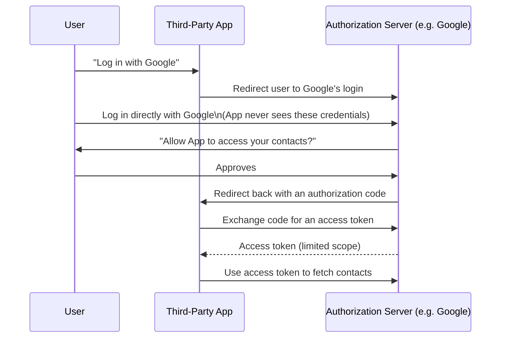

## Definition

OAuth (specifically OAuth 2.0, the widely used current version) is an authorization framework that lets a user grant a third-party application limited access to their data on another service (like Google or GitHub), without the user ever sharing their actual password with that third-party application.

## Why it exists

Before OAuth, an application wanting to access a user's data on another service (like reading their Google Contacts) typically had to ask for that service's username and password directly — a dangerous practice, since the third-party application would then have full, unrestricted access to the user's account, and the user would have no way to revoke that access without changing their password entirely. OAuth exists to solve this by introducing a delegated authorization flow where the user grants specific, limited, revocable permissions without ever handing over their actual credentials.

## The problem it solves

Directly sharing a password with a third-party application is a serious security anti-pattern: the third party gets full account access (far more than it likely needs), the user has no fine-grained way to limit what it can do, and revoking access requires changing the password (breaking access for every other application the user had also given that password to). OAuth solves all of this: the user authenticates directly with the service they trust (never the third party), grants specific, limited permissions, and can revoke that specific grant at any time without affecting anything else.

## Real-world analogy

Valet parking gives the valet a special valet key that can start the car and open the door, but can't open the trunk or glove compartment — rather than handing over your full set of keys (which could access everything). OAuth's access tokens work the same way: a third-party application gets a limited-scope key, not your actual account credentials.

## Simple explanation

Instead of giving a third-party application your Google password directly, you're redirected to Google itself, log in there (Google never shares your credentials with the third party), and explicitly approve specific permissions ("allow this app to read your contacts, but not send email as you") — Google then gives the third-party application a limited-scope access token, not your password.

## Technical explanation

### The authorization code flow (the most common OAuth 2.0 flow)

### Scopes

OAuth grants are limited to specific **scopes** — explicitly defined permissions (like `contacts.read` or `email.send`) — so a user can grant narrow, specific access rather than an all-or-nothing account takeover.

## Internal working — access tokens vs. refresh tokens

Access tokens are typically short-lived (to limit the damage if one is somehow leaked), while a longer-lived **refresh token** lets the third-party application request a new access token when the old one expires, without requiring the user to log in and re-approve again every time — balancing security (short-lived access tokens) against user convenience (not needing to constantly re-authenticate).

## Advantages

- The third-party application never sees or stores the user's actual password for the service being accessed.
- Users grant specific, limited scopes rather than full account access, and can revoke a specific application's access independently of any others.
- Revoking access doesn't require changing a password shared across multiple applications.

## Disadvantages

- More complex to implement correctly than simple, direct credential sharing — multiple redirects, token exchange, and careful scope management.
- If an access token is stolen, an attacker gains whatever access that token's scope allows, for as long as it remains valid (though typically limited by a short expiry).
- Misconfigured redirect URIs or overly broad requested scopes are common, real implementation mistakes that can undermine OAuth's security benefits.

## Trade-offs

OAuth trades some implementation complexity (compared to naive, direct credential sharing) for dramatically better security and much finer-grained, revocable, limited access — a trade that's essentially always worth making for any legitimate third-party integration, given how much worse the alternative (sharing actual passwords) genuinely is.

## Complexity considerations

Using a mature, well-tested OAuth client library (rather than implementing the token exchange and redirect flow from scratch) is strongly preferred — subtle mistakes in redirect URI validation or token handling can reintroduce real security vulnerabilities that OAuth is specifically designed to avoid.

## When to use

- Any scenario where a third-party application needs limited, specific access to a user's data on another service, without that user ever sharing their actual password with the third party.
- "Log in with Google/GitHub/Facebook" style authentication flows (technically using OAuth's mechanics, often combined with OpenID Connect for the authentication layer specifically).

## When NOT to use

- Scenarios that don't actually involve a third party needing access to another service's protected resources — for a service authenticating its own first-party users directly, simpler mechanisms (username/password with proper hashing, or a managed identity provider) may be more appropriate than the added complexity of an OAuth flow designed for delegated third-party access.

## Common mistakes

- Requesting overly broad scopes ("full account access") when a much narrower, specific scope would suffice for the application's actual needs.
- Misconfiguring redirect URI validation, potentially allowing an attacker to intercept the authorization code meant for a legitimate application.
- Confusing OAuth (an authorization framework, granting *access*) with OpenID Connect (built on top of OAuth, specifically for *authentication* / identity verification) — related but distinct purposes.

## Interview questions

- "Why is OAuth considered more secure than a third-party application asking for a user's actual password directly?"
- "What's the difference between an access token and a refresh token in OAuth?"
- "What's the difference between OAuth and OpenID Connect?"

## Practical example

A photo-printing web service offers "Import photos from Google Photos" — using OAuth, the user is redirected to Google, logs in there directly, and approves a specific, narrow scope (`photos.readonly`) — the printing service receives only a limited-scope access token, never the user's actual Google password, and the user can revoke this specific access later from their Google account settings without affecting any other application.

## Production example

"Sign in with Google," "Sign in with GitHub," and similar widely used authentication options are built on OAuth 2.0 (typically combined with OpenID Connect), letting countless third-party applications offer login without ever handling or storing the underlying Google/GitHub password directly.

## Best practices

- Request the narrowest scope that actually satisfies your application's needs, rather than broad, unnecessary permissions.
- Use a mature, well-tested OAuth client library rather than implementing the flow from scratch.
- Validate redirect URIs strictly, to prevent authorization codes from being redirected to an attacker-controlled endpoint.

## Summary

OAuth is an authorization framework letting users grant third-party applications limited, specific, revocable access to their data on another service — without ever sharing their actual password with that third party. Access tokens (short-lived) and refresh tokens (longer-lived) balance security and user convenience, and using a mature, well-tested implementation is strongly preferred over building the token exchange and redirect flow from scratch.

## References

- RFC 6749 (OAuth 2.0 specification)
- OAuth 2.0 Simplified (oauth.com)

<Quiz questions={[
  {
    q: "Why is OAuth considered a significant security improvement over a third-party application directly asking a user for their password?",
    options: [
      "OAuth makes authentication unnecessary",
      "The third-party application never sees or stores the user's actual password, and receives only a limited-scope, revocable access token instead of full account access",
      "OAuth is simply a faster login method with no security benefit",
      "OAuth eliminates the need for any user approval step"
    ],
    answer: 1,
    explanation: "With OAuth, the user authenticates directly with the trusted service (never the third party), and grants specific, limited scopes rather than full account access — the third-party application only ever receives a limited-scope access token, which can be revoked independently without affecting the user's actual password or other applications."
  }
]} />
