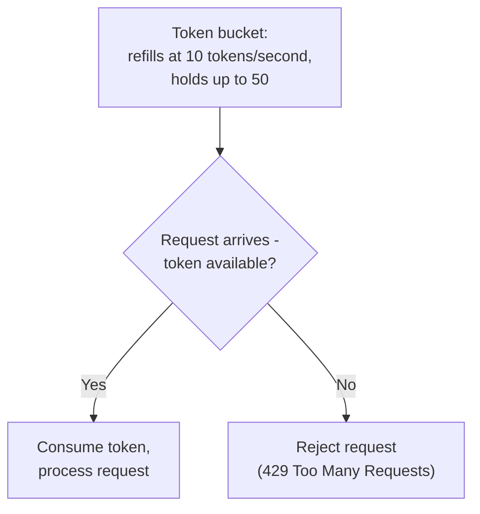
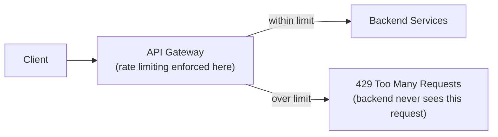

## Definition

Rate limiting restricts the number of requests a client (identified by IP address, API key, or user account) can make to a service within a given time window, rejecting or delaying requests beyond that limit to protect the service from overload or abuse.

## Why it exists

Without any limit, a single client — whether through a bug, a misconfigured retry loop, or deliberate abuse — can send an overwhelming volume of requests, degrading service for every other legitimate user, or in extreme cases causing a full outage. Rate limiting exists to cap any single client's consumption of shared resources, protecting overall service health and fairness across all users.

## The problem it solves

A service without rate limiting is vulnerable to both accidental overload (a client's retry loop gone wrong, a scraper hitting an API too aggressively) and deliberate abuse (a brute-force login attempt, a denial-of-service attack, or simply a paying customer trying to extract more usage than their plan allows). Rate limiting solves both by capping request volume per client, regardless of the underlying reason for the excess.

## Real-world analogy

A busy amusement park ride limiting each group to one ride per hour, regardless of how many times they'd like to go, ensures the ride is available fairly to everyone in line, rather than letting one enthusiastic (or inconsiderate) group monopolize it all day. Rate limiting applies exactly this fairness principle to shared computing resources.

## Simple explanation

A rate limiter tracks how many requests each client has made recently, and rejects (or queues) any request beyond the configured limit — commonly expressed as "N requests per minute" or similar.

## Technical explanation

### Common rate limiting algorithms

- **Fixed window**: count requests within a fixed time window (e.g. 100 requests per minute, reset every minute) — simple, but can allow a burst of up to 2x the limit right at a window boundary (a client using their full quota at the very end of one window, then immediately using another full quota at the start of the next).
- **Sliding window**: tracks requests over a continuously moving window, avoiding the fixed-window boundary burst problem, at slightly more computational cost.
- **Token bucket**: a bucket holds a limited number of tokens, refilled at a steady rate; each request consumes a token, and requests are rejected if no tokens remain — naturally allows brief bursts (using up saved tokens) while enforcing a steady average rate over time.

## Internal working — where rate limiting is enforced

Rate limiting is commonly enforced at an [API Gateway](/docs/networking/api-gateway) or [Reverse Proxy](/docs/networking/reverse-proxy) layer, centrally, before requests even reach backend application servers — this protects the backend from ever seeing the excess load at all, rather than having each individual service implement its own separate rate limiting logic.

## Advantages

- Protects shared infrastructure from being overwhelmed by any single client, whether through accident or deliberate abuse.
- Provides a defense against brute-force attacks (e.g. limiting login attempts per account or IP) and denial-of-service attempts.
- Enables fair usage enforcement and tiered pricing models (e.g. "free tier: 100 requests/day, paid tier: 10,000 requests/day").

## Disadvantages

- Overly aggressive rate limits can frustrate legitimate users or break legitimate use cases (like a client application making many requests during initial data sync).
- Distributed rate limiting (across multiple gateway/proxy instances) requires shared, coordinated tracking (e.g. via [Redis](/docs/caching/redis)) rather than each instance tracking independently, or the effective limit becomes inconsistent.

## Trade-offs

Stricter rate limits provide stronger protection against abuse and overload but risk frustrating legitimate high-volume users; looser limits are more permissive but provide less protection — the right limit should be based on genuine, expected legitimate usage patterns plus some reasonable headroom, not an arbitrary number.

## Complexity considerations

Fixed-window rate limiting is simple to implement but has the boundary-burst issue; token bucket or sliding window approaches are more robust but require slightly more sophisticated tracking, commonly implemented using a shared, fast store like Redis for coordinated tracking across multiple gateway instances.

## When to use

- Essentially any public-facing API or service, to protect against both accidental overload and deliberate abuse.
- Login endpoints specifically, to limit brute-force credential-guessing attempts.

## When to be careful

- Legitimate use cases involving inherently high, bursty request volumes (e.g. an initial bulk data sync) may need a higher limit, a separate allowance, or a token-bucket approach that naturally accommodates bursts.

## Common mistakes

- Using naive fixed-window rate limiting without considering the boundary-burst problem, allowing up to double the intended limit in adjacent windows.
- Implementing rate limiting independently per server instance without shared, coordinated tracking, resulting in an effective limit far higher than intended once traffic is spread across many instances.
- Setting limits without basing them on genuine, measured legitimate usage patterns, either frustrating real users (too strict) or providing insufficient protection (too loose).

## Interview questions

- "What's the difference between fixed window, sliding window, and token bucket rate limiting algorithms?"
- "Why does rate limiting typically need a shared, coordinated store (like Redis) rather than being tracked independently by each server instance?"
- "How would you design rate limiting to allow legitimate bursts while still enforcing an overall average rate limit?"

## Practical example

A public API limits each API key to 1,000 requests per hour using a token-bucket algorithm (refilling gradually, allowing a natural burst up to the bucket's capacity) — tracked in a shared Redis instance accessible to all API Gateway instances, ensuring the effective limit stays consistent regardless of which specific gateway instance handles any individual request.

## Production example

Most major API providers (Stripe, GitHub, Twitter/X) publish explicit rate limits per API key or account tier, enforced centrally at their API gateway layer, and return a standard `429 Too Many Requests` status code (often with headers indicating remaining quota and reset time) when a client exceeds their limit.

## Best practices

- Use a token bucket or sliding window algorithm rather than naive fixed windows, to avoid the boundary-burst problem.
- Enforce rate limiting centrally (at an API Gateway or reverse proxy) using a shared, coordinated store, rather than independently per backend instance.
- Return clear, standard responses (429 status code, headers indicating limit and reset time) so legitimate clients can gracefully handle and back off from rate limiting.

## Summary

Rate limiting caps how many requests a client can make within a given time window, protecting shared infrastructure from accidental overload and deliberate abuse while enabling fair usage enforcement across many clients. Token bucket and sliding window algorithms avoid the boundary-burst weakness of naive fixed-window limiting, and enforcement is typically centralized at an API Gateway layer using a shared store to keep limits consistent across multiple gateway instances.

## References

- Stripe API documentation: Rate Limits
- Cloudflare Learning Center: What is rate limiting?

<Quiz questions={[
  {
    q: "What is the main weakness of a naive fixed-window rate limiting algorithm?",
    options: [
      "It cannot be implemented at all",
      "A client can send up to double the intended limit by using their full quota right at the end of one window and immediately again at the start of the next",
      "Fixed windows are always slower to compute than other algorithms",
      "Fixed window rate limiting has no real weaknesses"
    ],
    answer: 1,
    explanation: "Because a fixed window resets at a specific boundary, a client can exploit this by sending their full allowed quota right before the window resets, then immediately sending another full quota right after — resulting in up to twice the intended rate in a short period spanning the boundary, a problem sliding window or token bucket approaches avoid."
  }
]} />
