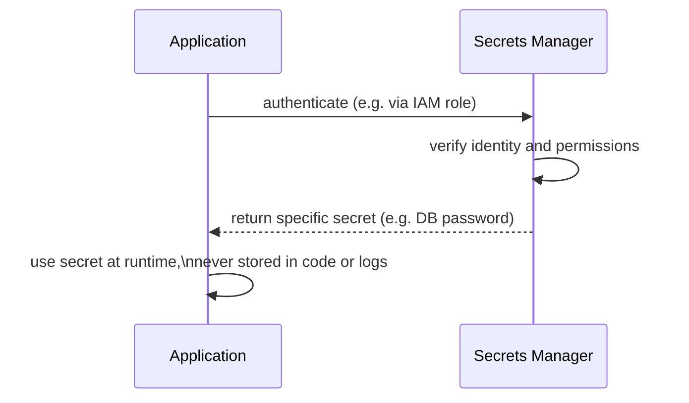

## Definition

Secrets management is the practice of securely storing, distributing, and rotating sensitive credentials — API keys, database passwords, encryption keys, TLS certificates — so they're never exposed in source code, configuration files, or logs, and can be updated or revoked without a full application redeployment.

## Why it exists

A secret (like a database password or an API key) hardcoded directly into source code ends up in version control history forever, visible to anyone with repository access, and nearly impossible to fully scrub or rotate cleanly. Secrets management exists to remove secrets from code and configuration entirely, storing them in a dedicated, access-controlled system that applications retrieve them from at runtime.

## The problem it solves

Secrets committed to source control (even if later "removed") typically remain in the repository's history indefinitely, accessible to anyone who can view that history — a serious, common, and often overlooked exposure risk. Secrets management solves this by ensuring secrets never enter source code or version control at all, retrieved instead from a dedicated secure store at application startup or runtime.

## Real-world analogy

Writing your house key's exact shape and your alarm code directly onto a note taped to your front door (readable by anyone who walks by) is roughly equivalent to hardcoding a secret in source code — anyone with access can trivially read it. A proper safe deposit box, accessible only with specific authorization, that you retrieve keys or codes from only when actually needed, is closer to how a secrets management system is meant to work.

## Simple explanation

Instead of writing `DATABASE_PASSWORD = "hunter2"` directly in application code, the application retrieves the actual password at runtime from a dedicated secrets management system (like HashiCorp Vault, AWS Secrets Manager, or a cloud provider's equivalent), which enforces access control, auditing, and supports rotation without requiring a code change.

## Technical explanation

### How applications retrieve secrets

The application authenticates to the secrets manager using its own identity (often an IAM role or a short-lived token, not a separate hardcoded credential — avoiding the "secret needed to fetch the secret" problem), and receives only the specific secrets it's authorized to access.

### Rotation

A key benefit of centralizing secrets in a dedicated system: they can be **rotated** (replaced with a new value) without requiring an application code change or redeployment — the application simply fetches the current value at runtime, and a rotation event just means the next fetch returns the updated value.

## Internal working — least privilege access

A well-designed secrets management setup grants each application or service access only to the specific secrets it actually needs (least privilege), rather than broad access to every secret in the organization — limiting the damage if any single application is compromised, since an attacker who compromises it only gains access to that application's specific secrets, not everything.

## Advantages

- Removes secrets from source code and version control entirely, eliminating a common and serious exposure risk.
- Enables secret rotation without requiring application redeployment.
- Provides centralized access control and audit logging — who accessed which secret, and when.

## Disadvantages

- Adds a new critical dependency — the secrets management system itself needs to be highly available, since applications depend on it to retrieve credentials needed to function.
- Requires careful handling of the "bootstrapping" problem — the application needs some way to authenticate to the secrets manager itself, which shouldn't itself be a hardcoded secret.
- Adds some operational complexity compared to simply hardcoding values, though this complexity is very much worth the security benefit.

## Trade-offs

Centralized secrets management trades a small amount of added infrastructure and initial setup complexity for dramatically reduced risk of secret exposure and much easier rotation — a trade that's essentially always worth making for any production system handling real credentials.

## Complexity considerations

Using a managed secrets management service (AWS Secrets Manager, Google Secret Manager) or a well-established self-hosted option (HashiCorp Vault) is strongly preferred over building custom secret storage — these tools have already solved the hard problems (secure storage, access control, audit logging, rotation) that a custom solution would need to carefully reimplement.

## When to use

- Essentially every production application handling any real credentials — database passwords, API keys, TLS private keys, encryption keys.

## When simpler approaches might be acceptable

- Local development environments, where a simpler mechanism (environment variables loaded from a local, gitignored file) is a reasonable, lower-stakes alternative to a full secrets management system — though even here, care should be taken that these local files are never accidentally committed.

## Common mistakes

- Hardcoding secrets directly in source code, where they persist in version control history indefinitely even if later "removed" from the current version.
- Logging secrets accidentally (e.g. logging a full request object that happens to include an API key or password), exposing them in log storage.
- Granting overly broad access to secrets (violating least privilege), so a single compromised application can access far more than it actually needs.

## Interview questions

- "Why is hardcoding a secret in source code dangerous even if you later remove it from the codebase?"
- "How does an application authenticate to a secrets manager without needing its own separate hardcoded secret to do so?"
- "Why is secret rotation easier with centralized secrets management than with hardcoded configuration?"

## Practical example

A production application retrieves its database password from AWS Secrets Manager at startup, authenticating using its EC2 instance's IAM role (not a separate hardcoded credential) — when the database password needs to be rotated, it's updated once in Secrets Manager, and the application picks up the new value on its next retrieval, without any code change or redeployment needed.

## Production example

HashiCorp Vault is widely used across the industry specifically as a centralized secrets management system, providing secure storage, fine-grained access policies, detailed audit logging, and built-in support for secret rotation and even dynamically-generated, short-lived credentials for some integrations.

## Best practices

- Never hardcode secrets in source code or commit them to version control, even temporarily.
- Use a mature, established secrets management system (a cloud provider's managed offering, or HashiCorp Vault) rather than building custom secret storage.
- Apply least-privilege access, granting each application or service access only to the specific secrets it genuinely needs.
- Enable and regularly review audit logs for secret access, to detect unusual or unauthorized access patterns.

## Summary

Secrets management securely stores and distributes sensitive credentials — API keys, passwords, certificates — outside of source code and version control, retrieved by applications at runtime from a dedicated, access-controlled system. This eliminates a common and serious exposure risk (hardcoded secrets persisting in repository history), enables rotation without redeployment, and provides centralized access control and auditing — all best achieved using a mature, established secrets management tool rather than a custom-built solution.

## References

- HashiCorp Vault documentation
- OWASP Secrets Management Cheat Sheet

<Quiz questions={[
  {
    q: "Why is hardcoding a secret directly in source code dangerous, even if it's later removed from the current version of the code?",
    options: [
      "It isn't actually dangerous once removed",
      "The secret typically remains accessible in the version control system's history indefinitely, visible to anyone with repository access, even after being removed from the current codebase",
      "Source code cannot technically contain secrets",
      "This only matters for open-source projects"
    ],
    answer: 1,
    explanation: "Version control systems retain history by design — simply deleting a secret from the current version of a file doesn't remove it from earlier commits, which remain accessible to anyone with access to the repository's history, making 'removed' hardcoded secrets a persistent, often overlooked exposure risk."
  }
]} />
