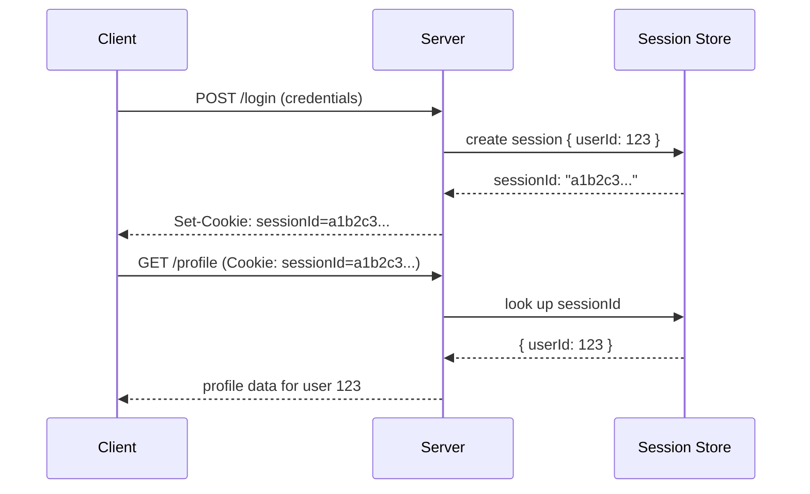

## Definition

A session is server-side state associated with a specific user's ongoing interaction with an application, typically referenced by an opaque session ID stored in a [cookie](/docs/security/cookies) on the client — letting the server "remember" that a user is logged in (and other relevant state) across multiple requests, since [HTTP](/docs/networking/http) itself is stateless.

## Why it exists

HTTP is fundamentally stateless — every request is independent, with no built-in memory of previous requests from the same client. But most applications need to remember that a user has already logged in, without requiring them to re-authenticate on every single request. Sessions exist to bridge this gap, giving the server a way to associate a sequence of requests with a specific, already-authenticated user.

## The problem it solves

Without sessions, every single request would need to include full authentication credentials again, or the server would have no way to know a request came from an already-logged-in user at all. Sessions solve this by having the server generate a random, opaque session ID upon successful login, store the relevant user state associated with that ID server-side, and give the client just that ID (via a cookie) to include on subsequent requests.

## Real-world analogy

Checking into a hotel once, and receiving a room key card, rather than needing to show your ID and pay again every single time you want to enter your room — the key card (like a session ID) is a simple, opaque token that the hotel's system (server-side session storage) can check against its own records to know exactly who you are and what you're allowed to access, without needing your full identification again on every single interaction.

## Simple explanation

Upon successful login, the server creates a session record (containing the user's ID and any other relevant state) and stores it server-side, giving the client a random, opaque session ID (via a cookie). On each subsequent request, the client automatically includes that cookie, and the server looks up the session ID against its stored records to know who's making the request.

## Technical explanation

### Session storage

Sessions can be stored in-memory on a single server (simple, but doesn't scale across multiple servers without [Sticky Sessions](/docs/load-balancing/sticky-sessions)), or in a shared, external store (like [Redis](/docs/caching/redis)) accessible to any server instance — the latter is generally preferred for horizontally scaled applications, since it lets any server handle any request without needing session affinity.

## Internal working — session expiry and invalidation

Sessions are typically given an expiry (after a period of inactivity, or a fixed maximum duration), after which they're considered invalid and the user must log in again. Critically, because session state lives server-side, a session can be immediately and completely invalidated at any time (e.g. on logout, or if an account is compromised) simply by deleting its record from the session store — unlike a self-contained [JWT](/docs/security/jwt), which can't be revoked this easily.

## Advantages

- Sessions can be immediately, completely revoked at any time by deleting the server-side record — a real security advantage over JWT's revocation limitations.
- Simple, well-understood, mature pattern with broad framework and library support.
- Server-side state can be updated at any time (not just re-issued), since the session ID is just a reference to data the server controls.

## Disadvantages

- Requires either a shared session store accessible to all server instances, or sticky sessions tying a user to one specific server — both add real infrastructure requirements compared to a stateless token.
- A database or cache lookup is needed on every request to verify and retrieve session data, an ongoing cost at scale (though a well-tuned cache like Redis makes this fast).

## Trade-offs

Sessions trade the stateless, lookup-free verification a JWT provides for immediate, reliable revocability and server-side control over the session's data — the right choice when instant revocation matters, or when session data needs to be updated dynamically, and JWT may be preferable specifically when avoiding a shared session store across many independent services is the higher priority.

## Complexity considerations

Single-server session storage (in-memory) is the simplest possible setup but doesn't scale horizontally without sticky sessions. A shared external session store (Redis being the common choice) adds a small amount of infrastructure but removes the sticky-session requirement, letting any server handle any request.

## When to use

- Applications where immediate session revocation (logout, compromised account response) is important, and where a shared session store (or single-server deployment) is a reasonable infrastructure choice.

## When to consider JWT instead

- Distributed, especially microservices, architectures where avoiding a shared session store across many independent services provides a meaningful architectural benefit, and the revocation limitation is an acceptable trade-off (often mitigated with short expiry).

## Common mistakes

- Storing sessions only in a single server's local memory in a horizontally scaled deployment without either a shared store or sticky sessions, causing users to be randomly logged out when routed to a different server.
- Not setting a reasonable session expiry, leaving sessions valid indefinitely even after long periods of inactivity.
- Not properly invalidating a session on logout, leaving it technically still valid if somehow reused (e.g. via a stolen cookie) even after the user believes they've logged out.

## Interview questions

- "Why do sessions require either a shared store or sticky sessions in a horizontally scaled deployment, and what does JWT do differently here?"
- "What's the security advantage of sessions over JWT specifically regarding revocation?"
- "How would you design session storage to scale across many server instances without sticky sessions?"

## Practical example

A web application stores session data in a shared Redis instance rather than individual servers' local memory — any of several load-balanced application servers can handle a given user's request by looking up their session ID in the shared Redis store, without needing that user's requests to be routed to any one specific server.

## Production example

Most traditional web application frameworks (Django, Rails, Express with appropriate middleware) provide built-in, mature session management, commonly configured to use Redis or a similar shared store as the session backend specifically to support horizontally scaled, multi-server deployments without requiring sticky sessions.

## Best practices

- Use a shared, external session store (like Redis) for any horizontally scaled deployment, rather than relying on sticky sessions or single-server in-memory storage.
- Set a reasonable session expiry balancing security (shorter is safer) and user convenience (avoiding excessive re-authentication).
- Ensure logout properly and immediately invalidates the server-side session record, not just clears the client-side cookie.

## Summary

Sessions provide server-side state, referenced by an opaque session ID in a cookie, to bridge HTTP's fundamental statelessness and let a server recognize an already-authenticated user across multiple requests. Their key advantage over JWT is immediate, reliable revocability (simply delete the server-side record), at the cost of requiring a shared session store (or sticky sessions) to work correctly across a horizontally scaled deployment.

## References

- OWASP Session Management Cheat Sheet
- Express.js / Django session documentation (as widely used reference implementations)

<Quiz questions={[
  {
    q: "What is a key security advantage sessions have over JWTs?",
    options: [
      "Sessions cannot be stolen or hijacked under any circumstances",
      "A session can be immediately and completely revoked at any time by deleting its server-side record, unlike a self-contained JWT which remains valid until its expiry regardless of server-side action",
      "Sessions never expire",
      "Sessions don't require any cookie at all"
    ],
    answer: 1,
    explanation: "Because session data lives entirely server-side, referenced only by an opaque ID, deleting that server-side record immediately and completely invalidates the session — a JWT, by contrast, is verified purely by its signature and remains valid until it naturally expires, regardless of any server-side action, unless additional revocation mechanisms are built."
  }
]} />
