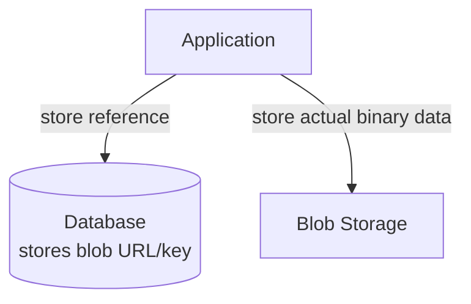

## Definition

Blob storage is storage designed for large **binary large objects (BLOBs)** — unstructured binary data like images, videos, and documents. The term is most closely associated with Microsoft Azure's Blob Storage service, and conceptually overlaps heavily with [Object Storage](/docs/storage/object-storage) more broadly.

## Why it exists

Applications frequently need to store large chunks of binary data that don't fit naturally into a relational database's row/column model — a video file, a scanned document, a compiled binary. Blob storage exists to provide a storage system specifically optimized for these large, unstructured binary payloads, rather than forcing them awkwardly into a traditional database.

## The problem it solves

Storing large binary files directly in a relational database (as a `BLOB` column type) works for small files but becomes a performance and operational problem at scale — large binary data bloats database size, slows backups, and doesn't benefit from a database's relational query capabilities anyway (you're not going to `JOIN` on the contents of a video file). Blob storage solves this by separating large, unstructured binary data into a purpose-built store, with the database instead just storing a reference (a URL or key) to the blob.

## Real-world analogy

Instead of stuffing an entire physical photo album into a filing cabinet drawer meant for paperwork (awkward, and doesn't fit the drawer's organizational system), you keep photo albums on a dedicated shelf built for that purpose, and just write a note in your filing cabinet ("Photo album #42 is on the third shelf") pointing to where the actual album lives. The filing cabinet (database) stays organized and fast for what it's good at; the dedicated shelf (blob storage) handles the bulky binary items.

## Simple explanation

Blob storage terminology and object storage are conceptually very similar — both store unstructured binary data under a key/identifier, accessed via a simple API, without traditional file system semantics. "Blob storage" specifically often refers to Azure's implementation and its specific blob type distinctions (below); "object storage" is the more general, provider-agnostic term (most associated with Amazon S3's terminology).

## Technical explanation

### Azure's blob types

Azure Blob Storage specifically distinguishes between a few blob types, each suited to different access patterns:

- **Block blobs**: optimized for storing large files (images, videos, documents) as a set of blocks that can be individually managed and uploaded — the most common type, closely analogous to a general object storage object.
- **Append blobs**: optimized specifically for append-only operations, like log files — data can be added to the end efficiently, but not modified elsewhere.
- **Page blobs**: optimized for random read/write access, commonly used to back virtual machine disk storage.

The common pattern (whether called "blob" or "object" storage): keep the database lean, storing only a reference to the large binary payload, while the actual bytes live in the purpose-built blob/object store.

## Internal working

Like object storage generally, blob storage typically replicates data across multiple machines and often multiple physical locations for durability, and is accessed via a simple HTTP-based API rather than traditional file system operations.

## Advantages

- Keeps databases lean and performant by not storing large binary payloads directly in relational tables.
- Specialized blob types (in Azure's model) let you optimize specifically for append-heavy (logs) or random-access (VM disks) patterns, rather than one-size-fits-all.
- Scales to very large amounts of unstructured binary data with high durability, similar to object storage generally.

## Disadvantages

- Same general limitations as object storage broadly — no traditional file system semantics for most blob types, and higher per-request latency than local disk access.
- The specific blob-type distinctions (block/append/page) add a layer of choice and understanding beyond a simpler, more uniform object storage model.

## Trade-offs

The trade-offs are largely the same as object storage's — trading fine-grained file system semantics for massive scalability and durability — with blob storage's specific type distinctions (particularly Azure's) offering the option to more precisely match a specific access pattern (append-only logs, random-access disks) at the cost of needing to choose the right type upfront.

## Complexity considerations

Basic blob storage usage (storing and retrieving a file) is as simple as general object storage. Choosing the right blob type (in Azure's model) for a specific access pattern requires a bit more upfront understanding than a single, uniform object storage model.

## When to use

- Storing large binary files (images, videos, documents) referenced from a database, rather than stored directly in it.
- Log storage specifically (append blobs) or VM disk storage specifically (page blobs), where the specialized blob type's access pattern genuinely matches the need.

## When NOT to use

- Structured, queryable data — a relational or document database is a better fit than storing structured data as an opaque blob.

## Common mistakes

- Storing large binary files directly in a relational database column instead of in blob/object storage with just a reference stored in the database — bloating the database and hurting its performance and backup times.
- Choosing the wrong blob type in Azure's model (e.g. a block blob for a rapidly growing log file, rather than an append blob purpose-built for that pattern).

## Interview questions

- "Why would you store an uploaded video's reference in your database, rather than the video's actual bytes?"
- "What's the difference between Azure's block, append, and page blob types, and when would you choose each?"
- "How does blob storage relate to (and differ from) the more general term 'object storage'?"

## Practical example

A video-sharing platform stores uploaded video files as block blobs, storing only the blob's URL and metadata (title, upload date, uploader ID) in its main relational database — keeping the database fast and lean, while the actual, potentially enormous video files live in blob storage, optimized for exactly that kind of large, unstructured content.

## Production example

Microsoft Azure customers building large-scale applications commonly use Azure Blob Storage's block blobs for user-uploaded content and append blobs specifically for continuously growing application log files — deliberately choosing the blob type that matches each specific access pattern.

## Best practices

- Store large binary content in blob/object storage, with only a reference (URL or key) in your primary database, rather than storing large binary payloads directly in database rows.
- Choose the specific blob type (if using Azure) that matches your actual access pattern — block for general files, append for logs, page for random-access disk-like use cases.
- Pair blob storage with a CDN for frequently accessed, publicly served content, just as with object storage generally.

## Summary

Blob storage is storage purpose-built for large, unstructured binary data, conceptually very similar to object storage more broadly, with the term most associated with Azure's specific implementation and its distinct block/append/page blob types tailored to different access patterns. The core practical pattern — keep databases lean by storing only a reference to large binary payloads, which live in a purpose-built blob/object store — applies regardless of which specific cloud provider's terminology you're using.

## References

- Microsoft Azure documentation: Blob Storage

<Quiz questions={[
  {
    q: "Why would an application typically store a reference (URL/key) to a video file in its database, rather than the video's actual binary data?",
    options: [
      "Databases cannot store any binary data under any circumstances",
      "Storing large binary payloads directly in a relational database bloats the database, slows backups, and doesn't benefit from relational query capabilities anyway - a purpose-built blob store handles this far better",
      "Video files are illegal to store in databases",
      "There's no real difference either way"
    ],
    answer: 1,
    explanation: "Large binary content doesn't fit naturally into a relational model and hurts database performance and manageability at scale — storing just a reference keeps the database lean while the actual bytes live in storage purpose-built for large binary data."
  }
]} />
