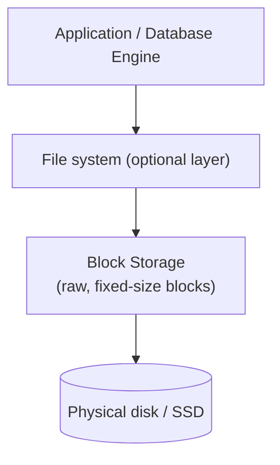

## Definition

Block storage divides data into fixed-size chunks called **blocks**, each independently addressable and readable/writable, with no built-in concept of files or metadata — that structure is imposed by whatever file system or application sits on top of it. It's the lowest-level, most raw form of persistent storage commonly used in system design, and the typical storage type backing virtual machine disks and databases.

## Why it exists

Applications like databases need extremely fine-grained, low-latency control over exactly how and where data is physically written and read — they want to manage their own data layout, caching, and write patterns directly, rather than working through the extra abstraction and semantics a file system or object store imposes. Block storage exists to provide exactly this: a raw, low-level, high-performance storage primitive that higher-level software (a file system, a database engine) can build its own structure on top of.

## The problem it solves

Object storage and file storage both impose their own structure and semantics (objects with metadata, or files with a hierarchical namespace) — appropriate for many use cases, but overhead and constraint for software that wants complete, low-level control over its own data layout and I/O patterns. Block storage solves this by getting out of the way entirely: it's just addressable blocks of bytes, and it's up to whatever sits on top (a file system, a database's own storage engine) to impose whatever structure it needs.

## Real-world analogy

If object storage is a warehouse that tracks and manages items for you by name, and file storage is a shared filing cabinet with folders, block storage is like an empty plot of land divided into numbered, identical parcels — you (or whatever system you build) decide entirely what to build on each parcel and how to organize the relationships between them. It's raw, general-purpose capacity, with all the structure left up to you.

## Simple explanation

Block storage presents itself as a raw disk volume — the same way a physical hard drive appears to an operating system — divided into fixed-size blocks, each independently addressable. A file system (like ext4 or NTFS) or an application (like a database engine) is then built on top of it to impose actual file/data structure.

## Technical explanation

Block storage is typically attached to a single compute instance (like an AWS EBS volume attached to an EC2 instance) and behaves much like a local physical disk from that instance's perspective — the operating system can format it with any file system it chooses, or an application (like many databases) can bypass a general-purpose file system entirely and manage the raw blocks itself for maximum control and performance.

## Internal working

Because block storage has no inherent understanding of files, objects, or metadata, all of that structure and meaning is imposed by the layer above it. This is precisely what gives applications like databases the flexibility to implement highly specialized, performance-tuned storage engines (custom on-disk data structures, specific write-ahead logging behavior) rather than being constrained by a general-purpose file system's assumptions.

## Advantages

- Extremely low latency and high performance — the lowest-level, least abstracted storage primitive, well-suited to latency-sensitive workloads.
- Maximum flexibility — any file system or custom data layout can be built on top, giving applications (especially databases) complete control over their own storage behavior.
- Supports fine-grained, in-place modifications at the byte/block level.

## Disadvantages

- No built-in concept of files, metadata, or a hierarchical namespace — all of that structure must be built by something above it.
- Typically attached to a single compute instance at a time (in most cloud implementations), unlike object or file storage's more naturally shared, multi-client access model.
- Doesn't scale to the same near-limitless capacity as object storage as easily — block storage volumes typically have defined size limits per volume.

## Trade-offs

Block storage trades built-in structure, sharing, and massive scalability (object storage's strengths) for raw performance and maximum flexibility over exactly how data is laid out and accessed — the right choice for latency-sensitive, single-instance workloads like databases, and a poor fit for large-scale, widely-shared, unstructured data (where object storage fits better).

## Complexity considerations

Using block storage directly (formatted with a standard file system) is straightforward and familiar. Building a custom storage engine directly on raw blocks (as sophisticated databases often do) is a significant, specialized engineering undertaking — most applications should use a standard file system on top of block storage rather than managing raw blocks themselves.

## When to use

- Database storage, where low latency and fine-grained control over data layout meaningfully improve performance.
- Virtual machine disk storage — the typical use case for cloud block storage services (AWS EBS, Azure Managed Disks).

## When NOT to use

- Large-scale storage of unstructured data (images, videos, backups) shared across many clients — [object storage](/docs/storage/object-storage) is a much better fit, being purpose-built for that scale and access pattern.
- Simple applications that don't need low-level control over storage layout — a standard file system or object storage is simpler and sufficient.

## Common mistakes

- Using block storage for large-scale, widely-shared unstructured data that would be far better served (more scalable, more cost-effective) by object storage instead.
- Underestimating the operational responsibility that comes with managing raw block volumes directly — snapshotting, resizing, and backup all become the user's responsibility in a way object storage's fully managed model largely avoids.

## Interview questions

- "Why do databases typically run on block storage rather than object storage?"
- "What's the fundamental difference between block storage and object storage in terms of what structure each provides?"
- "Why might a database engine choose to manage raw block storage directly rather than going through a general-purpose file system?"

## Practical example

A relational database server runs on a cloud virtual machine with an attached block storage volume (like an AWS EBS volume), formatted with a standard file system — the database engine's own write-ahead log and data files live on this low-latency, single-instance-attached block storage, distinct from any user-uploaded content (images, documents) the same application might store separately in object storage.

## Production example

AWS EBS (Elastic Block Store) is the standard block storage service backing most EC2-hosted databases and virtual machines specifically because of its low latency and the fine-grained control it gives applications over their own data layout, compared to the higher-level abstractions object or file storage impose.

## Best practices

- Use block storage for latency-sensitive, single-instance workloads (databases, VM disks) where fine-grained control over data layout genuinely matters.
- Use object storage instead for large-scale, widely-shared, unstructured data — don't default to block storage out of familiarity when object storage would be a better structural and cost fit.
- Plan for the operational responsibilities (snapshots, backups, resizing) that come with directly managing block storage volumes, since these aren't automatically handled the way they often are with fully managed object storage.

## Summary

Block storage provides raw, fixed-size, independently addressable blocks of storage with no inherent file or object structure, typically attached to a single compute instance — the low-level foundation databases and virtual machine disks are built on. It trades the built-in structure and massive multi-client scalability of object storage for raw performance and maximum flexibility over exactly how data is laid out and accessed, making it the right choice for latency-sensitive, single-instance storage needs.

## References

- AWS documentation: Amazon EBS
- Designing Data-Intensive Applications, Martin Kleppmann (Ch. 3, on storage engines)

<Quiz questions={[
  {
    q: "Why might a database engine prefer to run on block storage rather than object storage?",
    options: [
      "Object storage cannot store any data related to databases",
      "Block storage provides low-latency, fine-grained control over data layout and in-place modification that databases need for their storage engines, which object storage's whole-object model doesn't provide",
      "Block storage is always cheaper than object storage",
      "There's no meaningful difference for database workloads"
    ],
    answer: 1,
    explanation: "Databases typically need low-latency, fine-grained control over exactly how data is laid out on disk and modified in place (for write-ahead logs, indexes, etc.) — block storage's raw, low-level model supports this directly, while object storage's whole-object replace model doesn't fit that access pattern well."
  }
]} />
