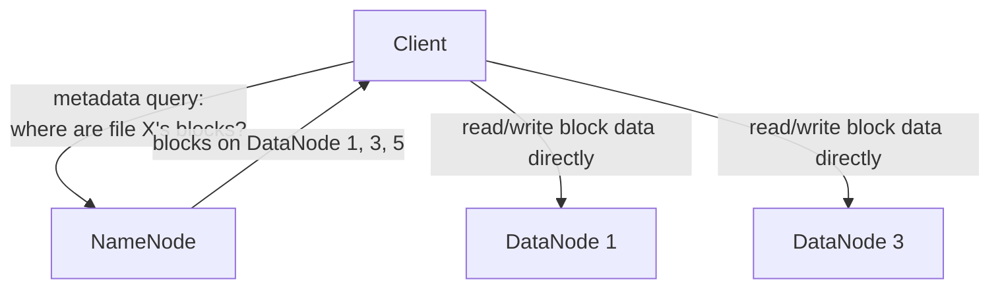
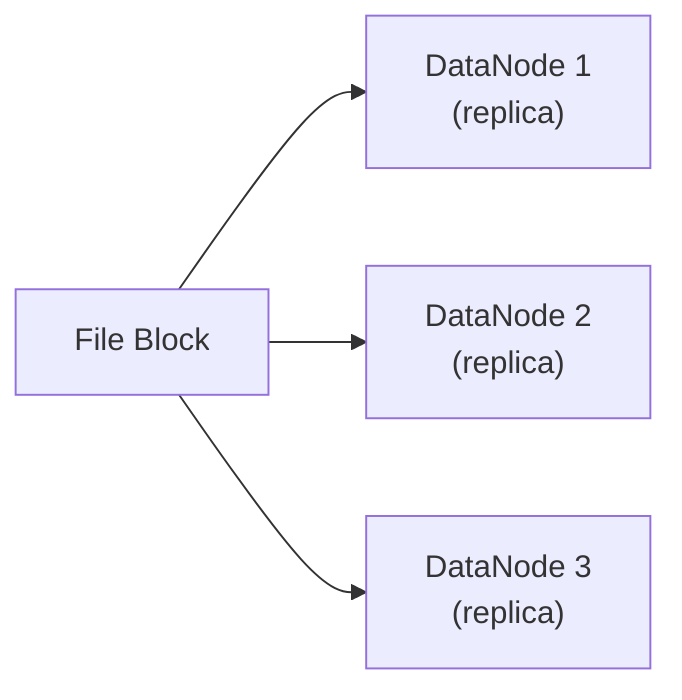

## Definition

A distributed file system (DFS) stores and manages files across multiple machines, presenting a unified file system interface to clients while transparently handling data distribution, replication, and fault tolerance behind the scenes — commonly used for very large-scale data storage and processing, such as in big data analytics infrastructure.

## Why it exists

A single machine's file system is fundamentally limited by that machine's disk capacity and I/O throughput. Distributed file systems exist to remove that ceiling by spreading both the data itself and the metadata describing it across many machines, while still presenting something that looks and behaves, from a client's perspective, much like a familiar file system.

## The problem it solves

Storing and processing datasets far larger than any single machine's disk could hold — common in big data analytics — requires spreading data across many machines. Doing this naively (each machine just holds an arbitrary slice with no coordination) makes it hard to know where any given piece of data actually lives, and offers no protection against any individual machine failing. A distributed file system solves both: a coordinated way to know where data lives, and built-in replication so a single machine's failure doesn't lose data.

## Real-world analogy

Imagine a company's document archive spread across many warehouses instead of one, because no single warehouse is big enough — a distributed file system is like the coordinated indexing and logistics system that lets any employee request "document #4521" without needing to know which specific warehouse (or warehouses, since important documents are duplicated across a few for safety) actually holds it.

## Simple explanation

Files are split into chunks (blocks), which are distributed (and typically replicated for redundancy) across many machines. A separate coordinating component (often called a metadata server or namenode) keeps track of which chunks belong to which files and where each chunk actually lives.

## Technical explanation

### HDFS as a representative example

The Hadoop Distributed File System (HDFS) is a widely known example, with a specific two-role architecture:

- **NameNode**: stores metadata — which files exist, which blocks make up each file, and which DataNodes hold each block. Critical, and typically made highly available itself (see [Fault Tolerance](/docs/fundamentals/fault-tolerance)).
- **DataNodes**: store the actual file block data, and replicate blocks to other DataNodes as instructed by the NameNode.

Clients query the NameNode for metadata (which blocks, and where), then read or write the actual block data directly to/from the relevant DataNodes — separating metadata coordination from bulk data transfer, so the (comparatively lightweight) metadata layer doesn't become a bottleneck for the actual data throughput.

## Internal working — replication for fault tolerance

Each block is typically replicated across multiple DataNodes (commonly 3, by default in HDFS) — if one DataNode fails, the block remains available from its other replicas, and the NameNode detects the failure and orchestrates re-replicating the affected blocks to restore the desired replication factor.

## Advantages

- Scales storage capacity and I/O throughput close to linearly by adding more machines, well past what any single machine could provide.
- Built-in replication provides strong fault tolerance — losing individual machines doesn't lose data.
- Presents a coordinated, unified interface, so clients and applications don't need to manually track where specific data physically lives.

## Disadvantages

- The metadata coordination layer (like HDFS's NameNode) can itself become a bottleneck or single point of failure if not made highly available and scaled appropriately.
- Generally optimized for large files and sequential/batch access patterns (as in big data analytics) rather than the low-latency, small, random access patterns a database or block storage would handle better.
- Real operational complexity — running and tuning a distributed file system at scale requires genuine, specialized expertise.

## Trade-offs

Distributed file systems trade the simplicity of a single-machine file system for massive scale and fault tolerance — the right trade for very large-scale batch data processing and storage, and generally unnecessary complexity for smaller-scale needs that fit comfortably within object, block, or traditional file storage.

## Complexity considerations

Operating a distributed file system at scale is a significant undertaking — capacity planning, replication factor tuning, and ensuring the metadata layer's own high availability are all genuine, ongoing operational responsibilities, generally reserved for organizations with big-data-scale storage and processing needs.

## When to use

- Large-scale batch data processing and analytics infrastructure (the traditional Hadoop/HDFS use case), where massive datasets need to be stored and processed across many machines.
- Any scenario needing to store and process data volumes genuinely too large for a single machine or even traditional network file storage to handle efficiently.

## When NOT to use

- Smaller-scale storage needs that fit comfortably within object storage, block storage, or traditional network file storage, where a full distributed file system's operational complexity isn't justified.
- Low-latency, small, random-access workloads — distributed file systems like HDFS are generally optimized for large files and sequential/batch access, not this pattern.

## Common mistakes

- Adopting a full distributed file system for storage needs that would be far simpler and equally effective using object storage or traditional file storage instead.
- Not planning for the metadata layer's own high availability, leaving it as an unaddressed single point of failure despite the data layer itself being well-replicated.
- Using a distributed file system optimized for large sequential batch access for a workload that's actually latency-sensitive and involves small, random reads/writes — a poor access-pattern fit.

## Interview questions

- "Why does HDFS separate metadata (NameNode) from actual data storage (DataNodes) architecturally?"
- "What happens if a single DataNode holding a replica of a file's block fails?"
- "When would you choose a distributed file system over simply using object storage for large-scale data?"

## Practical example

A big data analytics pipeline processing terabytes of log data stores that data in HDFS, spread and replicated across a cluster of many machines — batch processing jobs (like Spark or MapReduce jobs) then read this data in parallel, directly from the DataNodes holding the relevant blocks, achieving high aggregate throughput across the whole cluster.

## Production example

HDFS, originally built at Yahoo based on Google's published GFS (Google File System) design, became the foundational storage layer for the broader Hadoop big data ecosystem, and is still widely used today for large-scale batch analytics infrastructure, particularly in on-premises or hybrid big-data deployments.

## Best practices

- Reserve distributed file systems for genuinely large-scale batch/analytics storage needs — use simpler storage options (object, block, or traditional file storage) for smaller-scale needs.
- Ensure the metadata coordination layer is itself made highly available, since it's often the most critical single component in the overall architecture.
- Match the distributed file system's strengths (large files, sequential/batch access) to your actual workload's access pattern, rather than using it for latency-sensitive, small-random-access needs it isn't optimized for.

## Summary

Distributed file systems spread both data and metadata across many machines, presenting a unified file system interface while transparently handling replication and fault tolerance at a scale no single machine could support — the foundational storage layer behind big data processing infrastructure like Hadoop. They trade the simplicity of a single-machine file system for massive scale and fault tolerance, and are the right choice specifically for very large-scale, largely batch-oriented storage and processing needs, not general-purpose smaller-scale storage.

## References

- Ghemawat, Gobioff, Leung, "The Google File System" (2003)
- Apache Hadoop documentation: HDFS Architecture

<Quiz questions={[
  {
    q: "Why does HDFS separate the NameNode (metadata) from DataNodes (actual block data)?",
    options: [
      "It's an arbitrary historical design choice with no real benefit",
      "It lets the lightweight metadata coordination layer avoid becoming a bottleneck for the much larger volume of actual data transfer, which flows directly between clients and DataNodes",
      "DataNodes cannot store any data without a NameNode present",
      "NameNodes and DataNodes are actually the same component"
    ],
    answer: 1,
    explanation: "Separating metadata (which files/blocks exist, and where) from the actual bulk data transfer lets clients query the NameNode briefly for location info, then read/write the much larger actual data volume directly to/from DataNodes — keeping the metadata layer from becoming a throughput bottleneck."
  }
]} />
