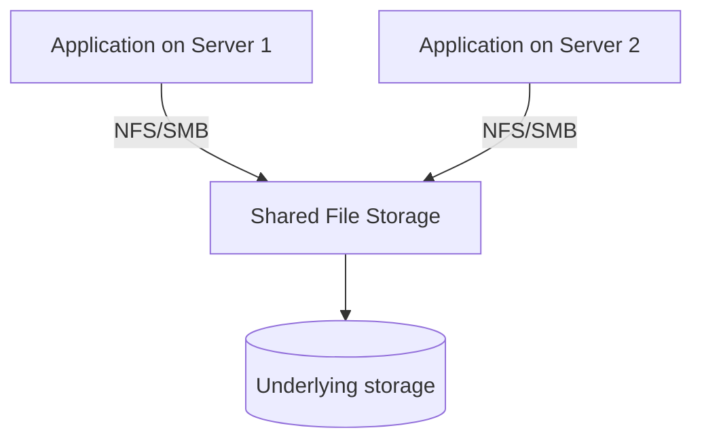

## Definition

File storage organizes data in a traditional hierarchical structure of files and folders, typically accessed via standard file system protocols (like NFS or SMB) that support familiar operations — open, read, write, seek, lock — the same way an application would interact with a local disk, but over a network.

## Why it exists

Many applications and operating systems are built directly around file system APIs and semantics — opening a file, reading/writing at a specific byte offset, locking it for exclusive access. File storage exists to provide these exact same familiar semantics, but backed by shared, networked storage rather than a single machine's local disk — letting multiple machines access and share the same files without an application needing to be rewritten around a different storage model.

## The problem it solves

[Object storage](/docs/storage/object-storage) intentionally gives up traditional file system semantics (in-place partial edits, file locking, true nested directories) in exchange for massive scalability. But many existing applications — legacy software, certain databases, content management systems — are built assuming those exact semantics are available. File storage solves this by providing shared, network-accessible storage that still behaves like a traditional file system, letting these applications work unmodified across multiple machines.

## Real-world analogy

If object storage is a professionally run warehouse where you retrieve whole items by tracking number, file storage is more like a shared filing cabinet in a shared office — multiple people can open specific drawers and folders, edit specific pages in place, and the whole system still works the way a traditional single-office filing cabinet always has, just now accessible to everyone in a larger shared space.

## Simple explanation

File storage looks and behaves like a normal file system — folders containing files, opened and modified using standard file operations — except the storage itself lives on a shared network location (like NFS or a cloud file service) rather than a single machine's local disk.

## Technical explanation

### Common protocols

- **NFS (Network File System)**: widely used, especially in Unix/Linux environments, for sharing file systems over a network.
- **SMB (Server Message Block)**: widely used, especially in Windows environments, for similar network file sharing.

### POSIX semantics

File storage typically supports (or aims to support) **POSIX** file system semantics — standard operations like opening a file, reading/writing at specific byte offsets, and locking a file for exclusive or shared access — the same semantics local applications already expect, just now working correctly across multiple machines accessing the same shared files concurrently.

## Internal working — file locking across machines

The genuinely hard part of network file storage (compared to a single local disk) is correctly implementing file locking and consistency guarantees when multiple machines might be reading and writing the same file concurrently over the network — ensuring, for example, that two machines don't both believe they have an exclusive write lock on the same file simultaneously.

## Advantages

- Compatible with existing applications and tools built around traditional file system semantics, without requiring them to be rewritten for a different storage model.
- Supports fine-grained operations (partial file edits, byte-range locking) that object storage generally doesn't.
- Familiar operational model for teams already comfortable with traditional file systems.

## Disadvantages

- Doesn't scale as gracefully as object storage — traditional file system semantics (locking, directory structures) become harder to maintain correctly and efficiently at very large scale or very high concurrency.
- Generally more expensive per unit of storage than object storage, given the more complex semantics being supported.
- Network file system protocols can introduce their own performance quirks and failure modes compared to local disk access.

## Trade-offs

File storage trades some of object storage's massive scalability and cost efficiency for familiar, traditional file system semantics — the right choice specifically for applications that genuinely need those semantics (in-place edits, locking, true directory hierarchies), and often unnecessarily limiting for applications that could work just as well (and more cheaply, at greater scale) with object storage instead.

## Complexity considerations

Setting up basic network file storage (NFS/SMB) is well-understood, mature technology. Ensuring correct, performant behavior under high concurrency and at large scale is harder than with object storage's simpler, less semantically rich model — this is part of why many cloud-native applications are increasingly designed around object storage instead, where scale allows it.

## When to use

- Legacy applications or existing software genuinely built around traditional file system semantics that can't easily be rewritten around object storage's simpler model.
- Shared development or content environments where multiple users/machines need traditional file-level access, editing, and locking of the same files.

## When NOT to use

- New, cloud-native applications that can be designed around object storage's simpler, more scalable model from the start — avoiding file storage's traditional semantics (and their scaling limitations) is often the better long-term choice when there's no legacy constraint forcing the traditional model.

## Common mistakes

- Defaulting to file storage out of familiarity for new applications that could be built more scalably and cost-effectively around object storage instead.
- Underestimating the complexity and performance considerations of correctly implementing file locking across many concurrent, networked clients at scale.

## Interview questions

- "When would you choose file storage over object storage for a specific application's needs?"
- "What does POSIX file system compliance actually guarantee, and why might an application specifically require it?"
- "What's harder about correctly implementing file locking over a network compared to a single local machine?"

## Practical example

A legacy content management system, originally built assuming direct file system access to store and edit documents in place, is migrated to run across multiple servers by using shared network file storage (NFS) — preserving its existing file-based logic without requiring a full rewrite around a different storage model.

## Production example

Amazon EFS (Elastic File System) and Azure Files both provide managed, scalable network file storage specifically for applications that need traditional file system semantics across multiple compute instances, while Amazon S3 (object storage) remains the choice for applications that can work with object storage's simpler model instead.

## Best practices

- Choose file storage specifically when an application genuinely requires traditional file system semantics (in-place edits, locking, true directory hierarchies) — not simply out of familiarity.
- For new, cloud-native applications without a legacy constraint, prefer object storage where feasible, given its superior scalability and typically lower cost.
- Understand and plan for the concurrency and locking behavior of your specific file storage service under your application's actual access patterns.

## Summary

File storage provides traditional, hierarchical file system semantics (folders, in-place edits, file locking) over shared network storage — compatible with applications built around these familiar operations, but generally less scalable and more expensive than object storage at very large scale. It remains the right choice specifically for legacy or traditionally-built applications that need genuine file system semantics, while new cloud-native systems increasingly favor object storage where the constraint doesn't apply.

## References

- Amazon EFS documentation
- POSIX file system standard (IEEE Std 1003.1)

<Quiz questions={[
  {
    q: "Why might a legacy application be migrated to file storage rather than object storage when moving to a multi-server architecture?",
    options: [
      "File storage is always faster than object storage",
      "The application may be built around traditional file system semantics (in-place edits, byte-range locking) that object storage doesn't provide, and rewriting it would be costly",
      "Object storage doesn't exist for legacy applications",
      "There's no reason to ever choose file storage"
    ],
    answer: 1,
    explanation: "Applications built directly around POSIX file system operations (opening files, editing in place, locking) often can't easily be adapted to object storage's simpler, whole-object model — file storage preserves those exact semantics over a network, avoiding a costly rewrite."
  }
]} />
