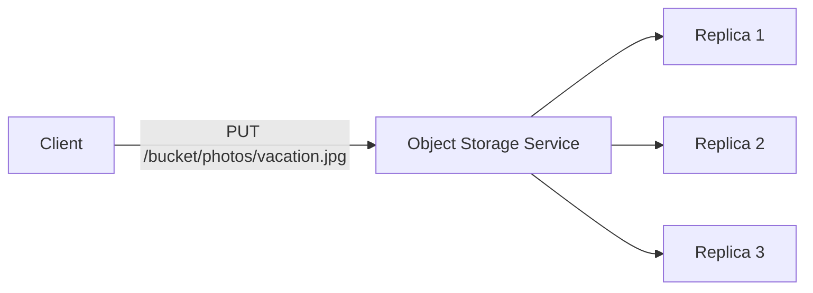

## Definition

Object storage is a data storage architecture that manages data as discrete **objects** — each with its data, a unique identifier (key), and metadata — stored in a flat structure (no nested folder hierarchy in the traditional sense) and typically accessed via a simple HTTP API rather than a traditional file system interface.

## Why it exists

Traditional file systems, with their hierarchical directory structures, were designed for single machines or small networks and don't scale gracefully to storing billions of files across a distributed, globally accessible infrastructure. Object storage exists to provide storage that scales close to limitlessly, is accessed uniformly over the network via simple APIs, and doesn't require the complex locking and consistency semantics a traditional file system needs for concurrent access.

## The problem it solves

Storing and serving massive amounts of unstructured data (images, videos, backups, logs) across a distributed system, accessible from anywhere, at effectively unlimited scale, is awkward with a traditional file system — file systems assume a specific machine's local disk (or a network-attached one with file-locking semantics) rather than a globally distributed, HTTP-accessible store. Object storage solves this by giving up hierarchical folder semantics and complex file-locking, in exchange for near-unlimited horizontal scalability and simple, uniform access.

## Real-world analogy

A traditional file system is like an organized office filing cabinet with nested folders and subfolders — great for a human sitting at that specific cabinet, but hard to scale to millions of documents accessed by people all over the world simultaneously. Object storage is more like a massive, professionally run self-storage warehouse: you get a unique tracking number (key) for each item you store, and you can retrieve any item instantly by that number from anywhere, without navigating a physical hierarchy of aisles and shelves yourself — the warehouse handles all of that internally.

## Simple explanation

You store an object (a file's raw bytes, plus some metadata) under a unique key, in a "bucket" (a logical container). Retrieving it is a simple `GET` request by key over HTTP — no traditional file paths, no complex directory traversal, no file-locking semantics for concurrent writers.

## Technical explanation

### Key characteristics

- **Flat namespace**: objects are identified by a key (often looking like a file path, e.g. `photos/2026/vacation.jpg`, but it's actually just a single, flat string identifier, not a real nested directory structure).
- **HTTP-based API**: typically accessed via simple `PUT`/`GET`/`DELETE` operations over HTTP.
- **Rich metadata**: each object can carry metadata (content type, custom tags) alongside its data.
- **Built-in redundancy**: object storage services typically replicate data across multiple machines (and often multiple physical locations) automatically, providing very high durability without the user needing to manage replication themselves.

## Internal working

Object storage services (like Amazon S3) typically don't support partial in-place modification of an object — updating an object generally means replacing it entirely, rather than modifying a specific byte range as a traditional file system would allow. This is a direct consequence of trading fine-grained file-system semantics for massive, simple, distributed scalability.

## Advantages

- Scales to essentially unlimited amounts of data, with no practical ceiling the way a single file system volume would have.
- Extremely durable — data is typically automatically replicated across multiple machines and often multiple physical locations by the storage provider.
- Simple, uniform HTTP-based access from anywhere, without needing to mount a file system or handle complex network file-sharing protocols.

## Disadvantages

- No traditional file system semantics — no true nested directories, no partial in-place file edits, no POSIX file-locking guarantees.
- Not suitable for use cases genuinely needing a traditional file system interface (e.g. a database engine that expects to open, seek within, and write to specific byte offsets of a file directly).
- Latency per individual object request, while generally low, is still higher than a local disk read — not ideal for extremely latency-sensitive, small, frequent read/write patterns.

## Trade-offs

Object storage trades traditional file system semantics (true hierarchical directories, partial in-place edits, file locking) for massive scalability, durability, and simple uniform HTTP access — an excellent trade for storing large volumes of relatively static, whole-file data (images, videos, backups), and a poor fit for workloads needing fine-grained, low-latency, in-place file modification.

## Complexity considerations

Basic object storage usage (uploading and retrieving whole objects by key) is very simple. More advanced usage — versioning, lifecycle policies (automatically moving old objects to cheaper storage tiers), and fine-grained access control — adds real configuration surface, though still generally simpler than managing a traditional distributed file system directly.

## When to use

- Storing and serving large, largely static unstructured data: user-uploaded images/videos, backups, static website assets, data lake storage for analytics.
- Any use case needing to scale storage capacity essentially without limit, accessed primarily as whole-object reads/writes rather than fine-grained in-place edits.

## When NOT to use

- Use cases genuinely needing traditional file system semantics — databases wanting direct control over file byte offsets, applications requiring POSIX file locking, or workloads with extremely low-latency, small, frequent read/write patterns to the same file.

## Common mistakes

- Trying to use object storage as a drop-in replacement for a traditional file system in an application that genuinely depends on file system semantics (partial writes, locking) it doesn't provide.
- Not using lifecycle policies to automatically move infrequently accessed data to cheaper storage tiers, leaving all data in the most expensive tier indefinitely.
- Underestimating per-request latency for use cases involving many small, frequent object accesses, where a cache or a different storage approach might be more appropriate.

## Interview questions

- "Why might you choose object storage over a traditional file system for storing user-uploaded images?"
- "What's a use case where object storage's lack of traditional file-locking semantics would actually be a problem?"
- "How does object storage typically achieve very high durability?"

## Practical example

A photo-sharing application stores every uploaded photo as an object in object storage, keyed by a unique ID, served directly (often via a [CDN](/docs/networking/cdn) in front of it for performance) — the application never needs to manage file system paths, disk capacity, or replication itself, since the object storage service handles all of that transparently.

## Production example

Amazon S3, the original and most widely used object storage service, underpins a huge fraction of the internet's static content and backup storage — Netflix, Airbnb, and countless other companies rely on it (or equivalents like Google Cloud Storage) specifically for its combination of durability, scalability, and simplicity.

## Best practices

- Use object storage for large, relatively static unstructured data, and a different storage type ([Block Storage](/docs/storage/block-storage) or a database) for workloads needing fine-grained, low-latency, in-place modification.
- Configure lifecycle policies to automatically transition infrequently accessed objects to cheaper storage tiers over time.
- Pair object storage with a CDN for frequently accessed, publicly served content, to reduce latency and load on the storage service itself.

## Summary

Object storage manages data as flat, uniquely-keyed objects accessed via a simple HTTP API, trading traditional file system semantics (nested directories, partial in-place edits, file locking) for massive scalability and very high durability with minimal operational effort. It's the right choice for large-scale storage of relatively static unstructured data, and a poor fit for workloads genuinely needing fine-grained file system behavior.

## References

- Amazon S3 documentation
- Google Cloud Storage documentation

<Quiz questions={[
  {
    q: "Why can't object storage typically be used as a drop-in replacement for a traditional file system in every application?",
    options: [
      "Object storage doesn't actually store any data",
      "Object storage generally doesn't support partial in-place edits or POSIX-style file locking the way a traditional file system does",
      "Object storage is always slower than any file system",
      "Object storage can only store text files"
    ],
    answer: 1,
    explanation: "Object storage trades traditional file system semantics — like modifying a specific byte range in place, or POSIX file locking for concurrent access — for massive scalability and simplicity, which makes it unsuitable for applications that genuinely depend on those specific file system behaviors."
  }
]} />
